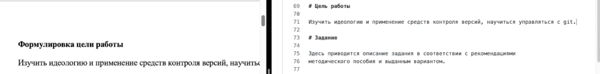
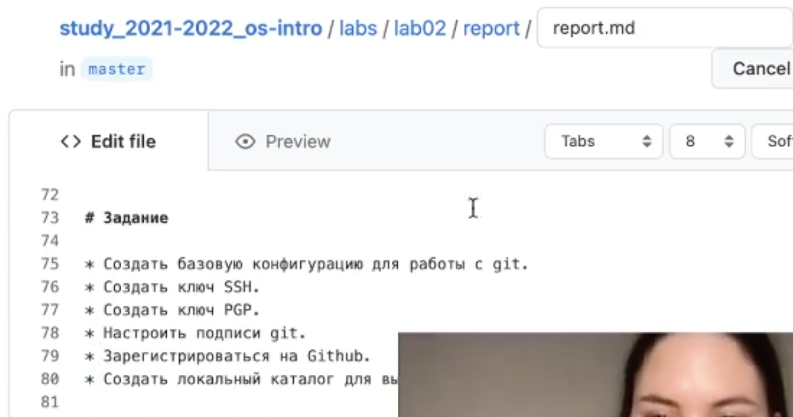
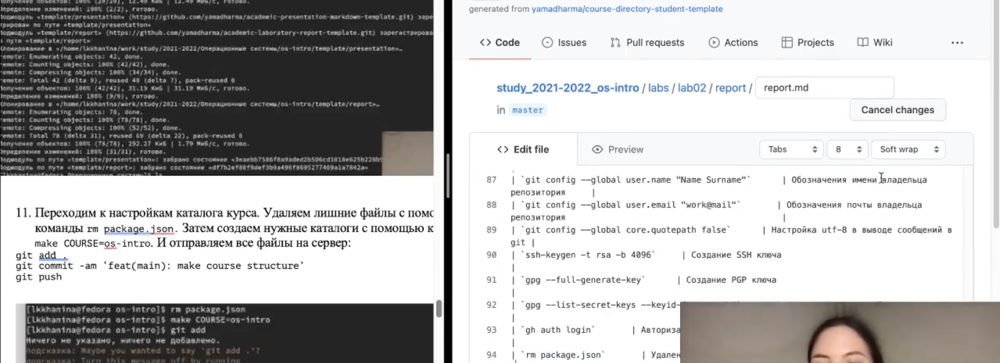
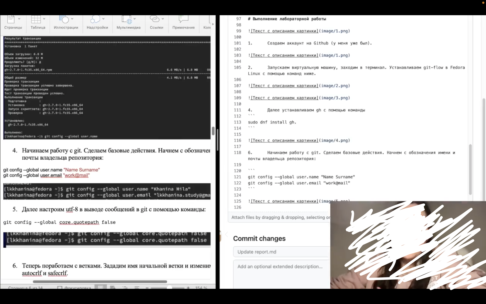
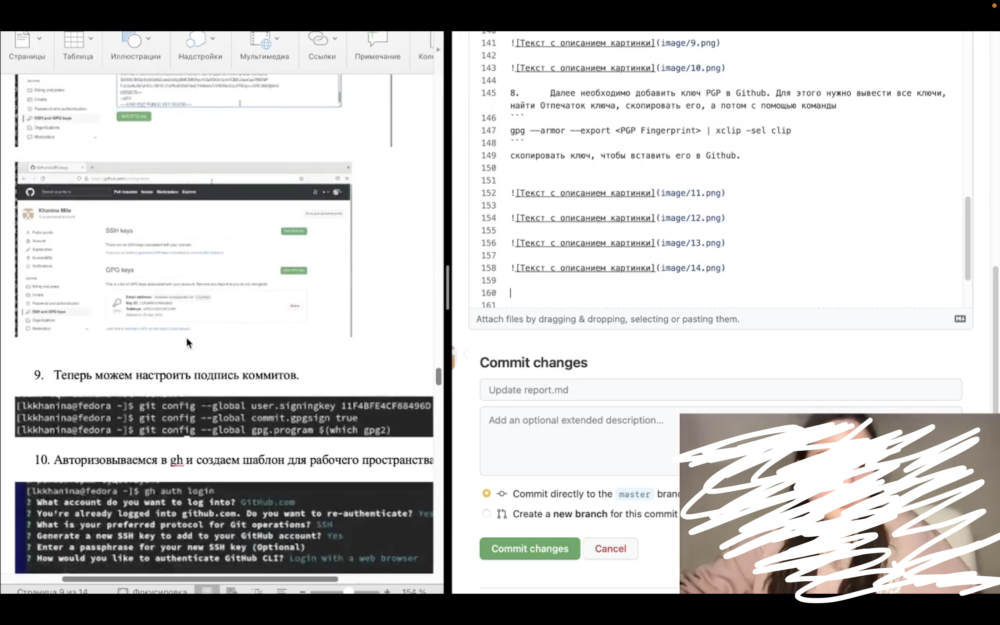
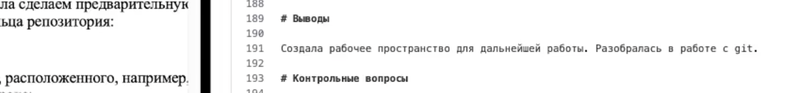
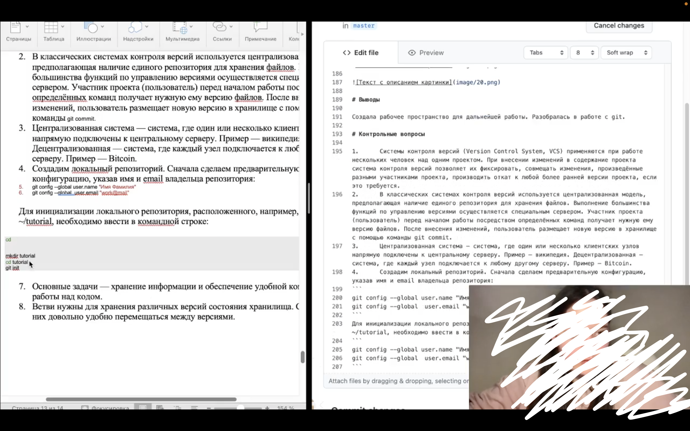

---
## Front matter
lang: ru-RU
title: Презентация лабораторной работы №3
author: |
	Khanina L. K.\inst{1}
institute: |
	\inst{1}RUDN University, Moscow, Russian Federation
date: NEC--2022, 30 April

## Formatting
toc: false
slide_level: 2
theme: metropolis
header-includes: 
 - \metroset{progressbar=frametitle,sectionpage=progressbar,numbering=fraction}
 - '\makeatletter'
 - '\beamer@ignorenonframefalse'
 - '\makeatother'
aspectratio: 43
section-titles: true
---

# Презентация лабораторной работы №3

# Цель работы

Научиться оформлять отчёты с помощью легковесного языка разметки Markdown.

# Задание

- Сделайть отчёт попредыдущей лабораторной работе в формате Markdown.

- В качестве отчёта предоставить отчёты в 3 форматах: pdf, docx и md (в архиве, поскольку он должен содержать скриншоты, Makefile и т.д.)

# Выполнение лабораторной работы

## Добавление картинок, чтобы затем их вставить в отчет. Указание цели работы. Указание задания.

## Создание теоретического введения с командами, которые я использовала в лабораторной работе №2. 

## Перенос текста из отчета с добавлением картинок и специальных вставок с кодом. 

## Указание вывода. 

## Перенос контрольных вопросов со вставками кода. 

# Вывод

Я изучила методы для создания и редактирования файлов формата Markdown.

# Спасибо за внимание!
