---
## Front matter
title: "Отчёта по лабораторной работе №2"
author: "Ханина Людмила Константиновна"

## Generic otions
lang: ru-RU
toc-title: "Содержание"

## Bibliography
bibliography: bib/cite.bib
csl: pandoc/csl/gost-r-7-0-5-2008-numeric.csl

## Pdf output format
toc: true # Table of contents
toc-depth: 2
lof: true # List of figures
lot: true # List of tables
fontsize: 12pt
linestretch: 1.5
papersize: a4
documentclass: scrreprt
## I18n polyglossia
polyglossia-lang:
  name: russian
  options:
	- spelling=modern
	- babelshorthands=true
polyglossia-otherlangs:
  name: english
## I18n babel
babel-lang: russian
babel-otherlangs: english
## Fonts
mainfont: PT Serif
romanfont: PT Serif
sansfont: PT Sans
monofont: PT Mono
mainfontoptions: Ligatures=TeX
romanfontoptions: Ligatures=TeX
sansfontoptions: Ligatures=TeX,Scale=MatchLowercase
monofontoptions: Scale=MatchLowercase,Scale=0.9
## Biblatex
biblatex: true
biblio-style: "gost-numeric"
biblatexoptions:
  - parentracker=true
  - backend=biber
  - hyperref=auto
  - language=auto
  - autolang=other*
  - citestyle=gost-numeric
## Pandoc-crossref LaTeX customization
figureTitle: "Рис."
tableTitle: "Таблица"
listingTitle: "Листинг"
lofTitle: "Список иллюстраций"
lotTitle: "Список таблиц"
lolTitle: "Листинги"
## Misc options
indent: true
header-includes:
  - \usepackage{indentfirst}
  - \usepackage{float} # keep figures where there are in the text
  - \floatplacement{figure}{H} # keep figures where there are in the text
---

# Цель работы

Изучить идеологию и применение средств контроля версий, научиться управляться с git.

# Задание

* Создать базовую конфигурацию для работы с git. 
* Создать ключ SSH.
* Создать ключ PGP.
* Настроить подписи git.
* Зарегистрироваться на Github.
* Создать локальный каталог для выполнения заданий по предмету.

# Теоретическое введение

| Команда | Описание команды                                                                                                          |
|--------------|----------------------------------------------------------------------------------------------------------------------------|
| `sudo dnf install gh`          | Установка gh                                                                              |
| `git config --global user.name "Name Surname"`      | Обозначения имени владельца репозитория     |
| `git config --global user.email "work@mail"`       | Обозначения почты владельца репозитория                                           |
| `git config –-global core.quotepath false`      | Настройка utf-8 в выводе сообщений в git |
| `ssh-keygen -t rsa -b 4096`     | Создание SSH ключа                                                                                  |
| `gpg --full-generate-key`      | Создание PGP ключа                                                                                   |
| `gpg --list-secret-keys --keyid-format LONG`       | Вывод списка ключей                                                                                                           |
| `gh auth login`       | Авторизация в gh                                                                                |
| `rm package.json`       | Удаление лишних файлов из репозитория                                                                             |

# Выполнение лабораторной работы

1.	Создаем аккаунт на Github (у меня уже был). 


2.	Запускаем виртуальную машину, заходим в терминал. Устанавливаем git-flow в Fedora Linux с помощью команд ниже.  

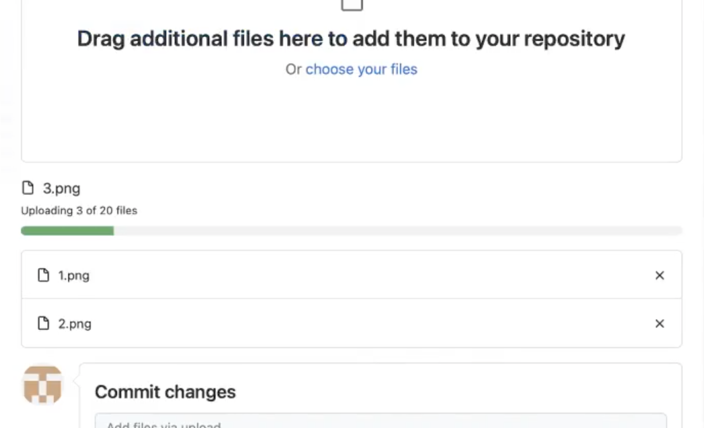 

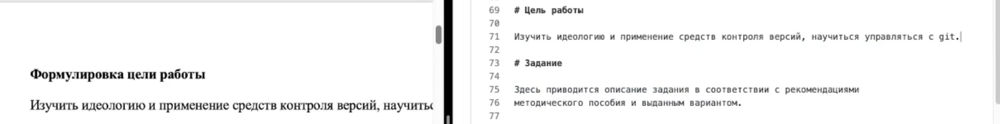

3.	Далее устанавливаем gh с помощью команды
```
sudo dnf install gh
```

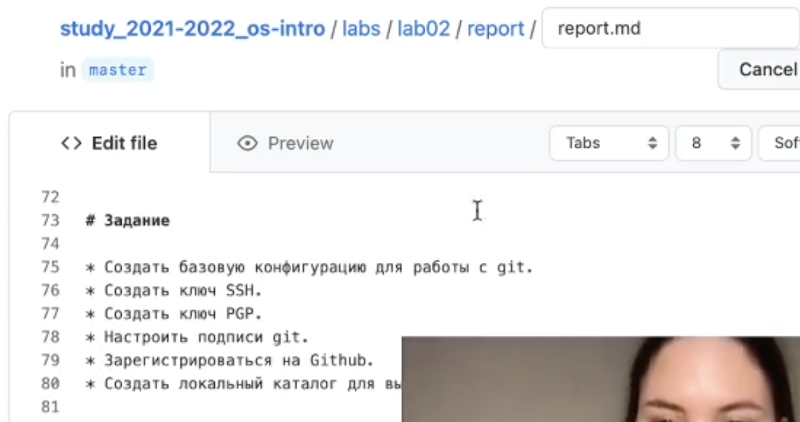

4.	Начинаем работу с git. Сделаем базовые действия. Начнем с обозначения имени и почты владельца репозитория:

```
git config --global user.name "Name Surname"
git config --global user.email "work@mail"
```

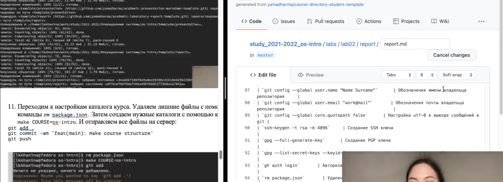

5.	Далее настроим utf-8 в выводе сообщений в git с помощью команды:

```
git config –-global core.quotepath false
```

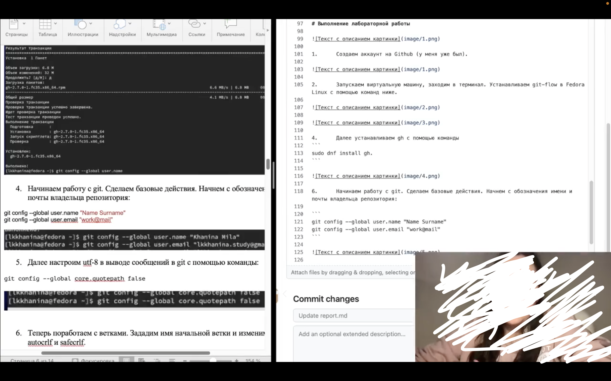

6.	Теперь поработаем с ветками. Зададим имя начальной ветки и изменим параметры autocrlf и safecrlf. 

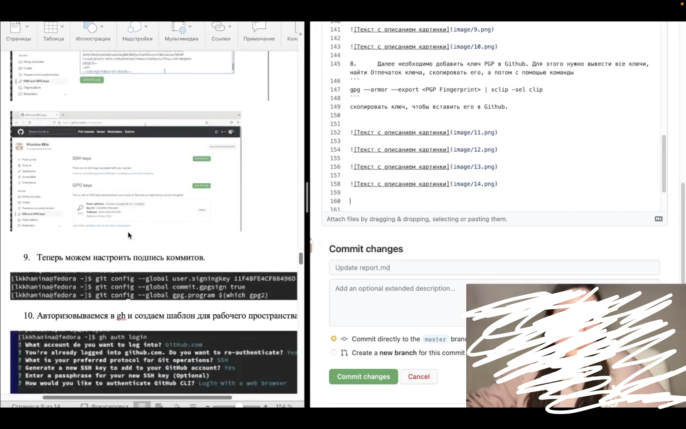

7.	Следующий шаг — создание ключей SSH и PGP. 

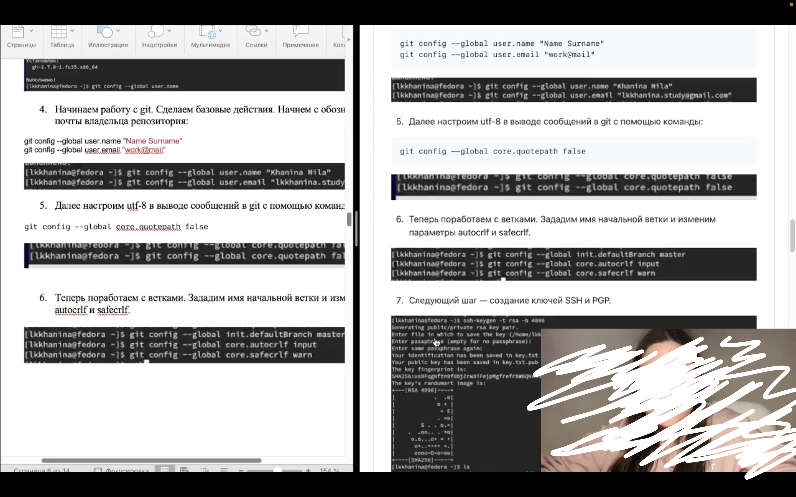

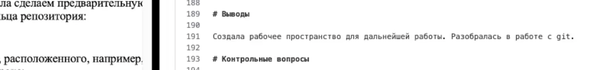

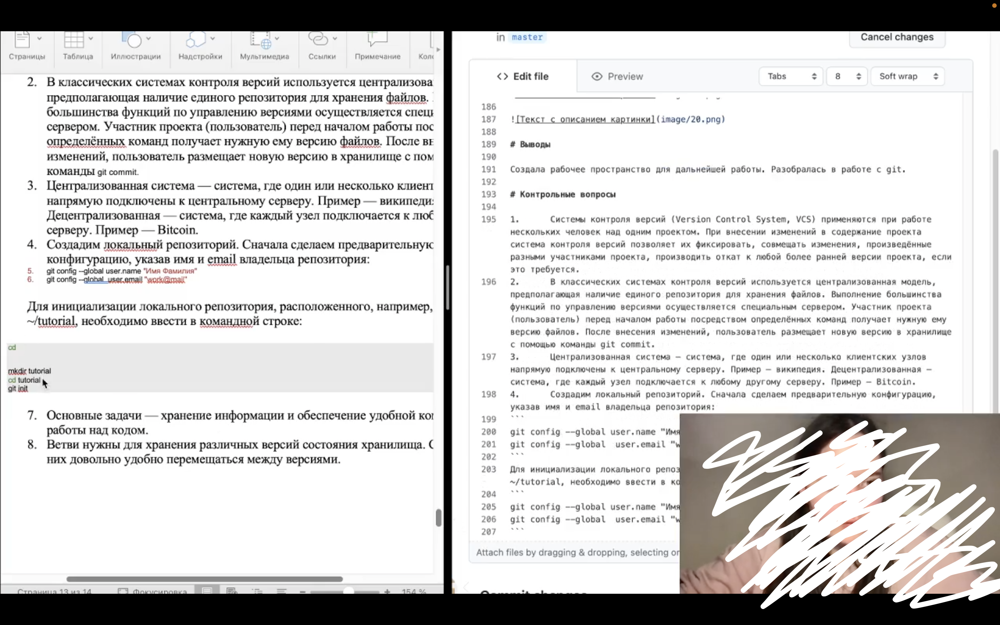

8.	Далее необходимо добавить ключ PGP в Github. Для этого нужно вывести все ключи, найти Отпечаток ключа, скопировать его, а потом с помощью команды
```
gpg –-armor –-export <PGP Fingerprint> | xclip -sel clip
```
скопировать ключ, чтобы вставить его в Github. 


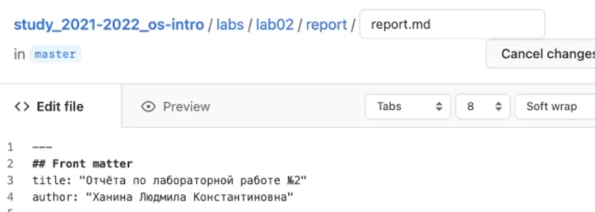

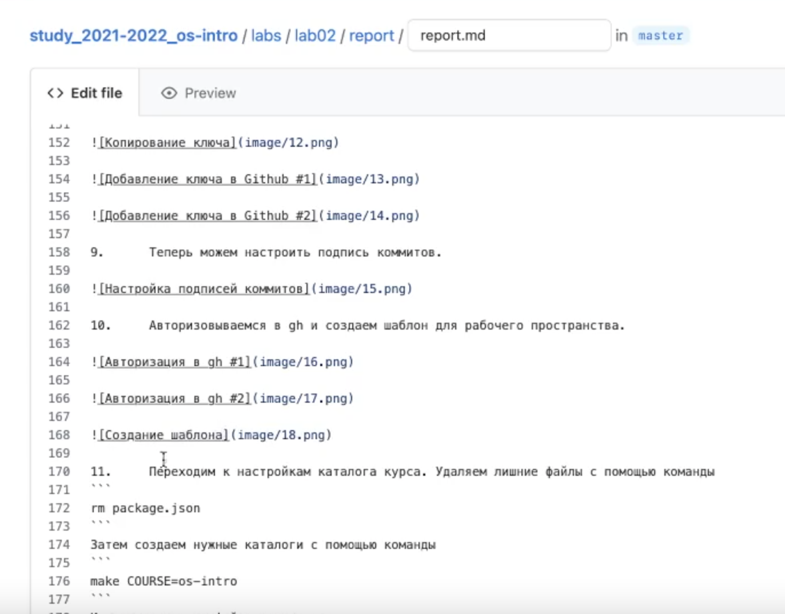


9.	Теперь можем настроить подпись коммитов.


10.	Авторизовываемся в gh и создаем шаблон для рабочего пространства.


11.	Переходим к настройкам каталога курса. Удаляем лишние файлы с помощью команды
```
rm package.json
```
Затем создаем нужные каталоги с помощью команды
```
make COURSE=os-intro
```
И отправляем все файлы на сервер:
```
git add .
git commit -am ‘feat(main): make course structure’
git push
```


# Выводы

Создала рабочее пространство для дальнейшей работы. Разобралась в работе с git. 

# Контрольные вопросы

1.	Системы контроля версий (Version Control System, VCS) применяются при работе нескольких человек над одним проектом. При внесении изменений в содержание проекта система контроля версий позволяет их фиксировать, совмещать изменения, произведённые разными участниками проекта, производить откат к любой более ранней версии проекта, если это требуется. 
2.	В классических системах контроля версий используется централизованная модель, предполагающая наличие единого репозитория для хранения файлов. Выполнение большинства функций по управлению версиями осуществляется специальным сервером. Участник проекта (пользователь) перед началом работы посредством определённых команд получает нужную ему версию файлов. После внесения изменений, пользователь размещает новую версию в хранилище с помощью команды git commit. 
3.	Централизованная система — система, где один или несколько клиентских узлов напрямую подключены к центральному серверу. Пример — википедия. Децентрализованная — система, где каждый узел подключается к любому другому серверу. Пример — Bitcoin.
4.	Создадим локальный репозиторий. Сначала сделаем предварительную конфигурацию, указав имя и email владельца репозитория: 
```
git config --global user.name "Имя Фамилия"
git config --global  user.email "work@mail"
```
Для инициализации локального репозитория, расположенного, например, в каталоге ~/tutorial, необходимо ввести в командной строке:
```
cd 
mkdir tutorial
cd tutorial
git init
```
7.	Основные задачи — хранение информации и обеспечение удобной командной работы над кодом. 
8.	Ветви нужны для хранения различных версий состояния хранилища. С помощью них довольно удобно перемещаться между версиями. 
