---
## Front matter
lang: ru-RU
title: Презентация лабораторной работы №4
author: |
	Ханина Людмила. Sevastianov\inst{1}
institute: |
	\inst{1}RUDN University, Moscow, Russian Federation
date: 30.04.2022

## Formatting
toc: false
slide_level: 2
theme: metropolis
header-includes: 
 - \metroset{progressbar=frametitle,sectionpage=progressbar,numbering=fraction}
 - '\makeatletter'
 - '\beamer@ignorenonframefalse'
 - '\makeatother'
aspectratio: 43
section-titles: true
---

# Презентация лабораторной работы №4

## Цель

Приобретение практических навыков взаимодействия пользователя с системой посредством командной строки.

## Задание

- Определите полное имя вашего домашнего каталога. Далее относительно этого каталога будут выполняться последующие упражнения.
- Выполните следующие действия: 2.1. Перейдите в каталог /tmp. 2.2. Выведите на экран содержимое каталога /tmp. Для этого используйте команду ls с различными опциями. Поясните разницу в выводимой на экран информации. 2.3. Определите,есть ли в каталоге /var/spool подкаталог с именем cron? 2.4. Перейдите в Ваш домашний каталог и выведите на экран его содержимое. Определите, кто является владельцем файлов и подкаталогов?
- Выполните следующие действия: 3.1. В домашнем каталоге создайте новый каталог с именем newdir. 3.2. В каталоге ~/newdir создайте новый каталог с именем morefun. 3.3. В домашнем каталоге создайте одной командой три новых каталога с именами letters, memos, misk. Затем удалите эти каталоги одной командой. 3.4. Попробуйте удалить ранее созданный каталог ~/newdir командой rm. Проверьте, был ли каталог удалён. 3.5. Удалите каталог ~/newdir/morefun из домашнего каталога. Проверьте, был ли каталог удалён.
- С помощью команды man определите, какую опцию команды ls нужно использовать для просмотра содержимое не только указанного каталога, но и подкаталогов, входящих в него.
- С помощью команды man определите набор опций команды ls,позволяющий отсортировать по времени последнего изменения выводимый список содержимого каталога с развёрнутым описанием файлов.
- Используйте команду man для просмотра описания следующих команд: cd, pwd, mkdir, rmdir, rm. Поясните основные опции этих команд.
- Используя информацию, полученную припомощи команды history,выполните модификацию и исполнение нескольких команд из буфера команд.

# Выполнение лабораторной работы

## Запускаем виртуальную машину. В ней открываем терминал

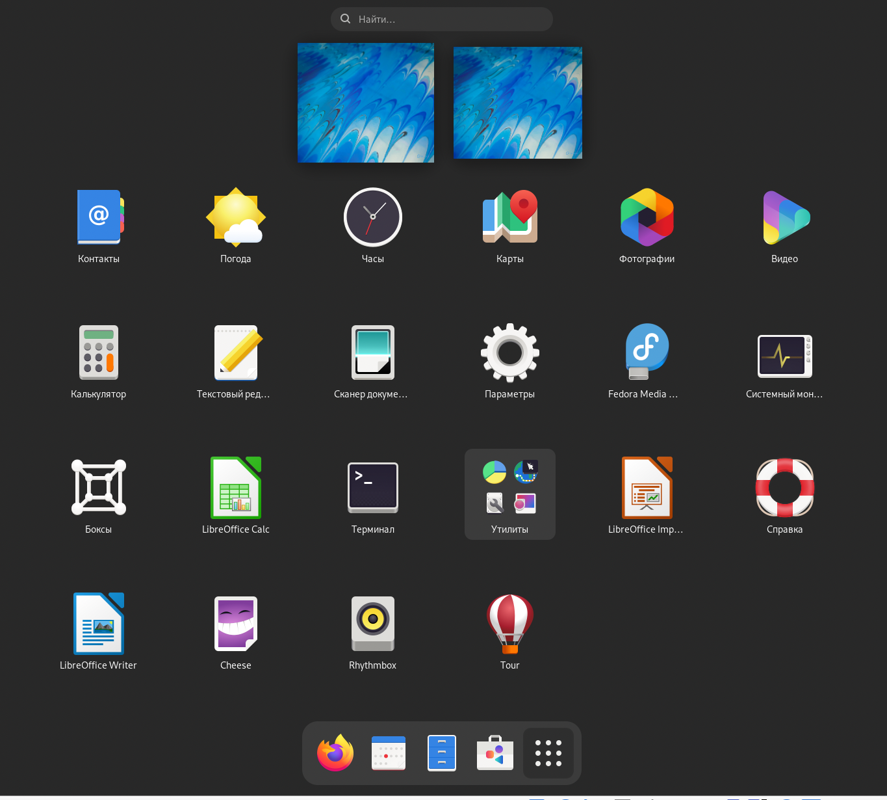{ #fig:001 width=70% }

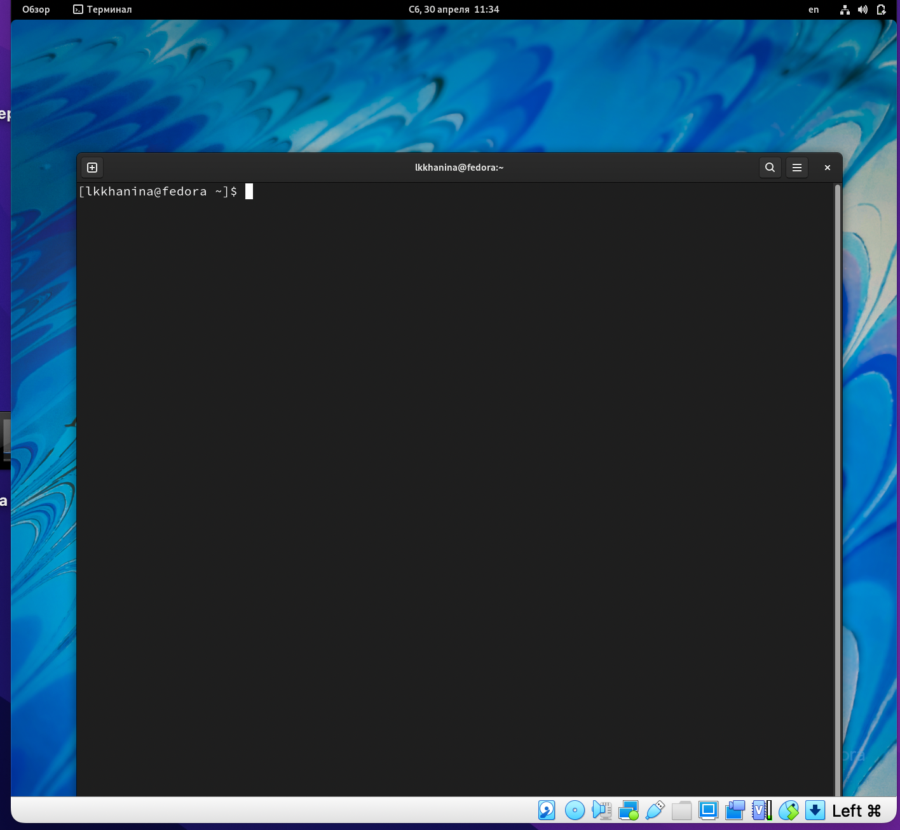{ #fig:001 width=70% }

## Чтобы определить полное имя домашнего каталога воспользуемся командой pwd

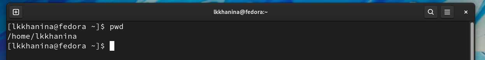{ #fig:001 width=70% }

## С помощью команды cd /tmp переходим в каталог tmp. Далее выводим его содержимое различными способами. Способ первый — ls. Способ второй — ls -a. Способ третий — ls -alF

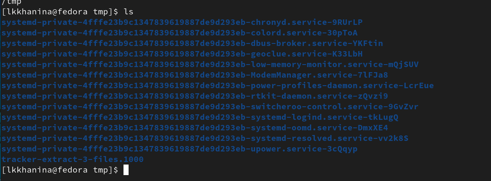{ #fig:001 width=70% }

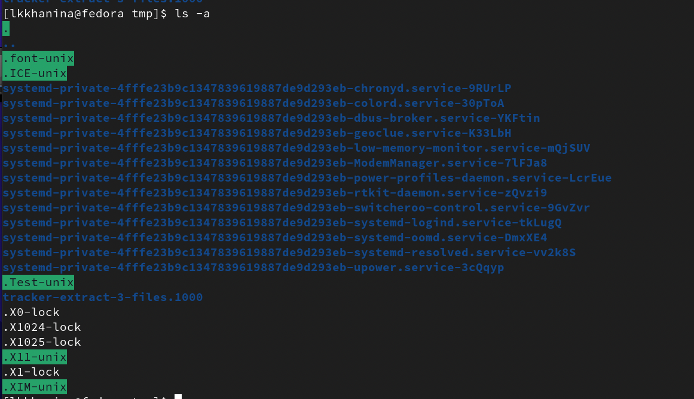{ #fig:001 width=70% }

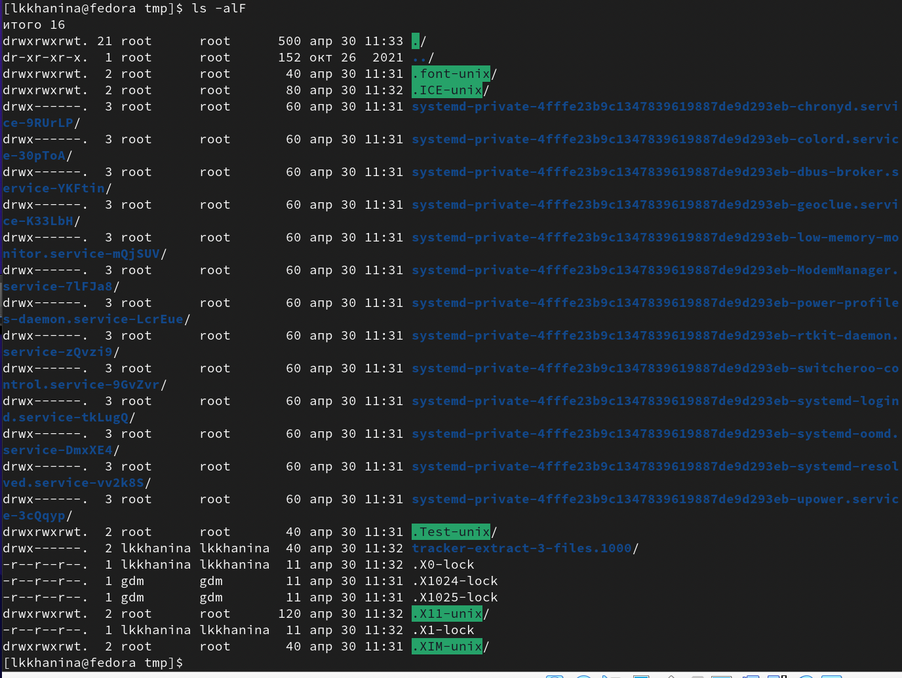{ #fig:001 width=70% }

## Чтобы определить, есть ли в каталоге spool подкаталог cron, с помощью команды cd /var/spool зайдем в каталог и воспользуемся командой ls -alF, чтобы узнать содержимое каталога. Убедимся, что данного подкаталога нет

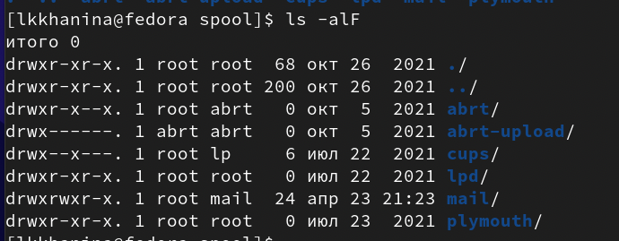{ #fig:001 width=70% }

## С помощью команды cd ~ переходим в домашний каталог. Далее вводим команду ls -alF. Видим, что владельцем каталогов и подкаталогов явлется lkkhanina, то есть я

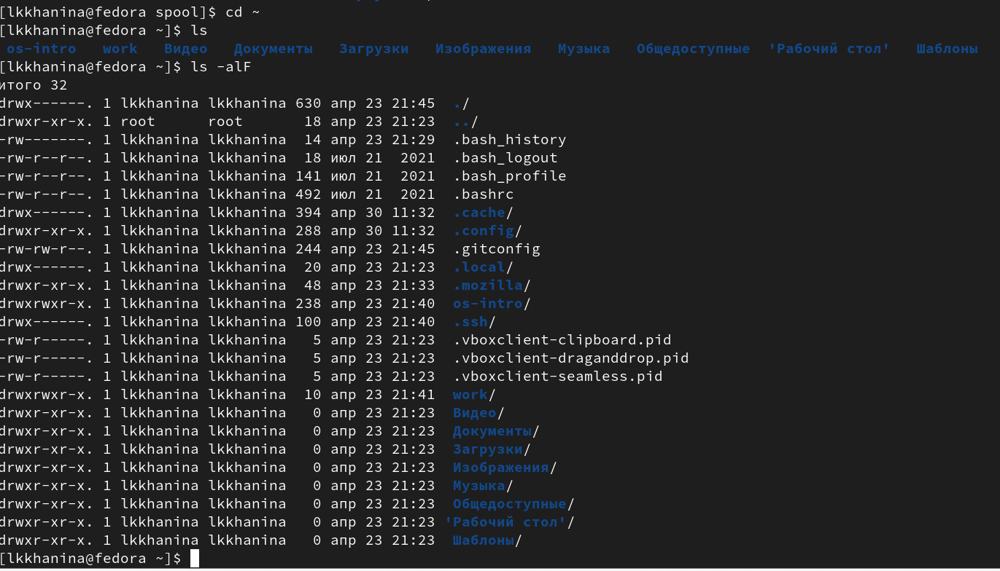{ #fig:001 width=70% }

## В домашнем каталоге с помощью команды mkdir newdir создаем каталог newdir. Далее переходим в него и аналогично создаем каталог morefun. Возвращаемся в домашний каталог

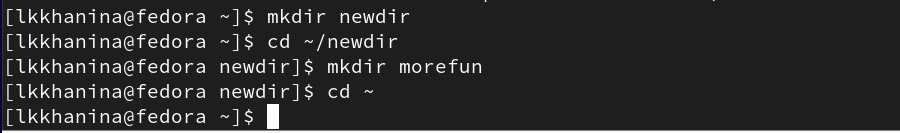{ #fig:001 width=70% }

## Далее создаем три новых каталога letters, memos, mist одной командой. Также одной командой их удаляем

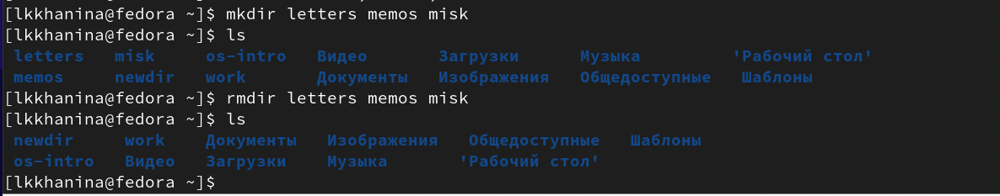{ #fig:001 width=70% }

## Попробуем удалить каталог newdir командой rm. Заметим, что выпадет ошибка, так как каталог не пуст. Необходимо дополнительно использовать опцию -r, которая рекурсивно проходится по подкаталогам, удаляет их, а потом и сам каталог. Проверим это

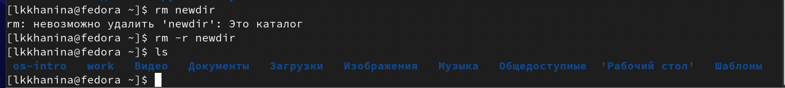{ #fig:001 width=70% }

##  Используем команду man ls, чтобы узнать информацию о команде ls. Найдем опцию -R, из-за которой программа рекурсивно заходит в каталоги и выводит их содержимое

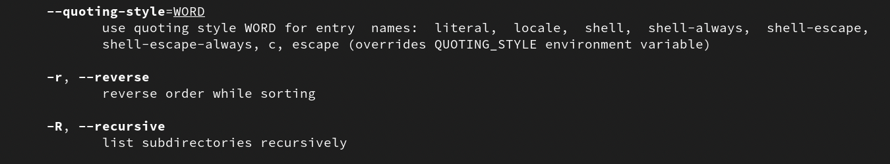{ #fig:001 width=70% }

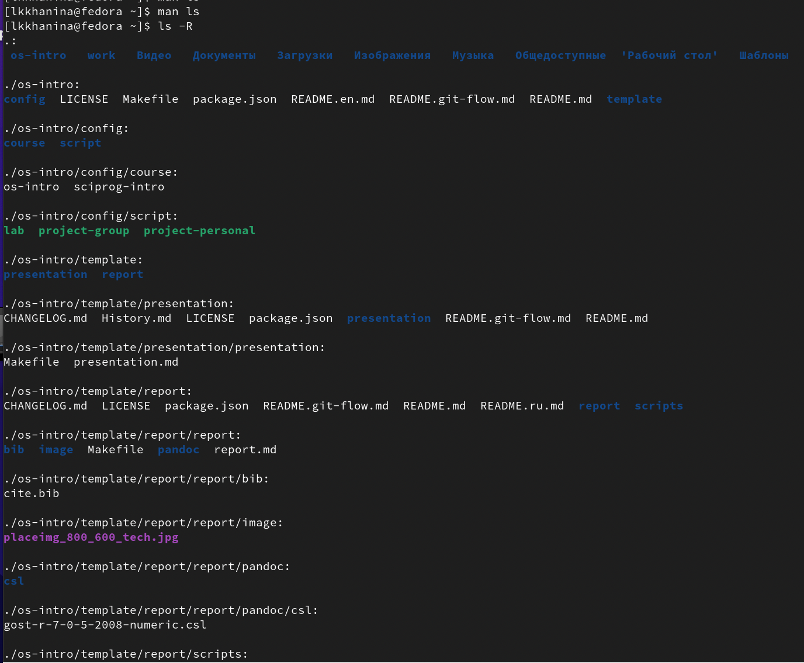{ #fig:001 width=70% }

## Опять спользуем команду man ls. Найдем опцию -t, из-за которой программа сортирует каталоги по времени последнего изменения. Также воспользуемся уже известной опцией -l, из-за которой программа выводит различную информацию о файлах/каталогах

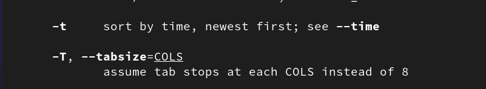{ #fig:001 width=70% }

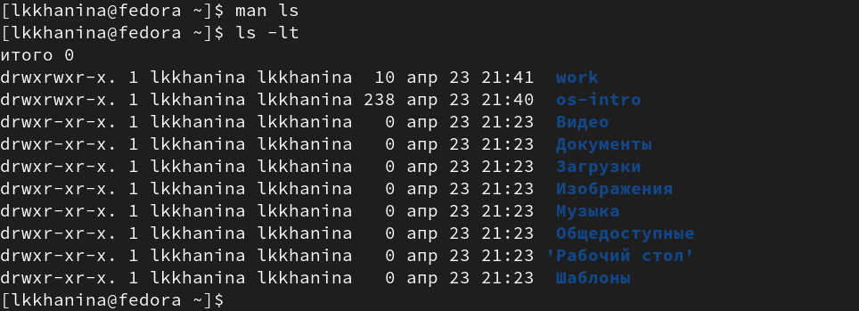{ #fig:001 width=70% }

## Воспользуемся командой man cd, чтобы получше узнать опции cd

* -P : позволяет следовать по символическим ссылкам перед тем, как будут обработаны все переходы "..".
* -L : переходит по символическим ссылкам только после того, как были обработаны "..".
* -e : если папку, в которую нужно перейти не удалось найти - выдает ошибку.

## Далее смотрим man pwd, чтобы получше узнать опции pwd

* -L : выводит путь даже с символическими ссылками. 
* -P : избегает символические ссылки. 
* --help : помощь по команде. 
* --version : версия утилиты.

## Далее смотрим man mkdir, чтобы получше узнать опции mkdir

* -m : устанавливает права доступа для создаваемого каталога. 
* -p : создает все каталоги, указанные в пути. 
* -v : пвыводит сообщение при создании каталога. 
* -Z : устанавливает контекст SELinux для каталога по умолчанию. 

## Далее смотрим man rmdir, чтобы получше узнать опции rmdir

* -v : отображение подробной информации для обработанного каталога. 
* -p : удаляет все каталоги, указанные в пути. 
* --help : помощь по команде. 
* --version : версия утилиты. 

## Далее смотрим man rm, чтобы получше узнать опции rm

* -r : рекурсивное удаление каталогов. 
* -d : удаление пустых каталогов. 
* -v : выводить информацию об удаляемых файлах. 

## Чтобы вывести историю команд, воспользуемся командой history. Чтобы исполнить некоторую команду из списка воспользуемся командой !<номер команды>. В случае модификации необходимо придерживаться следующего вида !<номер команды>:s/<что меняем>/<на что меняем>

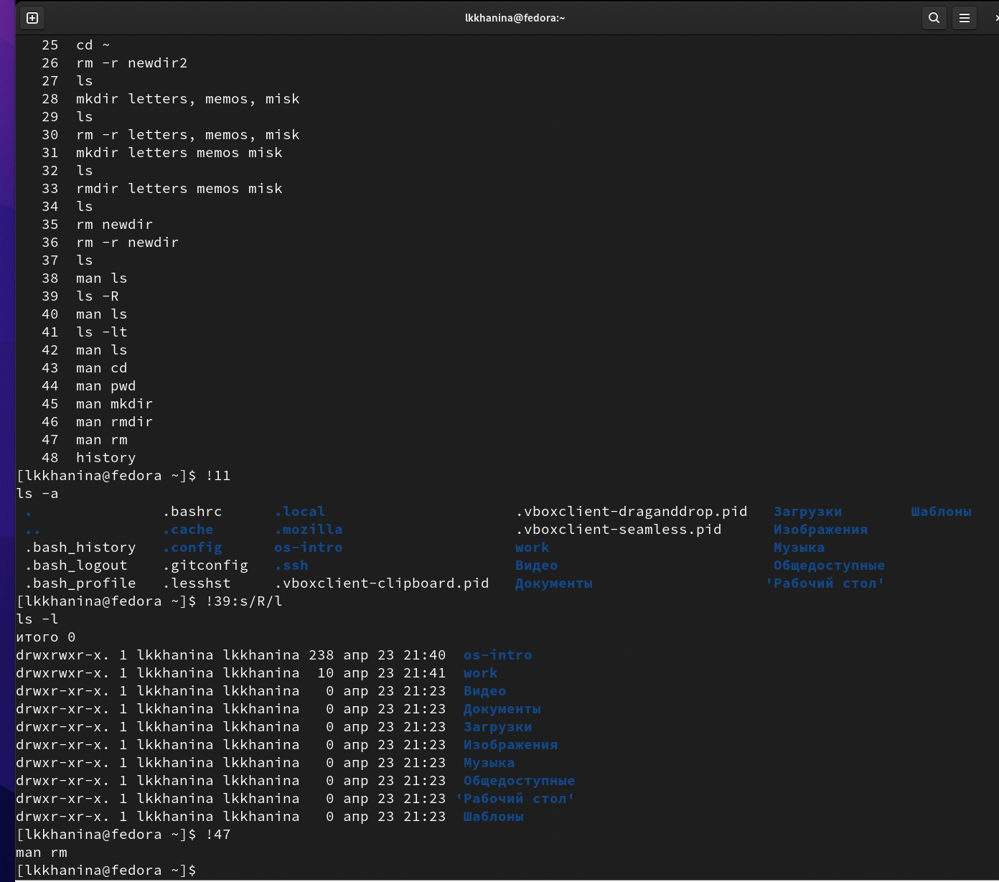{ #fig:001 width=70% }

# Контрольные вопросы

1. Командная строка — программа, позволяющая управлять компьютером путем ввода команд с клавиатуры. 
2. С помощью команды pwd можно определить абсолютный путь. 
{ #fig:001 width=70% }
3. С помощью команды ls -F можно определить тип файлов и их имена. 
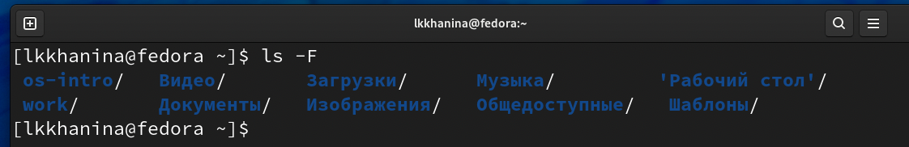{ #fig:001 width=70% }
4. С помощью команды ls -a можно отобразить информацию о скрытых файлах. 
{ #fig:001 width=70% }
5. С помощью команды rm можно удалить файл и каталог. Также можно использовать команду mkdir, но только в том случае, если каталог пусть. Иначе стоит воспользовать командой rm с опцией -r, то есть rm -r. 
6. C помощью команды history можно вывести информацию о последних выполненных пользователем командах. 
7. Чтобы модифицировать историю выполненных программ, нужно написать следующую команду
```
!<номер команды>:s/<что меняем>/<на что меняем>
```
Вот пример модификации. 
{ #fig:001 width=70% }
8. Чтобы запустить несколько программ в одной строке, их нужно указать через ';'. Например, 
```
cd dir; mkdir new
```
{ #fig:001 width=70% }

9. Экранирование символов - замена в тексте управляющих символов на соответствующие текстовые подстановки. Например, cd dir/new приведет в new. 
10. После выполнения команды ls -l, на экране появится список каталогов и файлов с информацией о них (тип файла, право доступа, число ссылок, владелец, размер, дата последнего изменения, имя файла/каталога). 
11. Абсолютный путь файла — путь от корня к текущему каталогу/файлу. Например, /dir/new — абсолютный путь, new — относительный. 
12. C помощью команды man <название команды> можно получить информацию об этой команде. 
13. Клавиша Tab служит для автоматического дополнения вводимых команд. 


# Выводы

Я изучила базовые команды для работы с каталогами и файлами. Научилась создавать и удалять последнии, узнавать их содержимое.
