---
## Front matter
lang: ru-RU
title: Презентация лабораторной работы №5
author: |
	Ханина Людмила. Sevastianov\inst{1}
institute: |
	\inst{1}RUDN University, Moscow, Russian Federation
date: 30.04.2022

## Formatting
toc: false
slide_level: 2
theme: metropolis
header-includes: 
 - \metroset{progressbar=frametitle,sectionpage=progressbar,numbering=fraction}
 - '\makeatletter'
 - '\beamer@ignorenonframefalse'
 - '\makeatother'
aspectratio: 43
section-titles: true
---

# Презентация лабораторной работы №5

## Цель

Ознакомление с файловой системой Linux, её структурой, именами и содержанием каталогов. Приобретение практических навыков по применению команд для работы с файлами и каталогами, по управлению процессами (и работами), по проверке использования диска и обслуживанию файловой системы.

## Задание

1. Выполните все примеры,приведённые в первой части описания лабораторной работы.
2. Выполните следующие действия, зафиксировав в отчёте по лабораторной работе используемые при этом команды и результаты их выполнения:
2.1. Скопируйте файл /usr/include/sys/io.h в домашний каталог и назовите его equipment. Если файла io.h нет, то используйте любой другой файл в каталоге
/usr/include/sys/ вместо него.
2.2. В домашнем каталоге создайте директорию ~/ski.plases.
2.3. Переместите файл equipment в каталог ~/ski.plases.
2.4. Переименуйте файл ~/ski.plases/equipment в ~/ski.plases/equiplist.
2.5. Создайте в домашнем каталоге файл abc1 и скопируйте его в каталог ~/ski.plases, назовите его equiplist2.
2.6. Создайте каталог с именемe quipment в каталоге ~/ski.plases.
2.7. Переместите файлы ~/ski.plases/equiplist и equiplist2 в каталог ~/ski.plases/equipment.
2.8. Создайте и переместите каталог ~/newdir в каталог ~/ski.plases и назовите его plans.
3. Определите опции команды chmod, необходимые для того,чтобы присвоить перечисленным ниже файлам выделенные права доступа, считая, что в начале таких прав нет:
3.1. drwxr--r-- ...   australia
3.2. drwx--x--x ...   play
3.3. -r-xr--r-- ...   my_os
3.4. -rw-rw-r-- ...   feathers
При необходимости создайте нужные файлы.
4. Проделайте приведённые ниже упражнения, записывая в отчёт по лабораторной работе используемые при этом команды:
4.1. Просмотрите содержимое файла /etc/password.
4.2. Скопируйте файл ~/feathers в файл~/file.old.
4.3. Переместите файл ~/file.old в каталог ~/play.
4.4. Скопируйте каталог ~/play в каталог ~/fun.
4.5. Переместите каталог ~/fun в каталог ~/play и назовите его games.
4.6. Лишите владельца файла ~/feathers права на чтение.
4.7. Что произойдёт, если вы попытаетесь просмотреть файл ~/feathers командой cat?
4.8. Чтопроизойдёт,есливыпопытаетесьскопироватьфайл~/feathers?
4.9. Дайте владельцу файла ~/feathers право на чтение.
4.10. Лишите владельца каталога ~/play права на выполнение.
4.11. Перейдите в каталог ~/play. Что произошло?
4.12. Дайте владельцу каталога ~/play право на выполнение.
5. Прочитайте man по командам mount,fsck,mkfs,kill и кратко их охарактеризуйте, приведя примеры.

# Выполнение лабораторной работы

## Выолняем примеры из первой части описания лабораторной работы

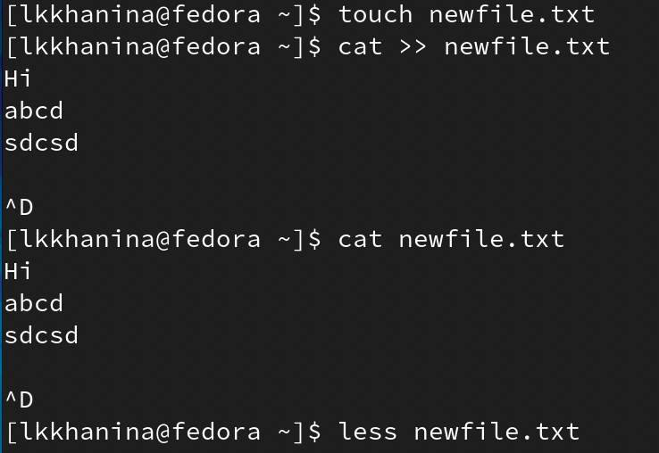{ #fig:001 width=70% }

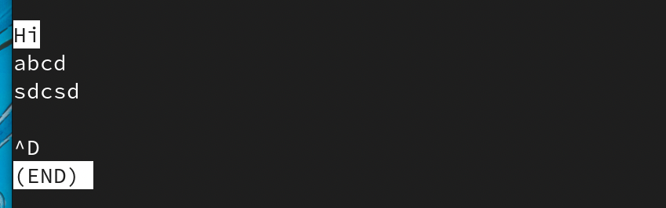{ #fig:001 width=70% }

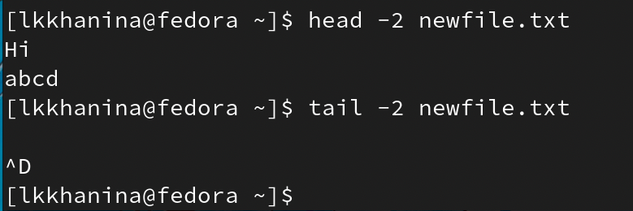{ #fig:001 width=70% }

## Скопируем файл /usr/include/sys/io.h в домашний каталог, переименуем его в equipment. Перед этим проверим, что нужный файл существует

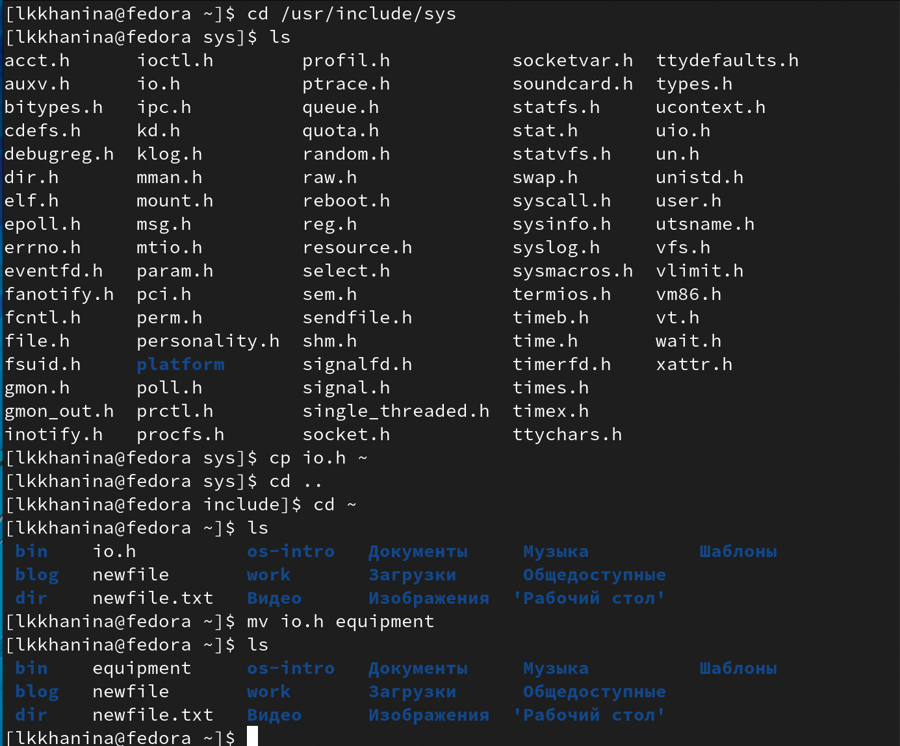{ #fig:001 width=70% }

## Далее создаем директорию ~/ski.places. Туда перемещаем файл equipment и переименовываем его в equiplist

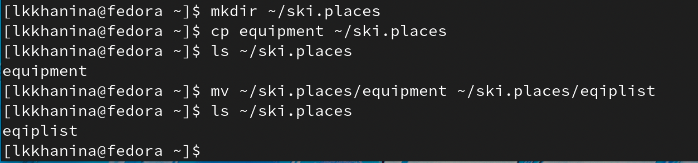{ #fig:001 width=70% }

## В домашнем каталоге создаем файл abc1, который сразу копируем в ~/ski.places и называем equiplis2

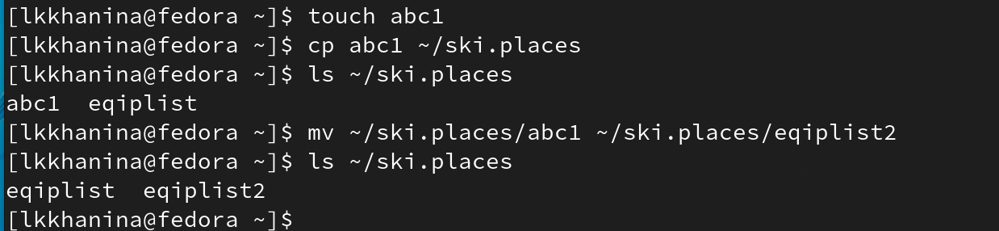{ #fig:001 width=70% }

## Далее создадим каталог equipment в ~/ski.places и переместим в него файлы equiplist и equiplist2

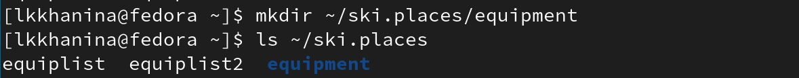{ #fig:001 width=70% }

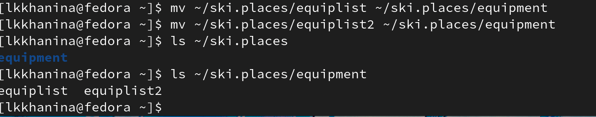{ #fig:001 width=70% }

## Создаем и перемещаем каталог ~/newdir в каталог ~/ski.places. Называем его plans

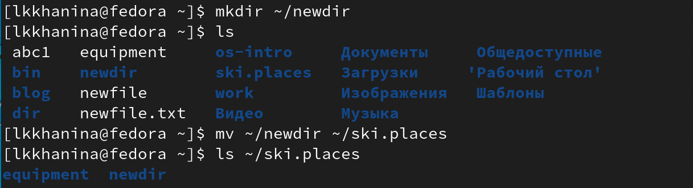{ #fig:001 width=70% }

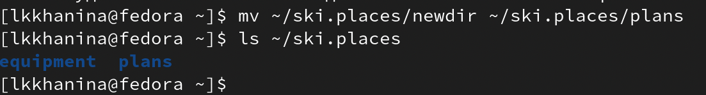{ #fig:001 width=70% }

## Посмотрим на текущий доступ к australia, play, my_os, feathers

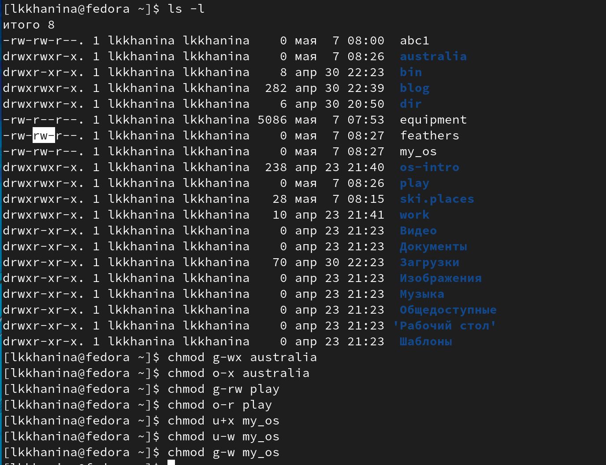{ #fig:001 width=70% }

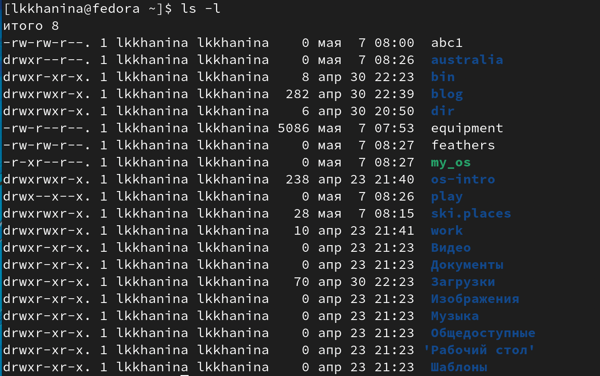{ #fig:001 width=70% }

## Копируем файл ~/feathers в файл ~/file.old и перемещаем файл ~/file.old в каталог ~/play. Копируем каталог ~/play в ~/fun и перемещаем каталог ~/fun в ~/play и переименовываем его в games

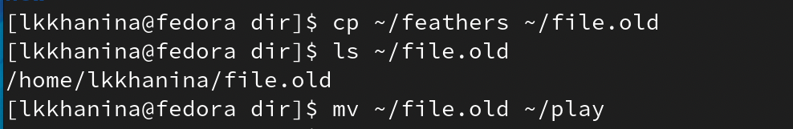{ #fig:001 width=70% }

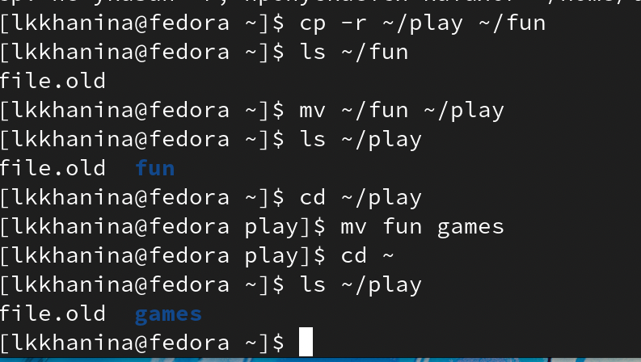{ #fig:001 width=70% }

##  Лишаем владельца файла ~/feathers права на чтение

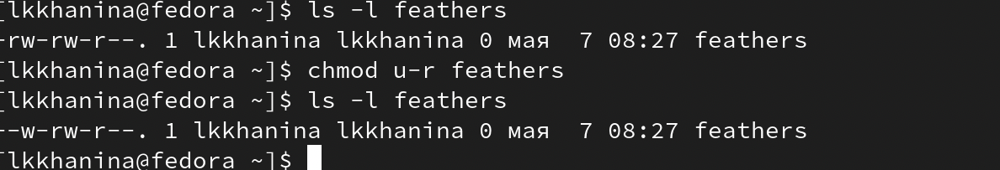{ #fig:001 width=70% }

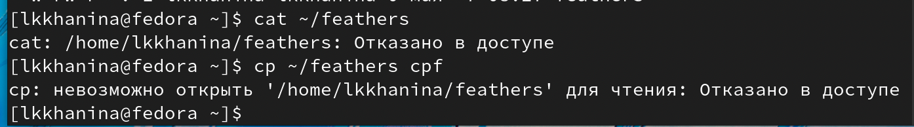{ #fig:001 width=70% }

## Лишаем владельца каталога ~/play права на выполнение

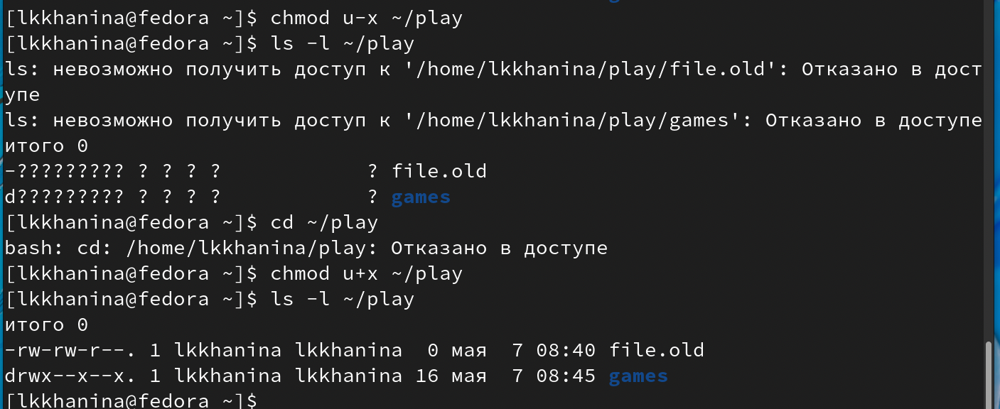{ #fig:001 width=70% }

## Команда mount монтирует устройство и позволяет присоединить хранящиеся на нем файлы к общему дереву каталога

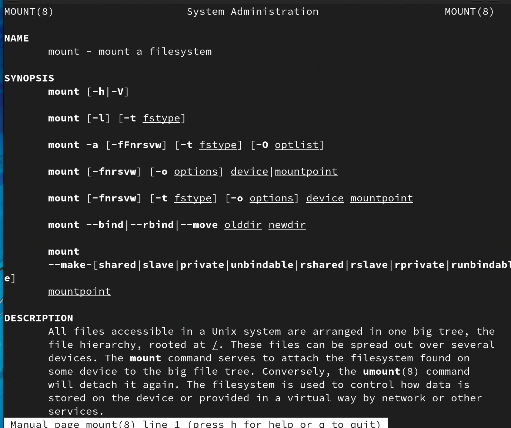{ #fig:001 width=70% }

## Команда fsck проверяет файловые системы на наличие ошибок или нерешенных проблем

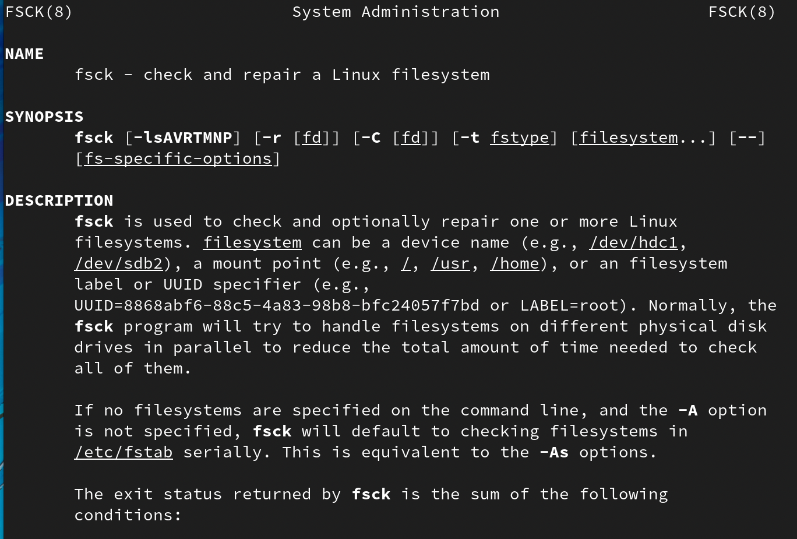{ #fig:001 width=70% }

## Команда mkfs создаeт новую файловую систему Linux

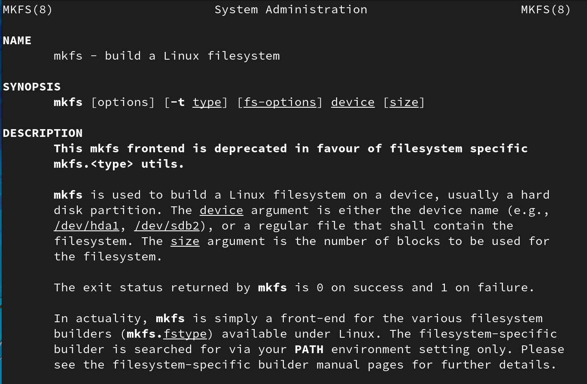{ #fig:001 width=70% }

## Команда kill посылает сигнал процессу, обычно используется для прерывание процесса

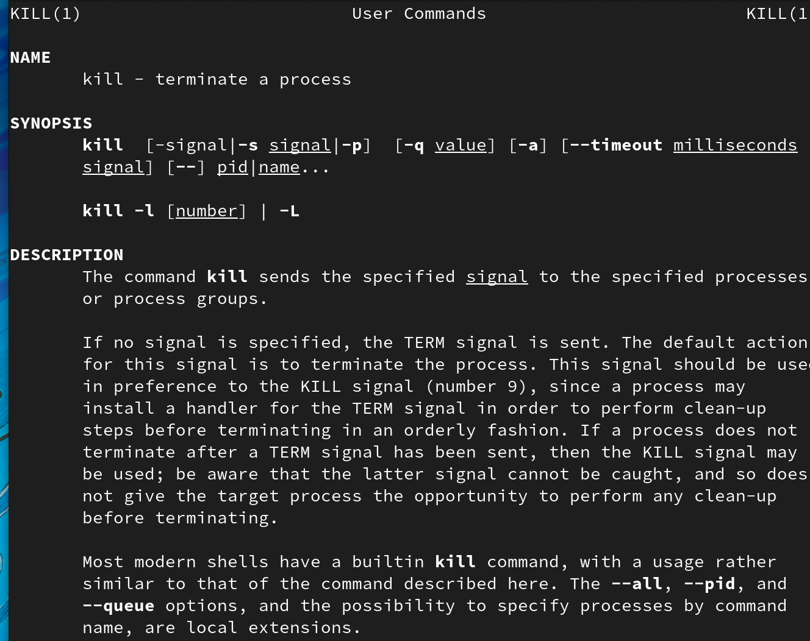{ #fig:001 width=70% }

# Выводы

Я изучила команды для перемещения файлов и каталогов и научилась менять доступ к файлам. 
