---
## Front matter
title: "Лабораторная работа №5"
author: "Ханина Людмила Константиновна"

## Generic otions
lang: ru-RU
toc-title: "Содержание"

## Bibliography
bibliography: bib/cite.bib
csl: pandoc/csl/gost-r-7-0-5-2008-numeric.csl

## Pdf output format
toc: true # Table of contents
toc-depth: 2
lof: true # List of figures
lot: true # List of tables
fontsize: 12pt
linestretch: 1.5
papersize: a4
documentclass: scrreprt
## I18n polyglossia
polyglossia-lang:
  name: russian
  options:
	- spelling=modern
	- babelshorthands=true
polyglossia-otherlangs:
  name: english
## I18n babel
babel-lang: russian
## Fonts
mainfont: PT Serif
romanfont: PT Serif
sansfont: PT Sans
monofont: PT Mono
mainfontoptions: Ligatures=TeX
romanfontoptions: Ligatures=TeX
sansfontoptions: Ligatures=TeX,Scale=MatchLowercase
monofontoptions: Scale=MatchLowercase,Scale=0.9
## Biblatex
biblatex: true
biblio-style: "gost-numeric"
biblatexoptions:
  - parentracker=true
  - backend=biber
  - hyperref=auto
  - language=auto
  - autolang=other*
  - citestyle=gost-numeric
## Pandoc-crossref LaTeX customization
figureTitle: "Рис."
tableTitle: "Таблица"
listingTitle: "Листинг"
lofTitle: "Список иллюстраций"
lotTitle: "Список таблиц"
lolTitle: "Листинги"
## Misc options
indent: true
header-includes:
  - \usepackage{indentfirst}
  - \usepackage{float} # keep figures where there are in the text
  - \floatplacement{figure}{H} # keep figures where there are in the text
---

# Цель работы

Ознакомление с файловой системой Linux, её структурой, именами и содержанием каталогов. Приобретение практических навыков по применению команд для работы с файлами и каталогами, по управлению процессами (и работами), по проверке использования диска и обслуживанию файловой системы.

# Задание

1. Выполните все примеры,приведённые в первой части описания лабораторной работы.
2. Выполните следующие действия, зафиксировав в отчёте по лабораторной работе используемые при этом команды и результаты их выполнения:
2.1. Скопируйте файл /usr/include/sys/io.h в домашний каталог и назовите его equipment. Если файла io.h нет, то используйте любой другой файл в каталоге
/usr/include/sys/ вместо него.
2.2. В домашнем каталоге создайте директорию ~/ski.plases.
2.3. Переместите файл equipment в каталог ~/ski.plases.
2.4. Переименуйте файл ~/ski.plases/equipment в ~/ski.plases/equiplist.
2.5. Создайте в домашнем каталоге файл abc1 и скопируйте его в каталог ~/ski.plases, назовите его equiplist2.
2.6. Создайте каталог с именемe quipment в каталоге ~/ski.plases.
2.7. Переместите файлы ~/ski.plases/equiplist и equiplist2 в каталог ~/ski.plases/equipment.
2.8. Создайте и переместите каталог ~/newdir в каталог ~/ski.plases и назовите его plans.
3. Определите опции команды chmod, необходимые для того,чтобы присвоить перечисленным ниже файлам выделенные права доступа, считая, что в начале таких прав нет:
3.1. drwxr--r-- ...   australia
3.2. drwx--x--x ...   play
3.3. -r-xr--r-- ...   my_os
3.4. -rw-rw-r-- ...   feathers
При необходимости создайте нужные файлы.
4. Проделайте приведённые ниже упражнения, записывая в отчёт по лабораторной работе используемые при этом команды:
4.1. Просмотрите содержимое файла /etc/password.
4.2. Скопируйте файл ~/feathers в файл~/file.old.
4.3. Переместите файл ~/file.old в каталог ~/play.
4.4. Скопируйте каталог ~/play в каталог ~/fun.
4.5. Переместите каталог ~/fun в каталог ~/play и назовите его games.
4.6. Лишите владельца файла ~/feathers права на чтение.
4.7. Что произойдёт, если вы попытаетесь просмотреть файл ~/feathers командой cat?
4.8. Чтопроизойдёт,есливыпопытаетесьскопироватьфайл~/feathers?
4.9. Дайте владельцу файла ~/feathers право на чтение.
4.10. Лишите владельца каталога ~/play права на выполнение.
4.11. Перейдите в каталог ~/play. Что произошло?
4.12. Дайте владельцу каталога ~/play право на выполнение.
5. Прочитайте man по командам mount,fsck,mkfs,kill и кратко их охарактеризуйте, приведя примеры.

# Теоретическое введение

| Команда | Значение команды                                                                                                        |
|--------------|----------------------------------------------------------------------------------------------------------------------------|
| `cp file tofile`          | Скопировать файл file в файл tofile      |
| `mv file todirectory`     | Переместить файл file в файл tofile    |
| `man command`       | Узнать информацию о команде command     |
| `ls -l`      | Узнать содержимое каталога и информацию о нем (владелец, доступ и прочее) |
| `chmod u-r file`     | Лишить владельца файла права на чтение файлы file    |
| `chmod g+x file`      | Лишить группу права на исполнение файлы file    |

# Выполнение лабораторной работы

1. Выолняем примеры из первой части описания лабораторной работы. Дополнительно я записала в файл пару строк. 

{ #fig:001 width=70% }

{ #fig:001 width=70% }

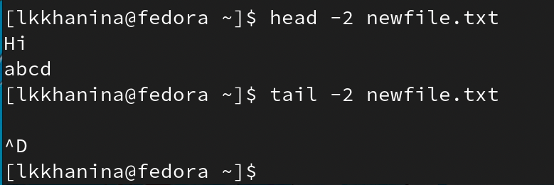{ #fig:001 width=70% }

2. Скопируем файл /usr/include/sys/io.h в домашний каталог, переименуем его в equipment. Перед этим проверим, что нужный файл существует. 

{ #fig:001 width=70% }

3. Далее создаем директорию ~/ski.places. Туда перемещаем файл equipment и переименовываем его в equiplist. 

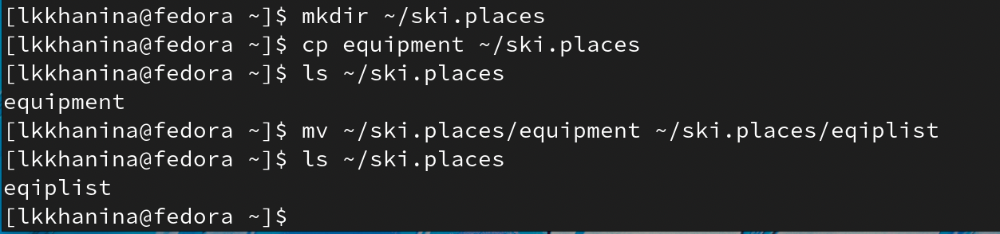{ #fig:001 width=70% }

4. В домашнем каталоге создаем файл abc1, который сразу копируем в ~/ski.places и называем equiplis2. При переимновании я допустила ошибку, поэтому меняю названия файлам. 

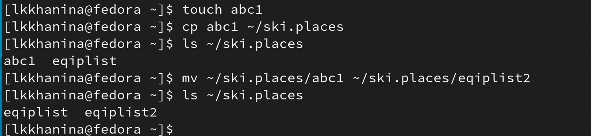{ #fig:001 width=70% }

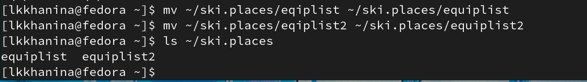{ #fig:001 width=70% }

5. Далее создадим каталог equipment в ~/ski.places и переместим в него файлы equiplist и equiplist2. 

{ #fig:001 width=70% }

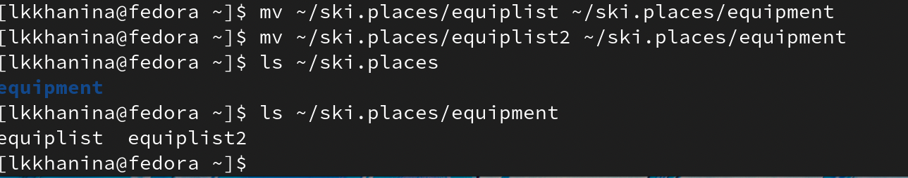{ #fig:001 width=70% }

6. Создаем и перемещаем каталог ~/newdir в каталог ~/ski.places. Называем его plans. 

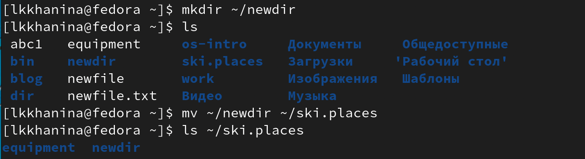{ #fig:001 width=70% }

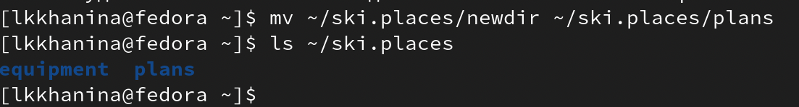{ #fig:001 width=70% }

7. Для начала посмотрим типы australia, play, my_os, feathers. Аргумент d сообщает, что australia, play — каталоги, а play, my_os — файлы. Создаем их. 

{ #fig:001 width=70% }

Посмотрим на текущий доступ к файлам. У australia владелец имеет полный доступ (rwx); группа тоже имеет полный доступ (rwx), поэтому отнимаем право изменять и исполнять (g-wx); остальные могут читать и исполнять (rx), оставляем только чтение (o-x). 

У каталога play с правами владельца все так, как нужно (rwx); у группы необходимо забрать права на чтение и запись (g-rw); всем остальным нужно запретить читать (o-r). 

У файла my_os у владельца необходимо забрать право на запись (u-w) и добавить право на исполнение (u+x); у группы нужно отнять право на запись (g-w); у остальных права такие, как нам нужно. 

Права feathers менять не надо. 

{ #fig:001 width=70% }

{ #fig:001 width=70% }

8. Чтобы посмотреть содержимое файла, вводим команду

```
cat /etc/password
```

9. Копируем файл ~/feathers в файл ~/file.old и перемещаем файл ~/file.old в каталог ~/play.

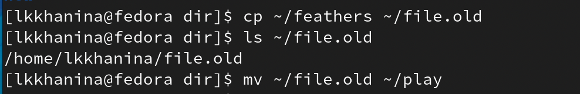{ #fig:001 width=70% }

10. Копируем каталог ~/play в ~/fun командой

```
cp ~/play ~/fun
```

Затем перемещаем каталог ~/fun в ~/play и переименовываем его в games. 

{ #fig:001 width=70% }

11. Лишаем владельца файла ~/feathers права на чтение. Теперь мы не сможем просмотреть (прочитать) содержимое файла и скопировать его, так как нет доступа к чтению. 

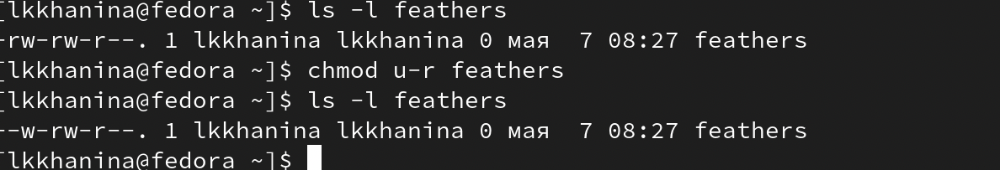{ #fig:001 width=70% }

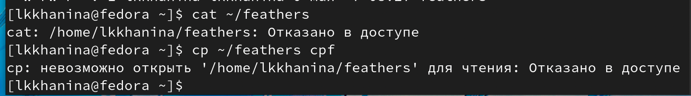{ #fig:001 width=70% }

Даем владельцу файла ~/feathers право на чтение командой

```
chmod u+r ~/feathers
```

12. Лишаем владельца каталога ~/play права на выполнение. Теперь мы не можем зайти в этот каталог. Возвращаем право. 

{ #fig:001 width=70% }

13. Cмотрим man mount. Узнаем, что команда mount монтирует устройство и позволяет присоединить хранящиеся на нем файлы к общему дереву каталого

{ #fig:001 width=70% }

```
mount /dir /newdir
```

В примере мы присоединили /dir к /newdir. 

14. Далее смотрим man fsck. Узнаем, что команда fsck проверяет файловые системы на наличие ошибок или нерешенных проблем.

{ #fig:001 width=70% }

Например, проверим состояние каталога dir. 

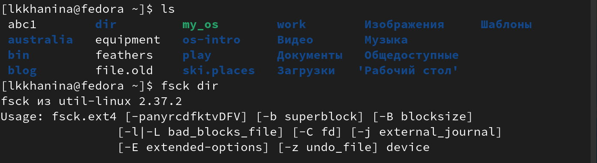{ #fig:001 width=70% }

15. Далее смотрим man mkfs. Узнаем, что команда mkfs создаeт новую файловую систему Linux.

{ #fig:001 width=70% }

16. Далее смотрим man kill. Узнаем, что команда kill посылает сигнал процессу, обычно используется для прерывание процесса.

{ #fig:001 width=70% }

Например, посмотрим на список возможных сигналов. 

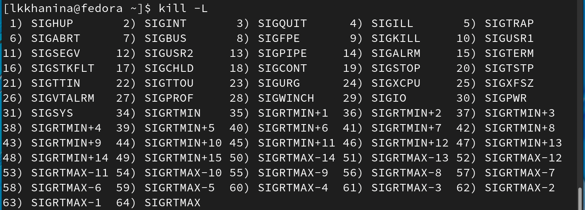{ #fig:001 width=70% }

# Контрольные вопросы

1. Командная строка — программа, позволяющая управлять компьютером путем ввода команд с клавиатуры. 
2. С помощью команды pwd можно определить абсолютный путь. 
{ #fig:001 width=70% }
3. С помощью команды ls -F можно определить тип файлов и их имена. 
{ #fig:001 width=70% }
4. С помощью команды ls -a можно отобразить информацию о скрытых файлах. 
{ #fig:001 width=70% }
5. С помощью команды rm можно удалить файл и каталог. Также можно использовать команду mkdir, но только в том случае, если каталог пусть. Иначе стоит воспользовать командой rm с опцией -r, то есть rm -r. 
6. C помощью команды history можно вывести информацию о последних выполненных пользователем командах. 
7. Чтобы модифицировать историю выполненных программ, нужно написать следующую команду
```
!<номер команды>:s/<что меняем>/<на что меняем>
```
Вот пример модификации. 
{ #fig:001 width=70% }
8. Чтобы запустить несколько программ в одной строке, их нужно указать через ';'. Например, 
```
cd dir; mkdir new
```
{ #fig:001 width=70% }

9. Экранирование символов - замена в тексте управляющих символов на соответствующие текстовые подстановки. Например, cd dir/new приведет в new. 
10. После выполнения команды ls -l, на экране появится список каталогов и файлов с информацией о них (тип файла, право доступа, число ссылок, владелец, размер, дата последнего изменения, имя файла/каталога). 
11. Абсолютный путь файла — путь от корня к текущему каталогу/файлу. Например, /dir/new — абсолютный путь, new — относительный. 
12. C помощью команды man <название команды> можно получить информацию об этой команде. 
13. Клавиша Tab служит для автоматического дополнения вводимых команд. 

# Выводы

Я изучила базовые команды для работы с каталогами и файлами. Научилась создавать и удалять последнии, узнавать их содержимое. 
