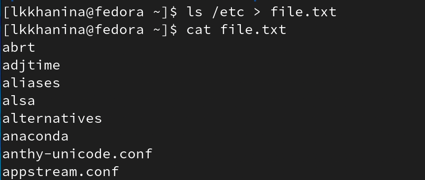
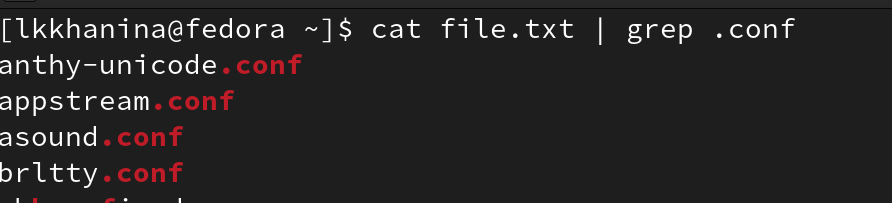
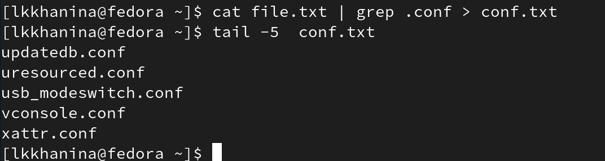
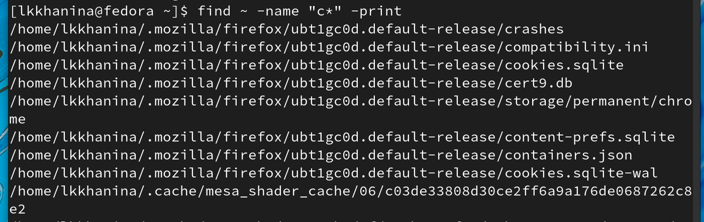
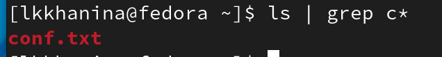

---
## Front matter
title: "Лабораторная работа №6"
author: "Ханина Людмила Константиновна"

## Generic otions
lang: ru-RU
toc-title: "Содержание"

## Bibliography
bibliography: bib/cite.bib
csl: pandoc/csl/gost-r-7-0-5-2008-numeric.csl

## Pdf output format
toc: true # Table of contents
toc-depth: 2
lof: true # List of figures
lot: true # List of tables
fontsize: 12pt
linestretch: 1.5
papersize: a4
documentclass: scrreprt
## I18n polyglossia
polyglossia-lang:
  name: russian
  options:
	- spelling=modern
	- babelshorthands=true
polyglossia-otherlangs:
  name: english
## I18n babel
babel-lang: russian
## Fonts
mainfont: PT Serif
romanfont: PT Serif
sansfont: PT Sans
monofont: PT Mono
mainfontoptions: Ligatures=TeX
romanfontoptions: Ligatures=TeX
sansfontoptions: Ligatures=TeX,Scale=MatchLowercase
monofontoptions: Scale=MatchLowercase,Scale=0.9
## Biblatex
biblatex: true
biblio-style: "gost-numeric"
biblatexoptions:
  - parentracker=true
  - backend=biber
  - hyperref=auto
  - language=auto
  - autolang=other*
  - citestyle=gost-numeric
## Pandoc-crossref LaTeX customization
figureTitle: "Рис."
tableTitle: "Таблица"
listingTitle: "Листинг"
lofTitle: "Список иллюстраций"
lotTitle: "Список таблиц"
lolTitle: "Листинги"
## Misc options
indent: true
header-includes:
  - \usepackage{indentfirst}
  - \usepackage{float} # keep figures where there are in the text
  - \floatplacement{figure}{H} # keep figures where there are in the text
---

# Цель работы

Ознакомление с файловой системой Linux, её структурой, именами и содержанием каталогов. Приобретение практических навыков по применению команд для работы с файлами и каталогами, по управлению процессами (и работами), по проверке использования диска и обслуживанию файловой системы.

# Задание

1. Выполните все примеры,приведённые в первой части описания лабораторной работы.
2. Выполните следующие действия, зафиксировав в отчёте по лабораторной работе используемые при этом команды и результаты их выполнения:
2.1. Скопируйте файл /usr/include/sys/io.h в домашний каталог и назовите его equipment. Если файла io.h нет, то используйте любой другой файл в каталоге
/usr/include/sys/ вместо него.
2.2. В домашнем каталоге создайте директорию ~/ski.plases.
2.3. Переместите файл equipment в каталог ~/ski.plases.
2.4. Переименуйте файл ~/ski.plases/equipment в ~/ski.plases/equiplist.
2.5. Создайте в домашнем каталоге файл abc1 и скопируйте его в каталог ~/ski.plases, назовите его equiplist2.
2.6. Создайте каталог с именемe quipment в каталоге ~/ski.plases.
2.7. Переместите файлы ~/ski.plases/equiplist и equiplist2 в каталог ~/ski.plases/equipment.
2.8. Создайте и переместите каталог ~/newdir в каталог ~/ski.plases и назовите его plans.
3. Определите опции команды chmod, необходимые для того,чтобы присвоить перечисленным ниже файлам выделенные права доступа, считая, что в начале таких прав нет:
3.1. drwxr--r-- ...   australia
3.2. drwx--x--x ...   play
3.3. -r-xr--r-- ...   my_os
3.4. -rw-rw-r-- ...   feathers
При необходимости создайте нужные файлы.
4. Проделайте приведённые ниже упражнения, записывая в отчёт по лабораторной работе используемые при этом команды:
4.1. Просмотрите содержимое файла /etc/password.
4.2. Скопируйте файл /feathers в файл /file.old.
4.3. Переместите файл  /file.old в каталог ~/play.
4.4. Скопируйте каталог ~/play в каталог ~/fun.
4.5. Переместите каталог ~/fun в каталог ~/play и назовите его games.
4.6. Лишите владельца файла ~/feathers права на чтение.
4.7. Что произойдёт, если вы попытаетесь просмотреть файл /feathers командой cat?
4.8. Что произойдёт,если вы попытаетесь скопировать файл ~/feathers?
4.9. Дайте владельцу файла ~/feathers право на чтение.
4.10. Лишите владельца каталога ~/play права на выполнение.
4.11. Перейдите в каталог ~/play. Что произошло?
4.12. Дайте владельцу каталога ~/play право на выполнение.
5. Прочитайте man по командам mount, fsck, mkfs, kill и кратко их охарактеризуйте, приведя примеры.

# Теоретическое введение

| Команда | Значение команды                                                                                                        |
|--------------|----------------------------------------------------------------------------------------------------------------------------|
| `cp file tofile`          | Скопировать файл file в файл tofile      |
| `mv file todirectory`     | Переместить файл file в файл tofile    |
| `man command`       | Узнать информацию о команде command     |
| `ls -l`      | Узнать содержимое каталога и информацию о нем (владелец, доступ и прочее) |
| `chmod u-r file`     | Лишить владельца файла права на чтение файлы file    |
| `chmod g+x file`      | Лишить группу права на исполнение файлы file    |

# Выполнение лабораторной работы

1. Выолняем примеры из первой части описания лабораторной работы. Дополнительно я записала в файл пару строк. 

{ #fig:001 width=70% }

{ #fig:001 width=70% }

{ #fig:001 width=70% }

2. Скопируем файл /usr/include/sys/io.h в домашний каталог, переименуем его в equipment. Перед этим проверим, что нужный файл существует. 

{ #fig:001 width=70% }

3. Далее создаем директорию ~/ski.places. Туда перемещаем файл equipment и переименовываем его в equiplist. 

{ #fig:001 width=70% }

4. В домашнем каталоге создаем файл abc1, который сразу копируем в ~/ski.places и называем equiplis2. При переимновании я допустила ошибку, поэтому меняю названия файлам. 

{ #fig:001 width=70% }

{ #fig:001 width=70% }

5. Далее создадим каталог equipment в ~/ski.places и переместим в него файлы equiplist и equiplist2. 

{ #fig:001 width=70% }

{ #fig:001 width=70% }

6. Создаем и перемещаем каталог ~/newdir в каталог ~/ski.places. Называем его plans. 

{ #fig:001 width=70% }

{ #fig:001 width=70% }

7. Для начала посмотрим типы australia, play, my_os, feathers. Аргумент d сообщает, что australia, play — каталоги, а play, my_os — файлы. Создаем их. 

{ #fig:001 width=70% }

Посмотрим на текущий доступ к файлам. У australia владелец имеет полный доступ (rwx); группа тоже имеет полный доступ (rwx), поэтому отнимаем право изменять и исполнять (g-wx); остальные могут читать и исполнять (rx), оставляем только чтение (o-x). 

У каталога play с правами владельца все так, как нужно (rwx); у группы необходимо забрать права на чтение и запись (g-rw); всем остальным нужно запретить читать (o-r). 

У файла my_os у владельца необходимо забрать право на запись (u-w) и добавить право на исполнение (u+x); у группы нужно отнять право на запись (g-w); у остальных права такие, как нам нужно. 

Права feathers менять не надо. 

{ #fig:001 width=70% }

{ #fig:001 width=70% }

8. Чтобы посмотреть содержимое файла, вводим команду

```
cat /etc/password
```

9. Копируем файл ~/feathers в файл ~/file.old и перемещаем файл ~/file.old в каталог ~/play.

{ #fig:001 width=70% }

10. Копируем каталог ~/play в ~/fun командой

```
cp ~/play ~/fun
```

Затем перемещаем каталог ~/fun в ~/play и переименовываем его в games. 

{ #fig:001 width=70% }

11. Лишаем владельца файла ~/feathers права на чтение. Теперь мы не сможем просмотреть (прочитать) содержимое файла и скопировать его, так как нет доступа к чтению. 

{ #fig:001 width=70% }

{ #fig:001 width=70% }

Даем владельцу файла ~/feathers право на чтение командой

```
chmod u+r ~/feathers
```

12. Лишаем владельца каталога ~/play права на выполнение. Теперь мы не можем зайти в этот каталог. Возвращаем право. 

{ #fig:001 width=70% }

13. Cмотрим man mount. Узнаем, что команда mount монтирует устройство и позволяет присоединить хранящиеся на нем файлы к общему дереву каталога. 

{ #fig:001 width=70% }

```
mount /dir /newdir
```

В примере мы присоединили /dir к /newdir. 

14. Далее смотрим man fsck. Узнаем, что команда fsck проверяет файловые системы на наличие ошибок или нерешенных проблем.

{ #fig:001 width=70% }

Например, проверим состояние каталога dir. 

{ #fig:001 width=70% }

15. Далее смотрим man mkfs. Узнаем, что команда mkfs создаeт новую файловую систему Linux.

{ #fig:001 width=70% }

16. Далее смотрим man kill. Узнаем, что команда kill посылает сигнал процессу, обычно используется для прерывание процесса.

{ #fig:001 width=70% }

Например, посмотрим на список возможных сигналов. 

{ #fig:001 width=70% }

# Контрольные вопросы

1. Ext2, Ext3, Ext4 или Extended Filesystem - это стандартная файловая система для Linux. Она самая стабильная из всех существующих, кодовая база изменяется очень редко и эта файловая система содержит больше всего функций. 

JFS или Journaled File System была разработана в IBM для AIX UNIX и использовалась в качестве альтернативы для файловых систем ext. Сейчас она используется там, где необходима высокая стабильность и минимальное потребление ресурсов. При разработке файловой системы ставилась цель создать максимально эффективную файловую систему для многопроцессорных компьютеров.

ReiserFS - была разработана намного позже, в качестве альтернативы ext3 с улучшенной производительностью и расширенными возможностями. Из особенностей можно отметить динамический размер блока, что позволяет упаковывать несколько небольших файлов в один блок, что предотвращает фрагментацию и улучшает работу с небольшими файлами. Еще одно преимущество - в возможности изменять размеры разделов на лету. Но минус в некоторой нестабильности и риске потери данных при отключении энергии.

XFS - это высокопроизводительная файловая система, разработанная в Silicon Graphics для собственной операционной системы еще в 2001 году. Из преимуществ файловой системы можно отметить высокую скорость работы с большими файлами, отложенное выделение места, увеличение разделов на лету и незначительный размер служебной информации.

XFS - журналируемая файловая система, однако в отличие от ext, в журнал записываются только изменения метаданных. Она используется по умолчанию в дистрибутивах на основе Red Hat. Из недостатков - это невозможность уменьшения размера, сложность восстановления данных и риск потери файлов при записи, если будет неожиданное отключение питания, поскольку большинство данных находится в памяти.

Btrfs или B-Tree File System - это совершенно новая файловая система, которая сосредоточена на отказоустойчивости, легкости администрирования и восстановления данных. Файловая система объединяет в себе очень много новых интересных возможностей, таких как размещение на нескольких разделах, поддержка подтомов, изменение размера не лету, создание мгновенных снимков, а также высокая производительность. Но многими пользователями файловая система Btrfs считается нестабильной.

2. / — root каталог. Содержит в себе всю иерархию системы;

/bin — здесь находятся двоичные исполняемые файлы. Основные общие команды, хранящиеся отдельно от других программ в системе (прим.: pwd, ls, cat, ps);

/boot — тут расположены файлы, используемые для загрузки системы (образ initrd, ядро vmlinuz);

/dev — в данной директории располагаются файлы устройств (драйверов). С помощью этих файлов можно взаимодействовать с устройствами. К примеру, если это жесткий диск, можно подключить его к файловой системе. В файл принтера же можно написать напрямую и отправить задание на печать;

/etc — в этой директории находятся файлы конфигураций программ. Эти файлы позволяют настраивать системы, сервисы, скрипты системных демонов;

/home — каталог, аналогичный каталогу Users в Windows. Содержит домашние каталоги учетных записей пользователей (кроме root). При создании нового пользователя здесь создается одноименный каталог с аналогичным именем и хранит личные файлы этого пользователя;

/lib — содержит системные библиотеки, с которыми работают программы и модули ядра;

/lost+found — содержит файлы, восстановленные после сбоя работы системы. Система проведет проверку после сбоя и найденные файлы можно будет посмотреть в данном каталоге;

/media — точка монтирования внешних носителей. Например, когда вы вставляете диск в дисковод, он будет автоматически смонтирован в директорию /media/cdrom;

/mnt — точка временного монтирования. Файловые системы подключаемых устройств обычно монтируются в этот каталог для временного использования;

/opt — тут расположены дополнительные (необязательные) приложения. Такие программы обычно не подчиняются принятой иерархии и хранят свои файлы в одном подкаталоге (бинарные, библиотеки, конфигурации);

/proc — содержит файлы, хранящие информацию о запущенных процессах и о состоянии ядра ОС;

/root — директория, которая содержит файлы и личные настройки суперпользователя;

/run — содержит файлы состояния приложений. Например, PID-файлы или UNIX-сокеты;

/sbin — аналогично /bin содержит бинарные файлы. Утилиты нужны для настройки и администрирования системы суперпользователем;

/srv — содержит файлы сервисов, предоставляемых сервером (прим. FTP или Apache HTTP);

/sys — содержит данные непосредственно о системе. Тут можно узнать информацию о ядре, драйверах и устройствах;

/tmp — содержит временные файлы. Данные файлы доступны всем пользователям на чтение и запись. Стоит отметить, что данный каталог очищается при перезагрузке;

/usr — содержит пользовательские приложения и утилиты второго уровня, используемые пользователями, а не системой. Содержимое доступно только для чтения (кроме root). Каталог имеет вторичную иерархию и похож на корневой;

/var — содержит переменные файлы. Имеет подкаталоги, отвечающие за отдельные переменные. Например, логи будут храниться в /var/log, кэш в /var/cache, очереди заданий в /var/spool/ и так далее.

3. Монтирование тома.

4. Отсутствие синхронизации между образом файловой системы в памяти и ее данными на диске в случае аварийного останова может привести к появлению следующих ошибок:

* Один блок адресуется несколькими mode (принадлежит нескольким файлам).

* Блок помечен как свободный, но в то же время занят (на него ссылается onode).

* Блок помечен как занятый, но в то же время свободен (ни один inode на него не ссылается).

* Неправильное число ссылок в inode (недостаток или избыток ссылающихся записей в каталогах).

* Несовпадение между размером файла и суммарным размером адресуемых inode блоков.

* Недопустимые адресуемые блоки (например, расположенные за пределами файловой системы).

* "Потерянные" файлы (правильные inode, на которые не ссылаются записи каталогов).

* Недопустимые или неразмещенные номера inode в записях каталогов.

Если нарушение все же произошло, на помощь может прийти утилита fsck(1M), производящая исправление файловой системы. Запуск этой утилиты может производиться автоматически каждый раз при запуске системы, или администратором, с помощью команды:
```
fsck [options] filesystem
```

5. С помощью команды mkfs.

6. Команда cat выводит содержимое файла. Команда less позволяет посмотреть файл построчно. Команда head -n выводит первые n строк, а команда tail -n выводит последние n строк. 

7. Команда cp позволяет копировать файлы и каталоги. 

8. Команда cp позволяет перемещать и переименовывать файлы и каталоги. 

9. Права доступа к файлу или каталогу можно изменить, воспользовавшись командой chmod. Сделать это может владелец файла (или каталога) или пользователь с правами администратора. Выбираем e/g/o, затем =/+/-, а потом rwx. 


# Выводы

Я изучила команды для перемещения файлов и каталогов и научилась менять доступ к файлам. 
