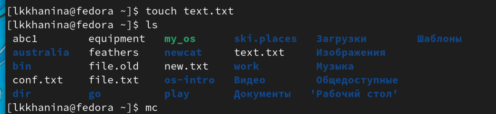
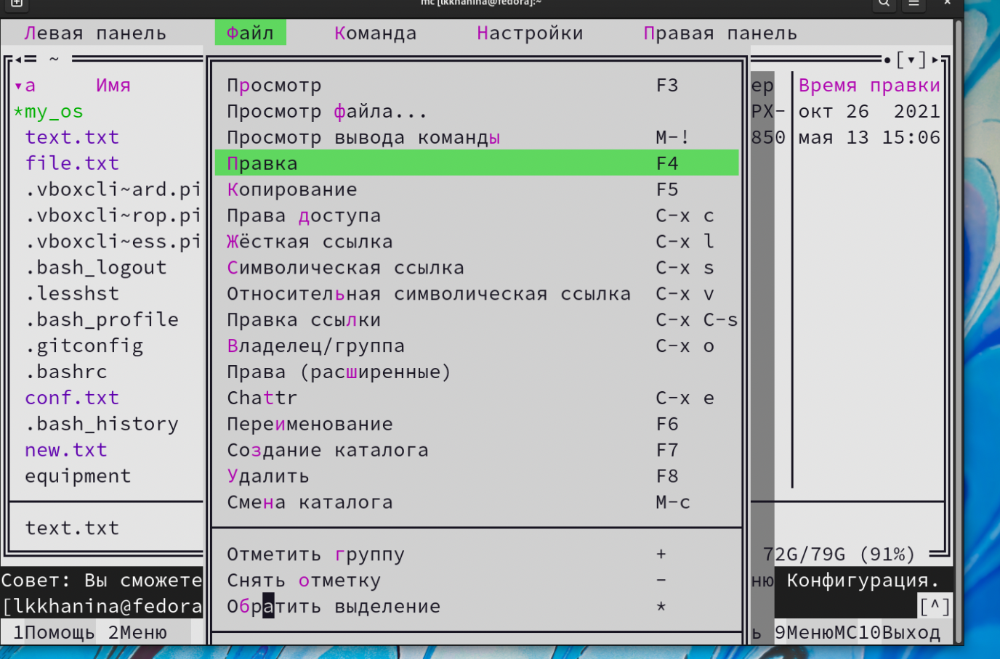

---
## Front matter
lang: ru-RU
title: Презентация лабораторной работы №6
author: |
	Ханина Людмила. Sevastianov\inst{1}
institute: |
	\inst{1}RUDN University, Moscow, Russian Federation
date: 30.04.2022

## Formatting
toc: false
slide_level: 2
theme: metropolis
header-includes: 
 - \metroset{progressbar=frametitle,sectionpage=progressbar,numbering=fraction}
 - '\makeatletter'
 - '\beamer@ignorenonframefalse'
 - '\makeatother'
aspectratio: 43
section-titles: true
---

# Презентация лабораторной работы №6

## Цель

Ознакомление с инструментами поиска файлов и фильтрации текстовых данных. Приобретение практических навыков: по управлению процессами (и заданиями), по проверке использования диска и обслуживанию файловых систем.

## Задание

* Осуществите вход в систему,используя соответствующее имя пользователя.
* Запишите в файл file.txt названия файлов, содержащихся в каталоге /etc. Допишите в этот же файл названия файлов, содержащихся в вашем домашнем каталоге.
* Выведите имена всех файлов из file.txt, имеющих расширение .conf,после чего запишите их в новый текстовой файл conf.txt.
* Определите,какие файлы в вашем домашнем каталоге имеют имена,начинавшиеся с символа c? Предложите несколько вариантов, как это сделать.
* Выведите на экран (постранично) имена файлов из каталога /etc,начинающиеся с символа h.
* Запустите в фоновом режиме процесс,который будет записывать в файл ~/logfile файлы, имена которых начинаются с log.
* Удалите файл ~/logfile.
* Запустите из консоли в фоновом режиме редактор gedit.
* Определите идентификатор процесса gedit, используя команду ps,конвейер и фильтр grep. Как ещё можно определить идентификатор процесса?
* Прочтите справку (man) команды kill, после чего используйте её для завершения
процесса gedit.
* Выполните команды df и du, предварительно получив более подробную информацию
об этих командах, с помощью команды man.
* Воспользовавшись справкой команды find, выведите имена всех директорий, имеющихся в вашем домашнем каталоге.

# Выполнение лабораторной работы

## Запишем в файл file.txt названия файлов, содержащихся в каталоге /etc

{ #fig:001 width=70% }

{ #fig:001 width=70% }

## Выведим содержимое файлa file.txt, добавив фильтр (окончание должно быть .conf). Затем полученную информацию запишем в conf.txt

{ #fig:001 width=70% }

{ #fig:001 width=70% }

## Два варианта вывода файлов, лежащих в домашнем каталоге и начинающихся с символа c

{ #fig:001 width=70% }

{ #fig:001 width=70% }

## Запускаем в фоновом режиме процесс, который будет записывать файлы, начинающиеся с log, в файл ~/logfile. Затем удалим этот файл

{ #fig:001 width=70% }

## Запускаем из консоли в фоновом режиме редактор gedit

{ #fig:001 width=70% }

## Определяем идентификатор процесса gedit

{ #fig:001 width=70% }

## Читаем информацию о команде kill. Далее, используя идентификатор нужного процесса, завершаю его

{ #fig:001 width=70% }

## Читаем информацию о командах df, du. Далее запускам команду df с опцией -h. Затем запускаем команду du с опциями -ha

{ #fig:001 width=70% }

## Читаем информацию о команде find. Чтобы узнать имена всех директорий из домашнего каталога, указываем тип данных при поиске

{ #fig:001 width=70% }

# Выводы

Я научилась перенаправлять потоки ввода и вывода, управлять процессами, находить нужные файлы и каталоги, а также фильтровать содержимое файлов. 
