---
## Front matter
lang: ru-RU
title: Презентация лабораторной работы №7
author: |
	Ханина Людмила. Sevastianov\inst{1}
institute: |
	\inst{1}RUDN University, Moscow, Russian Federation

## Formatting
toc: false
slide_level: 2
theme: metropolis
header-includes: 
 - \metroset{progressbar=frametitle,sectionpage=progressbar,numbering=fraction}
 - '\makeatletter'
 - '\beamer@ignorenonframefalse'
 - '\makeatother'
aspectratio: 43
section-titles: true
---

# Презентация лабораторной работы №7

## Цель

Освоение основных возможностей командной оболочки Midnight Commander. Приоб- ретение навыков практической работы по просмотру каталогов и файлов; манипуляций с ними.

## Задание

* Задания по mc
* Задания по встроенному редактору mc

# Выполнение лабораторной работы

## Запустим cm. Изучим команды левой (и правой) панели. Изменим формат вывода информации о файлах

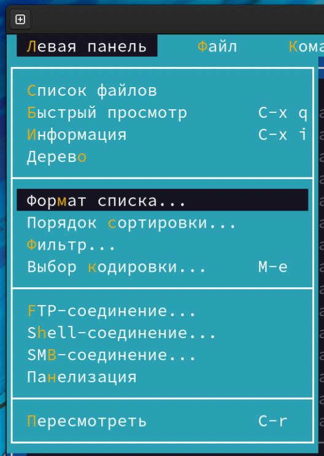{ #fig:001 width=70% }

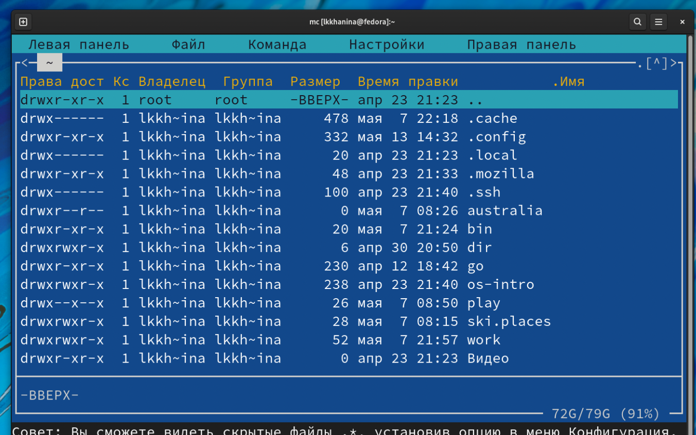{ #fig:001 width=70% }

## Используем возможности подменю Файл. Посмотрим содержимое файла. (Перед этим его создаем.) Далее выбираем редактирование содержимого текстового файла

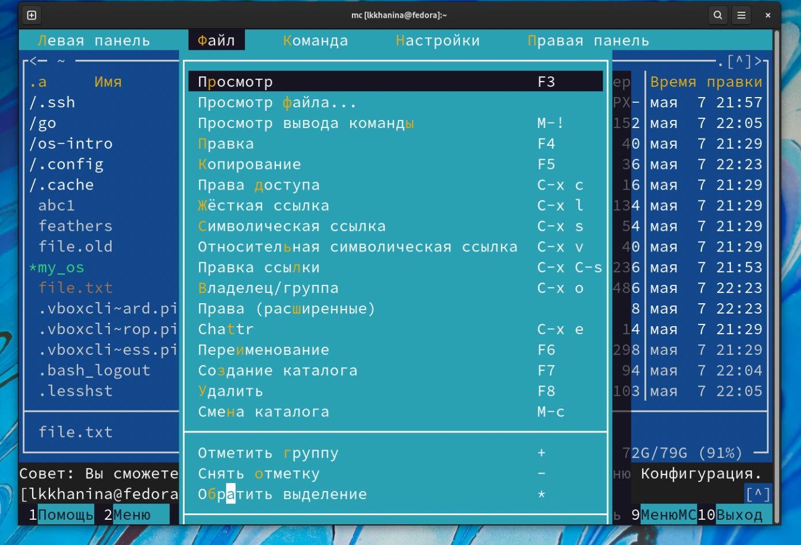{ #fig:001 width=70% }

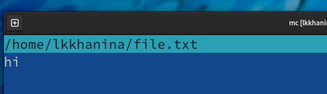{ #fig:001 width=70% }

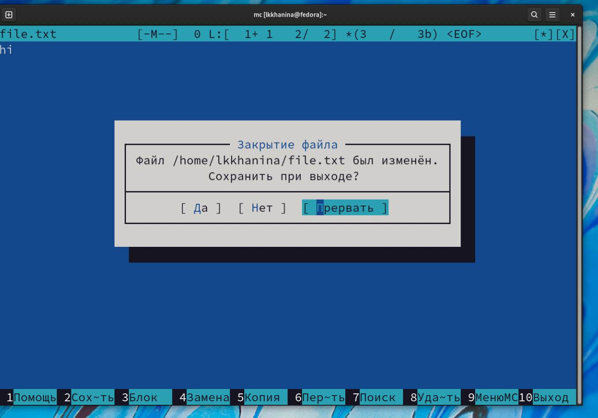{ #fig:001 width=70% }

## Используем возможности подменю Команда. Поищем в файловой системе файлы, которые содержат слово file, посмотрим историю использованных команд, повторим одну из них

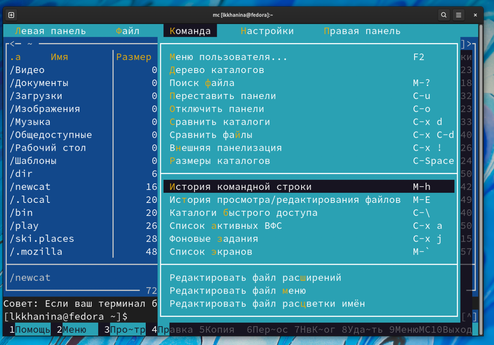{ #fig:001 width=70% }

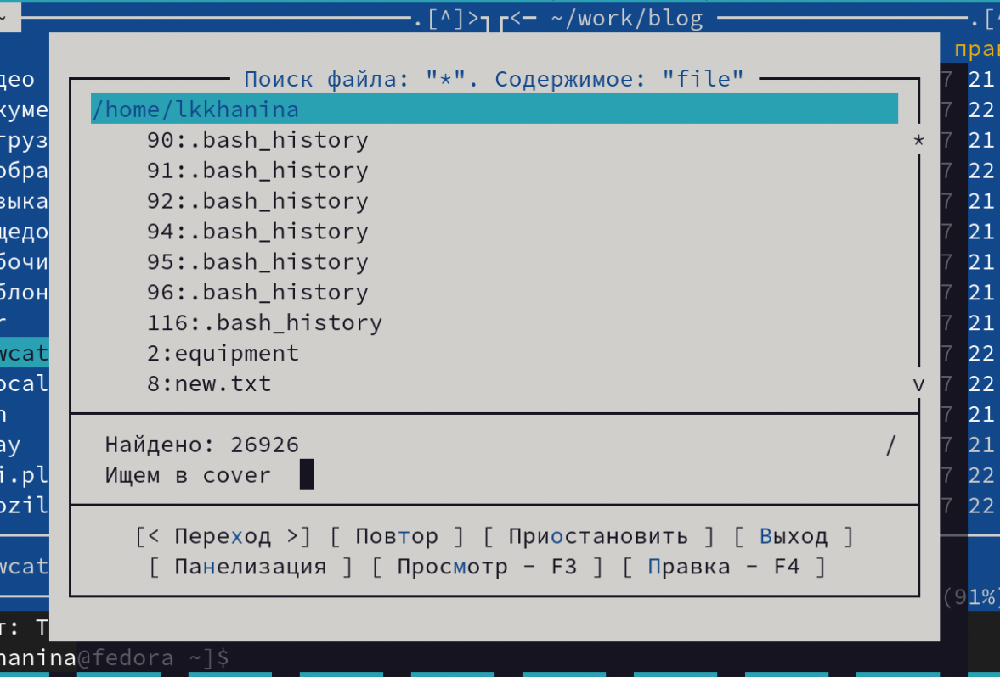{ #fig:001 width=70% }

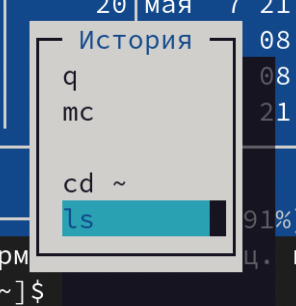{ #fig:001 width=70% }

## Рассмотрим возможности подменю Настройки. Например, изменим цветовое оформление

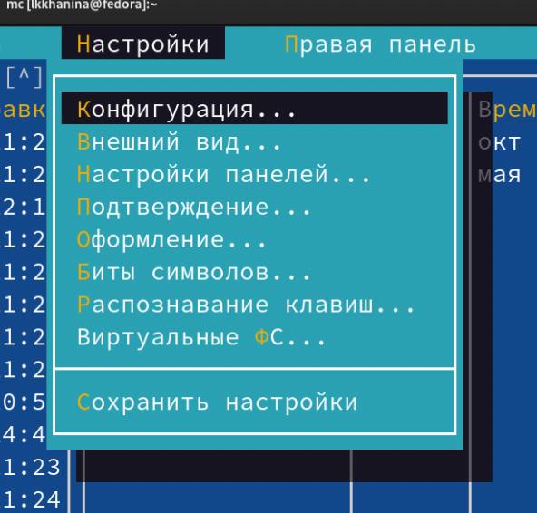{ #fig:001 width=70% }

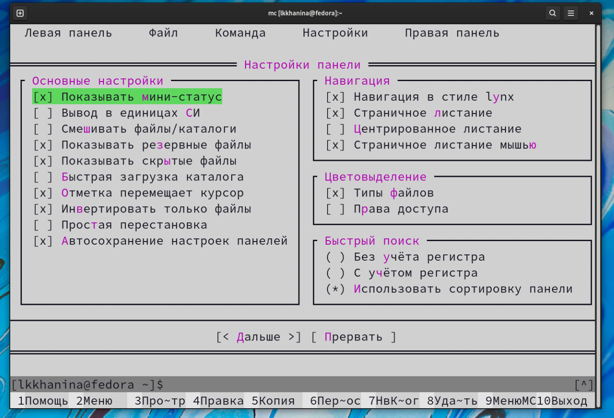{ #fig:001 width=70% }

## Теперь поработаем со внутренним редактором mc. Создадим текстовый файл и откроем его с помощью встроенного в mc редактора. Начинаем работать с этим файлом. Удаляем строку с помощью горячих клавиш Ctrl-y

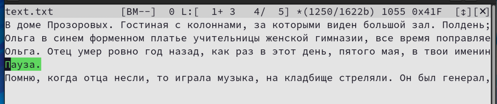{ #fig:001 width=70% }

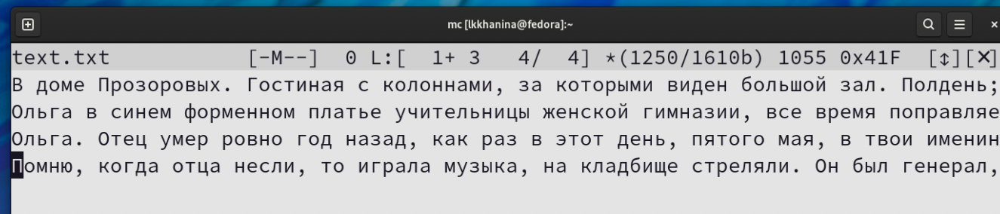{ #fig:001 width=70% }

## Далее выделяем часть текста с помощью клавиши F3 и копируем его с помощью клавиши F5

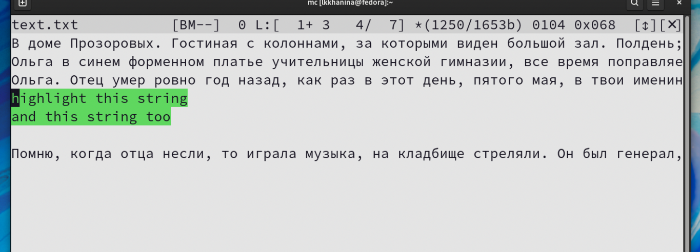{ #fig:001 width=70% }

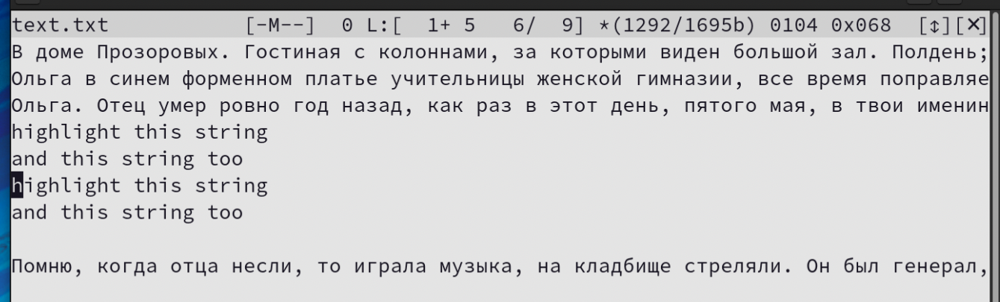{ #fig:001 width=70% }

## Затем выделяем часть текста с помощью клавиши F3 и переносим ее на новую строку с помощью клавиши F6. Сохраняем файл. С помощью клавиш Ctrl-u отменяем последнее действие

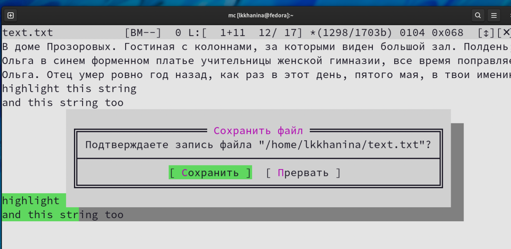{ #fig:001 width=70% }

## Далее переходим в конец файла с помощью сочетаний Ctrl-End и пишем фразу 'the last string'. Аналогичего переходим в начало файла только уже с помощью команды Ctrl-Home и пишем фразу 'the first string'. Сохраняем и закрываем файл

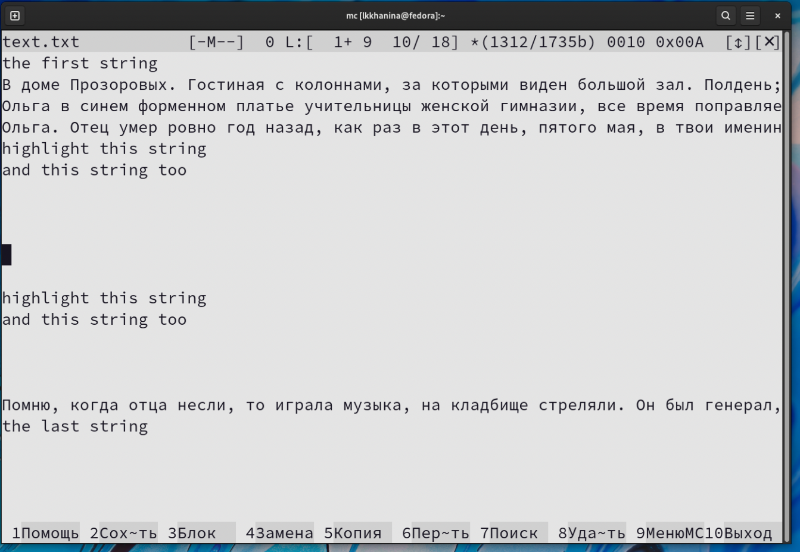{ #fig:001 width=70% }

## Я специально создала файл text.py, в котором содержится код на Python. Открываем его. Нажимаем F9, в подменю Команды включаем подсветку синтаксиса

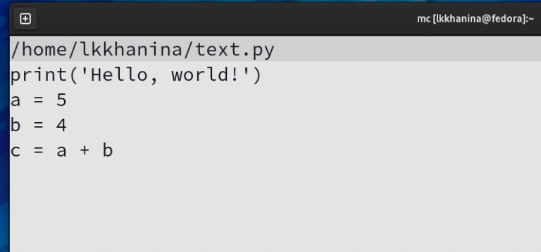{ #fig:001 width=70% }

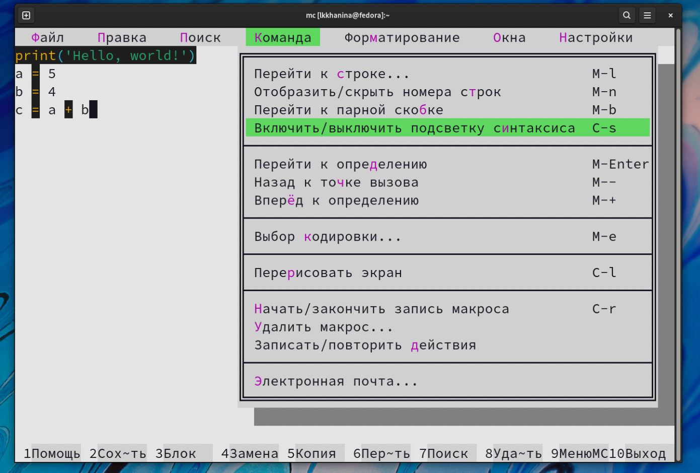{ #fig:001 width=70% }

# Выводы

Я научилась работать в mc. Узнала режими и возможности  Научилась редактировать файлы с помощью встроенного в mc редактора
