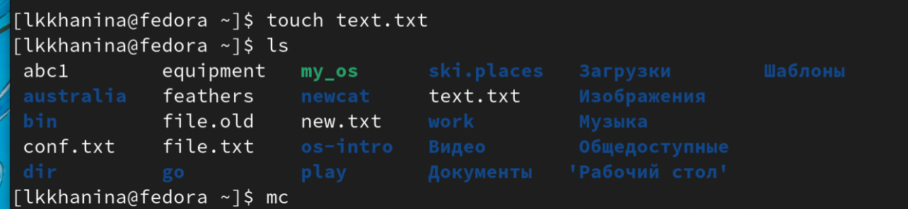
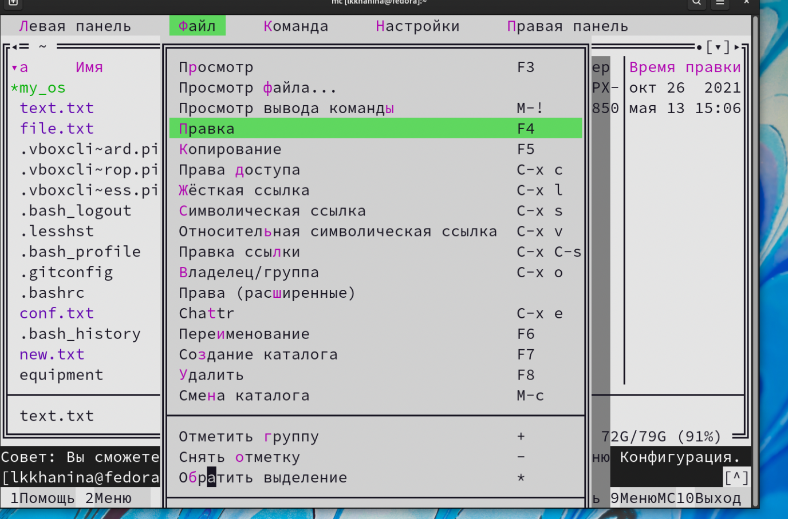

---
## Front matter
title: "Лабораторная работа №6"
author: "Ханина Людмила Константиновна"

## Generic otions
lang: ru-RU
toc-title: "Содержание"

## Bibliography
bibliography: bib/cite.bib
csl: pandoc/csl/gost-r-7-0-5-2008-numeric.csl

## Pdf output format
toc: true # Table of contents
toc-depth: 2
lof: true # List of figures
lot: true # List of tables
fontsize: 12pt
linestretch: 1.5
papersize: a4
documentclass: scrreprt
## I18n polyglossia
polyglossia-lang:
  name: russian
  options:
	- spelling=modern
	- babelshorthands=true
polyglossia-otherlangs:
  name: english
## I18n babel
babel-lang: russian
## Fonts
mainfont: PT Serif
romanfont: PT Serif
sansfont: PT Sans
monofont: PT Mono
mainfontoptions: Ligatures=TeX
romanfontoptions: Ligatures=TeX
sansfontoptions: Ligatures=TeX,Scale=MatchLowercase
monofontoptions: Scale=MatchLowercase,Scale=0.9
## Biblatex
biblatex: true
biblio-style: "gost-numeric"
biblatexoptions:
  - parentracker=true
  - backend=biber
  - hyperref=auto
  - language=auto
  - autolang=other*
  - citestyle=gost-numeric
## Pandoc-crossref LaTeX customization
figureTitle: "Рис."
tableTitle: "Таблица"
listingTitle: "Листинг"
lofTitle: "Список иллюстраций"
lotTitle: "Список таблиц"
lolTitle: "Листинги"
## Misc options
indent: true
header-includes:
  - \usepackage{indentfirst}
  - \usepackage{float} # keep figures where there are in the text
  - \floatplacement{figure}{H} # keep figures where there are in the text
---

# Цель работы

Ознакомление с инструментами поиска файлов и фильтрации текстовых данных. Приобретение практических навыков: по управлению процессами (и заданиями), по проверке использования диска и обслуживанию файловых систем.

# Задание

* Осуществите вход в систему,используя соответствующее имя пользователя.
* Запишите в файл file.txt названия файлов, содержащихся в каталоге /etc. Допишите в этот же файл названия файлов, содержащихся в вашем домашнем каталоге.
* Выведите имена всех файлов из file.txt, имеющих расширение .conf,после чего запишите их в новый текстовой файл conf.txt.
* Определите,какие файлы в вашем домашнем каталоге имеют имена,начинавшиеся с символа c? Предложите несколько вариантов, как это сделать.
* Выведите на экран (постранично) имена файлов из каталога /etc,начинающиеся с символа h.
* Запустите в фоновом режиме процесс,который будет записывать в файл ~/logfile файлы, имена которых начинаются с log.
* Удалите файл ~/logfile.
* Запустите из консоли в фоновом режиме редактор gedit.
* Определите идентификатор процесса gedit, используя команду ps,конвейер и фильтр grep. Как ещё можно определить идентификатор процесса?
* Прочтите справку (man) команды kill, после чего используйте её для завершения
процесса gedit.
* Выполните команды df и du, предварительно получив более подробную информацию
об этих командах, с помощью команды man.
* Воспользовавшись справкой команды find, выведите имена всех директорий, имеющихся в вашем домашнем каталоге.

# Теоретическое введение

| Команда | Значение команды                                                                                                        |
|--------------|----------------------------------------------------------------------------------------------------------------------------|
| `ls /dir > file.txt`          | Записать в файл file.txt содержание каталога /dir     |
| `man command`       | Узнать информацию о команде command     |
| `ps aux`      | Получить информацию о текущих процессах |
| `find ~ -name "c*" -print`     | Найти и вывести файлы, начинающиеся на c    |


# Выполнение лабораторной работы

1. Запишем в файл file.txt названия файлов, содержащихся в каталоге /etc. Чтобы дописать в этот же файл названия файлов из домашнего каталога, используем символы >>. С помощью head и tail заметим, что информация в файле не перезаписалась, а именно дописалась. 

{ #fig:001 width=70% }

{ #fig:001 width=70% }

2. Выведим содержимое файлы file.txt, добавив фильтр (окончание должно быть .conf). Затем полученную информацию запишем в conf.txt. 

{ #fig:001 width=70% }

{ #fig:001 width=70% }

3. Предложу два варианта вывода файлов, лежащих в домашнем каталоге и начинающихся с символа c:
```
ls | grep c*
```
и
```
find ~ -name "c*" -print
```

{ #fig:001 width=70% }

{ #fig:001 width=70% }

4. Чтобы вывести имена файлов из каталога /ets, начинающихся с символа h, воспользуемся командой

```
find /etc -name "h*" -print
```

{ #fig:001 width=70% }

5. Запускаем в фоновом режиме процесс, который будет записывать файлы, начинающиеся с log, в файл ~/logfile. Затем удалим этот файл. 

{ #fig:001 width=70% }

6. Запускаем из консоли в фоновом режиме редактор gedit. 

{ #fig:001 width=70% }

7. Определяем идентификатор процесса gedit с помощью команды

```
ps aux | grep 'gedit'
```

{ #fig:001 width=70% }

8. Читаем информацию о команде kill. Далее, используя идентификатор нужного процесса, завершаю его с помощью команды

```
kill [PID]
```

{ #fig:001 width=70% }

9. Читаем информацию о командах df, du. Далее запускам команду df с опцией -h, чтобы в более удобном формате получить данные о памяти. Затем запускаем команду du с опциями -ha, чтобы узнать более читабельную информацию не только о каталогах, но и о файлах. 

{ #fig:001 width=70% }

10. Читаем информацию о команде find. Чтобы узнать имена всех директорий из домашнего каталога, указываем тип данных при поиске, в данном случае —type d. 

{ #fig:001 width=70% }

# Контрольные вопросы

1. Стандартный ввод при работе пользователя в терминале передается через клавиатуру. Стандартный вывод и стандартная ошибка отображаются на дисплее терминала пользователя в виде текста.
       Ввод и вывод распределяется между тремя стандартными потоками:
 • stdin — стандартный ввод (клавиатура),
 • stdout — стандартный вывод (экран),
 • stderr — стандартная ошибка (вывод ошибок на экран).
      Потоки также пронумерованы:
 •   stdin — 0,
 •   stdout — 1,
 •   stderr — 2.

2. '> file' — направить стандартный поток вывода в файл. Если файл не существует, он будет создан, если существует — перезаписан сверху.
  '>>file' — направить стандартный поток вывода в файл. Если файл не существует, он будет создан, если существует — данные будут дописаны к нему в конец.

3. Конвейер — некоторое множество процессов, для которых выполнено следующее перенаправление ввода-вывода: то, что выводит на поток стандартного вывода предыдущий процесс, попадает в поток стандартного ввода следующего процесса.

4. Процесс в Linux - это программа, которая выполняется в отдельном виртуальном адресном пространстве (это экземпляр запущенной программы). Когда пользователь регистрируется в системе, автоматически создается процесс, в котором выполняется оболочка (shell), например, /bin/bash. 

5. PID - идентификационный номер уникального процесса, GID– это идентификационный номер группы данного процесса.

6. Термин задача используется в ядре Linux для обозначения единицы выполнения, которая может совместно использовать различные системные ресурсы с другими задачами в системе. В зависимости от уровня совместного использования задача может рассматриваться как обычный поток или процесс.

7. top - интерактивный просмотрщик процессов. Программа top динамически выводит в режиме реального времени информацию о работающей системе, т.е. о фактической активности процессов. По умолчанию она выдает задачи, наиболее загружающие процессор сервера, и обновляет список каждые две секунды. htop - просмотрщик процессов подобный top, но позволяющий прокручивать  список процессов вертикально и горизонтально, чтобы видеть их полные параметры запуска. Управление процессами (остановка, изменение приоритета) может выполняться без ручного ввода их идентификаторов.

8. Команда find - команда для поиска файлов и каталогов на основе специальных условий. Ее можно использовать в различных обстоятельствах, например, для поиска файлов по разрешениям, владельцам, группам, типу, размеру и другим подобным критериям. Например, простой поиск по имени
```
find / -name "file.txt"
```

9. Можно, используя команду grep. Например, команда
```
grep word /dir/*
```
ищет строки, содержащие "word", во всех файлах, находящихся в директории /dir и ниже. 

10. df - показывает объем используемого и доступного дискового пространства в файловых системах Linux. 

11. du сообщает объем дискового пространства, используемого набором указанных файлов и для каждого подкаталога. Без аргументов du сообщает о дисковом пространстве для текущего каталога.

12. Когда известен PID процесса, мы можем убить его командой kill:
```
kill [PID]
```

# Выводы

Я научилась перенаправлять потоки ввода и вывода, управлять процессами, находить нужные файлы и каталоги, а также фильтровать содержимое файлов. 
