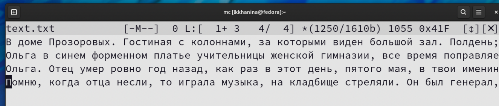

---
## Front matter
title: "Лабораторная работа №7"
author: "Ханина Людмила Константиновна"

## Generic otions
lang: ru-RU
toc-title: "Содержание"

## Bibliography
bibliography: bib/cite.bib
csl: pandoc/csl/gost-r-7-0-5-2008-numeric.csl

## Pdf output format
toc: true # Table of contents
toc-depth: 2
lof: true # List of figures
lot: true # List of tables
fontsize: 12pt
linestretch: 1.5
papersize: a4
documentclass: scrreprt
## I18n polyglossia
polyglossia-lang:
  name: russian
  options:
	- spelling=modern
	- babelshorthands=true
polyglossia-otherlangs:
  name: english
## I18n babel
babel-lang: russian
## Fonts
mainfont: PT Serif
romanfont: PT Serif
sansfont: PT Sans
monofont: PT Mono
mainfontoptions: Ligatures=TeX
romanfontoptions: Ligatures=TeX
sansfontoptions: Ligatures=TeX,Scale=MatchLowercase
monofontoptions: Scale=MatchLowercase,Scale=0.9
## Biblatex
biblatex: true
biblio-style: "gost-numeric"
biblatexoptions:
  - parentracker=true
  - backend=biber
  - hyperref=auto
  - language=auto
  - autolang=other*
  - citestyle=gost-numeric
## Pandoc-crossref LaTeX customization
figureTitle: "Рис."
tableTitle: "Таблица"
listingTitle: "Листинг"
lofTitle: "Список иллюстраций"
lotTitle: "Список таблиц"
lolTitle: "Листинги"
## Misc options
indent: true
header-includes:
  - \usepackage{indentfirst}
  - \usepackage{float} # keep figures where there are in the text
  - \floatplacement{figure}{H} # keep figures where there are in the text
---

# Цель работы

Освоение основных возможностей командной оболочки Midnight Commander. Приоб- ретение навыков практической работы по просмотру каталогов и файлов; манипуляций с ними.

# Задание

* Задания по mc
* Задания по встроенному редактору mc

# Теоретическое введение

| Команда | Значение команды                                                                                                        |
|--------------|----------------------------------------------------------------------------------------------------------------------------|
| `mc`          | Запуск командной оболочки Midnight Commander     |
| `man command`       | Узнать информацию о команде command     |


# Выполнение лабораторной работы

1. С помощью команды mac mc изучаем информацию о командной оболочке. Далее запускаем ее. 

2. Поработаем с панелями. Например, скопируем файл и посмотрем права доступа. 

{ #fig:001 width=70% }

{ #fig:001 width=70% }

3. Изучим команды левой (и правой) панели. Изменим формат вывода информации о файлах. 

{ #fig:001 width=70% }

{ #fig:001 width=70% }

4. Используем возможности подменю Файл. Посмотрим содержимое файла. (Перед этим его создаем.) Далее выбираем редактирование содержимого текстового файла.

{ #fig:001 width=70% }

{ #fig:001 width=70% }

{ #fig:001 width=70% }

5. Далее создаем каталог и копируем наш файл в этот каталог. 

{ #fig:001 width=70% }

{ #fig:001 width=70% }

6. Используем возможности подменю Команда. 

{ #fig:001 width=70% }

Поищем в файловой системе файлы, которые содержат слово file. 

{ #fig:001 width=70% }

Далее посмотрим историю использованных команд. Повторим одну из них. Затем перейдем в домашних каталог. 

{ #fig:001 width=70% }

{ #fig:001 width=70% }

Проанализируем файл меню и файл расширений.

{ #fig:001 width=70% }

{ #fig:001 width=70% }

7. Рассмотрим возможности подменю Настройки. Например, изменим цветовое оформление. 

{ #fig:001 width=70% }

{ #fig:001 width=70% }

8. Теперь поработаем со внутренним редактором mc. Создадим текстовый файл и откроем его с помощью встроенного в mc редактора.

{ #fig:001 width=70% }

{ #fig:001 width=70% }

Далее находим в интернете любой текст и вставляем его в файл. 

{ #fig:001 width=70% }

9. Начинаем работать с этим файлом. Удаляем строку с помощью горячих клавиш Ctrl-y. 

{ #fig:001 width=70% }

{ #fig:001 width=70% }

Далее выделяем часть текста с помощью клавиши F3 и копируем его с помощью клавиши F5. 

{ #fig:001 width=70% }

{ #fig:001 width=70% }

Затем выделяем часть текста с помощью клавиши F3 и переносим ее на новую строку с помощью клавиши F6. Сохраняем файл. С помощью клавиш Ctrl-u отменяем последнее действие. 

{ #fig:001 width=70% }

Далее переходим в конец файла с помощью сочетаний Ctrl-End и пишем фразу 'the last string'. Аналогичего переходим в начало файла только уже с помощью команды Ctrl-Home и пишем фразу 'the first string'. Сохраняем и закрываем файл. 

{ #fig:001 width=70% }

10. Я специально создала файл text.py, в котором содержится код на Python. Открываем его.

{ #fig:001 width=70% }

Нажимаем F9, в подменю Команды включаем подсветку синтаксиса. 

{ #fig:001 width=70% }

# Контрольные вопросы

1. Стандартный ввод при работе пользователя в терминале передается через клавиатуру. Стандартный вывод и стандартная ошибка отображаются на дисплее терминала пользователя в виде текста.
       Ввод и вывод распределяется между тремя стандартными потоками:
 • stdin — стандартный ввод (клавиатура),
 • stdout — стандартный вывод (экран),
 • stderr — стандартная ошибка (вывод ошибок на экран).
      Потоки также пронумерованы:
 •   stdin — 0,
 •   stdout — 1,
 •   stderr — 2.

2. '> file' — направить стандартный поток вывода в файл. Если файл не существует, он будет создан, если существует — перезаписан сверху.
  '>>file' — направить стандартный поток вывода в файл. Если файл не существует, он будет создан, если существует — данные будут дописаны к нему в конец.

3. Конвейер — некоторое множество процессов, для которых выполнено следующее перенаправление ввода-вывода: то, что выводит на поток стандартного вывода предыдущий процесс, попадает в поток стандартного ввода следующего процесса.

4. Процесс в Linux - это программа, которая выполняется в отдельном виртуальном адресном пространстве (это экземпляр запущенной программы). Когда пользователь регистрируется в системе, автоматически создается процесс, в котором выполняется оболочка (shell), например, /bin/bash. 

5. PID - идентификационный номер уникального процесса, GID– это идентификационный номер группы данного процесса.

6. Термин задача используется в ядре Linux для обозначения единицы выполнения, которая может совместно использовать различные системные ресурсы с другими задачами в системе. В зависимости от уровня совместного использования задача может рассматриваться как обычный поток или процесс.

7. top - интерактивный просмотрщик процессов. Программа top динамически выводит в режиме реального времени информацию о работающей системе, т.е. о фактической активности процессов. По умолчанию она выдает задачи, наиболее загружающие процессор сервера, и обновляет список каждые две секунды. htop - просмотрщик процессов подобный top, но позволяющий прокручивать  список процессов вертикально и горизонтально, чтобы видеть их полные параметры запуска. Управление процессами (остановка, изменение приоритета) может выполняться без ручного ввода их идентификаторов.

8. Команда find - команда для поиска файлов и каталогов на основе специальных условий. Ее можно использовать в различных обстоятельствах, например, для поиска файлов по разрешениям, владельцам, группам, типу, размеру и другим подобным критериям. Например, простой поиск по имени
```
find / -name "file.txt"
```

9. Можно, используя команду grep. Например, команда
```
grep word /dir/*
```
ищет строки, содержащие "word", во всех файлах, находящихся в директории /dir и ниже. 

10. df - показывает объем используемого и доступного дискового пространства в файловых системах Linux. 

11. du сообщает объем дискового пространства, используемого набором указанных файлов и для каждого подкаталога. Без аргументов du сообщает о дисковом пространстве для текущего каталога.

12. Когда известен PID процесса, мы можем убить его командой kill:
```
kill [PID]
```

# Выводы

Я научилась работать в mc. Узнала режими и возможности  Научилась редактировать файлы с помощью встроенного в mc редактора. 
