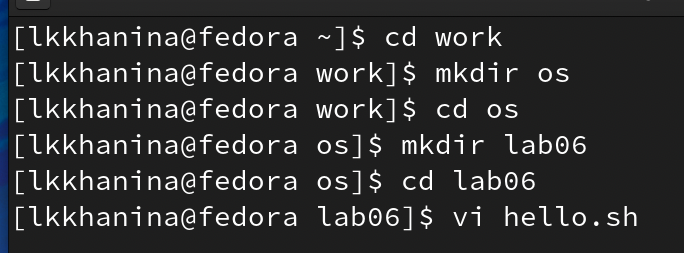
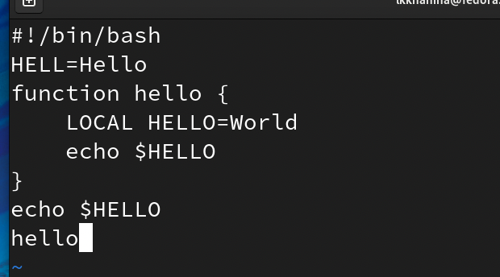
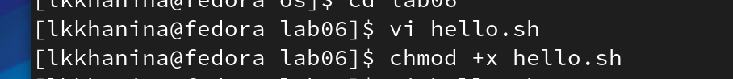
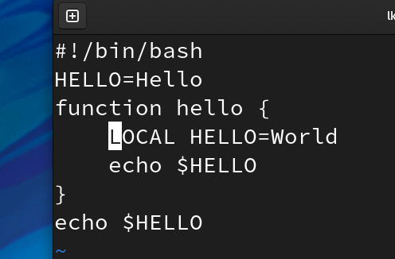
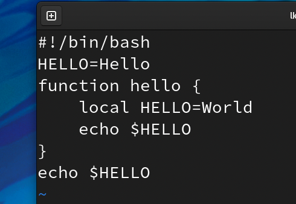
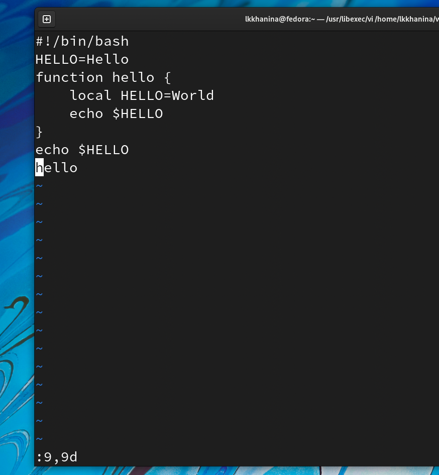
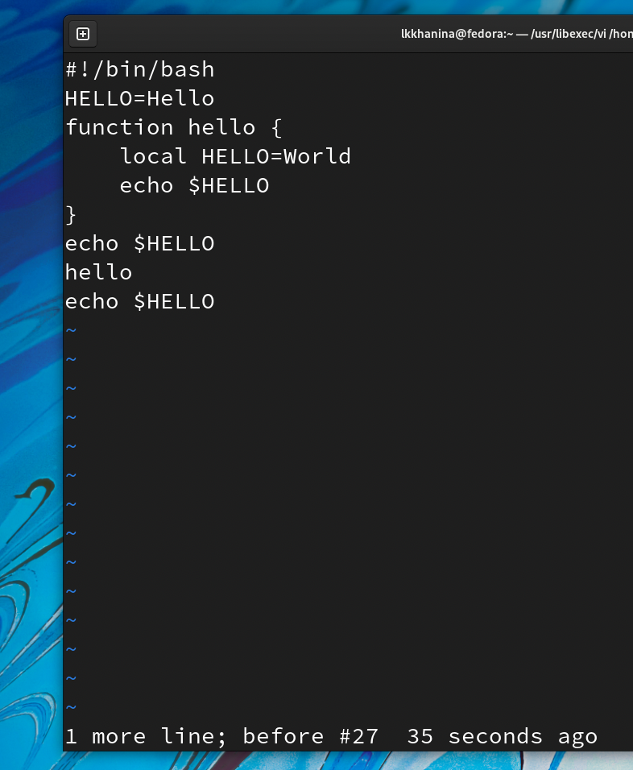
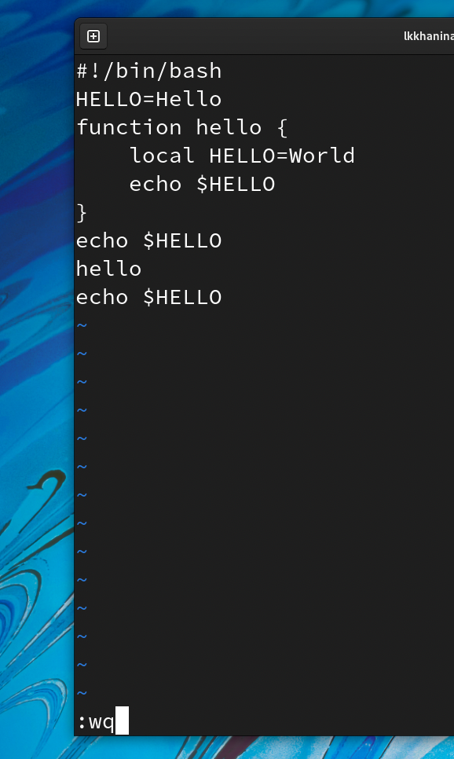

---
## Front matter
lang: ru-RU
title: Презентация лабораторной работы №8
author: |
	Ханина Людмила. Sevastianov\inst{1}
institute: |
	\inst{1}RUDN University, Moscow, Russian Federation

## Formatting
toc: false
slide_level: 2
theme: metropolis
header-includes: 
 - \metroset{progressbar=frametitle,sectionpage=progressbar,numbering=fraction}
 - '\makeatletter'
 - '\beamer@ignorenonframefalse'
 - '\makeatother'
aspectratio: 43
section-titles: true
---

# Презентация лабораторной работы №8

## Цель

Познакомиться с операционной системой Linux. Получить практические навыки работы с редактором vi, установленным по умолчанию практически во всех дистрибутивах.

## Задание

* Создайте каталог с именем ~/work/os/lab06.
* Перейдите во вновь созданный каталог.
* Вызовите vi и создайте файл hello.sh
* Нажмите клавишу i и вводите следующий текст.
* Нажмите клавишу Esc для перехода в командный режим после завершения ввода текста.
* Нажмите : для перехода в режим последней строки и внизу вашего экрана появится приглашение в виде двоеточия.
* Нажмите w (записать) и q (выйти), а затем нажмите клавишу Enter для сохранения вашего текста и завершения работы.
* Сделайте файл исполняемым. 
* Вызовите vi на редактирование файла hello.sh. 
* Установите курсор в конец слова HELL второй строки.
* Перейдите в режим вставки и замените на HELLO. Нажмите Esc для возврата в командный режим.
* Установите курсор на четвертую строку и сотрите слово LOCAL.
* Перейдите в режим вставки и наберите следующий текст: local, нажмите Esc для возврата в командный режим.
* Установите курсор на последней строке файла. Вставьте после неё строку, содержащую следующий текст: echo $HELLO.
* Нажмите Esc для перехода в командный режим.
* Удалите последнюю строку.
* Введите команду отмены изменений u для отмены последней команды.
* Введите символ : для перехода в режим последней строки. Запишите произведённые изменения и выйдите из vi.

# Выполнение лабораторной работы

## Создаем каталог с именем ~/work/os/lab06. Переходим туда и вызывам vi для файла hello.sh. Записываем туда текст

{ #fig:001 width=70% }

{ #fig:001 width=70% }

## Сделаем файл исполняемым с помощью команды 

{ #fig:001 width=70% }

## Уже из домашнего каталога начнем редактировать файл с помощью vi. Устанавливаем курсор на вторую строку с помощью сочетания клавиш 2G. Нажимаем w, чтобы установить курсор в конец слова HELL. Переходим в режим вставки и заменяем слово на HELLO. Далее возвращаемся в командный режим, используя Esc

## Устанавливаем курсор на четвертую строку с помощью сочетания клавиш 4G. Нажимаем x столько раз, чтобы стереть слово LOCAL. Переходим в режим вставки и набираем текст local. Возвращаемся в командный режим, используя Esc

{ #fig:001 width=70% }

{ #fig:001 width=70% }

## Далее устанавливаем курсор на последней строке. Вставляем послее нее строку. Удаляем последнюю строку сочетанием клавиш :9,9d. А затем возвращаем ее клавишей u

{ #fig:001 width=70% }

{ #fig:001 width=70% }

## Пишем сочетание клавиш :wq для сохранения изменений и выхода из режима редактирования

{ #fig:001 width=70% }

# Выводы

Я научилась работать в vi. Изучила методы перехода между режимами, передвижения курсора и изменения содержимого файла через команды
