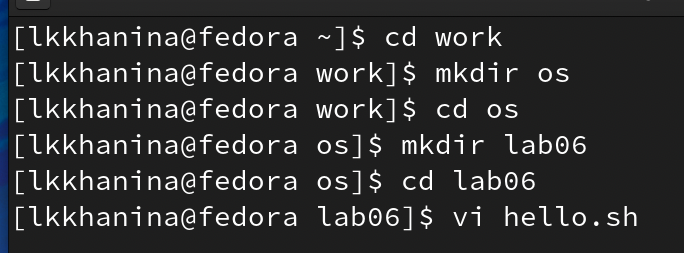
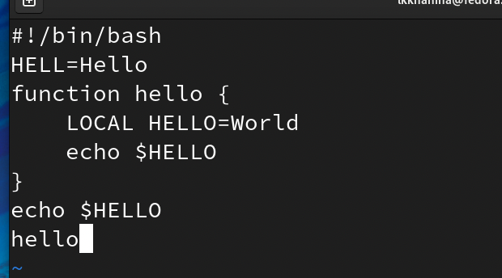
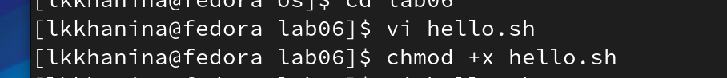
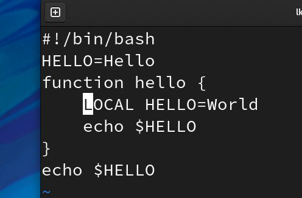
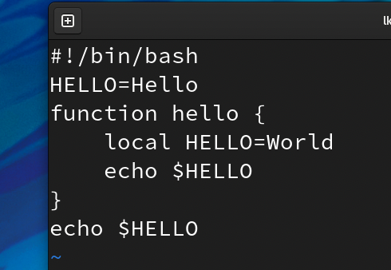
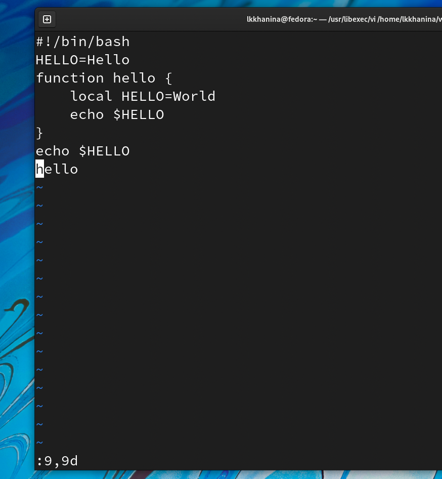
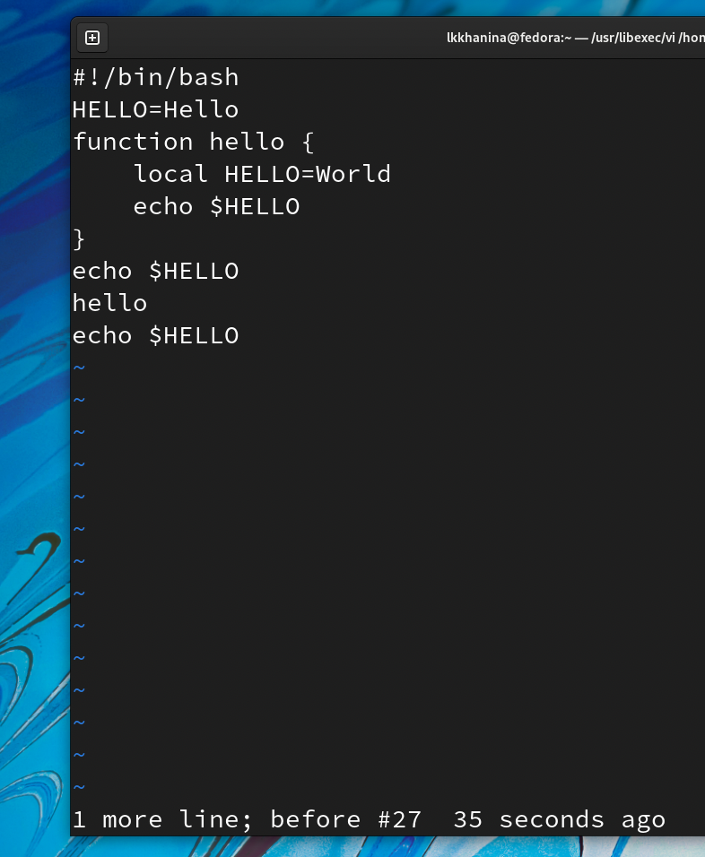
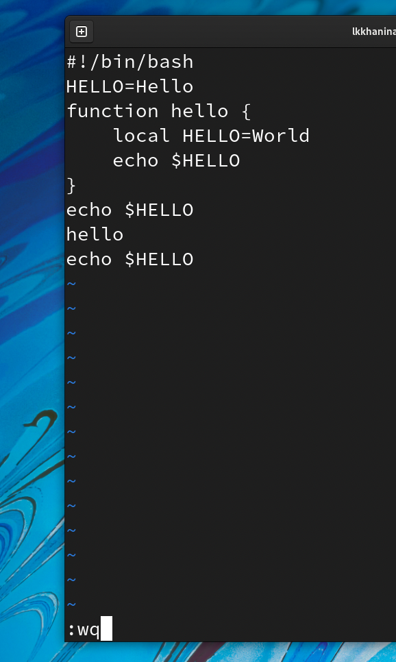

---
## Front matter
title: "Лабораторная работа №8"
author: "Ханина Людмила Константиновна"

## Generic otions
lang: ru-RU

## Bibliography
bibliography: bib/cite.bib
csl: pandoc/csl/gost-r-7-0-5-2008-numeric.csl

## Pdf output format
toc: true # Table of contents
toc-depth: 2
lof: true # List of figures
lot: true # List of tables
fontsize: 12pt
linestretch: 1.5
papersize: a4
documentclass: scrreprt
## I18n polyglossia
polyglossia-lang:
  name: russian
  options:
	- spelling=modern
	- babelshorthands=true
polyglossia-otherlangs:
  name: english
## I18n babel
babel-lang: russian
## Fonts
mainfont: PT Serif
romanfont: PT Serif
sansfont: PT Sans
monofont: PT Mono
mainfontoptions: Ligatures=TeX
romanfontoptions: Ligatures=TeX
sansfontoptions: Ligatures=TeX,Scale=MatchLowercase
monofontoptions: Scale=MatchLowercase,Scale=0.9
## Biblatex
biblatex: true
biblio-style: "gost-numeric"
biblatexoptions:
  - parentracker=true
  - backend=biber
  - hyperref=auto
  - language=auto
  - autolang=other*
  - citestyle=gost-numeric
## Pandoc-crossref LaTeX customization
figureTitle: "Рис."
tableTitle: "Таблица"
listingTitle: "Листинг"
lofTitle: "Список иллюстраций"
lotTitle: "Список таблиц"
lolTitle: "Листинги"
## Misc options
indent: true
header-includes:
  - \usepackage{indentfirst}
  - \usepackage{float} # keep figures where there are in the text
  - \floatplacement{figure}{H} # keep figures where there are in the text
---

# Цель работы

Познакомиться с операционной системой Linux. Получить практические навыки работы с редактором vi, установленным по умолчанию практически во всех дистрибутивах.

# Задание

* Создайте каталог с именем ~/work/os/lab06.
* Перейдите во вновь созданный каталог.
* Вызовите vi и создайте файл hello.sh
* Нажмите клавишу i и вводите следующий текст.
* Нажмите клавишу Esc для перехода в командный режим после завершения ввода текста.
* Нажмите : для перехода в режим последней строки и внизу вашего экрана появится приглашение в виде двоеточия.
* Нажмите w (записать) и q (выйти), а затем нажмите клавишу Enter для сохранения вашего текста и завершения работы.
* Сделайте файл исполняемым. 
* Вызовите vi на редактирование файла hello.sh. 
* Установите курсор в конец слова HELL второй строки.
* Перейдите в режим вставки и замените на HELLO. Нажмите Esc для возврата в командный режим.
* Установите курсор на четвертую строку и сотрите слово LOCAL.
* Перейдите в режим вставки и наберите следующий текст: local, нажмите Esc для возврата в командный режим.
* Установите курсор на последней строке файла. Вставьте после неё строку, содержащую следующий текст: echo $HELLO.
* Нажмите Esc для перехода в командный режим.
* Удалите последнюю строку.
* Введите команду отмены изменений u для отмены последней команды.
* Введите символ : для перехода в режим последней строки. Запишите произведённые изменения и выйдите из vi.

# Теоретическое введение

| Команда | Значение команды                                                                                                        |
|--------------|----------------------------------------------------------------------------------------------------------------------------|
| `:wq`          | Сохранить изменения файла и выйти из режима редактирования     |
| `vi filename`       | Вызов vi на редактирование файла    |


# Выполнение лабораторной работы

1. Создаем каталог с именем ~/work/os/lab06. Переходим туда и вызывам vi для файла hello.sh. Файл до этого не существовал, поэтому он создастся. 

{ #fig:001 width=70% }

2. Нажимаем i, чтобы перейти в режим редактирования файла. Записываем в него текст. Далее Нажимаем Esc для перехода в командный режим и сочетание клавиш :qw, чтобы сохранить текст и выйти из режима редактирования файла. 

{ #fig:001 width=70% }

3. Сделаем файл исполняемым с помощью команды 

```
chmod +x hello.sh
```

{ #fig:001 width=70% }

4. Уже из домашнего каталога начнем редактировать файл с помощью vi. 

```
vi ~/work/os/lab06/hello.sh
```

5. Устанавливаем курсор на вторую строку с помощью сочетания клавиш 2G. Нажимаем w, чтобы установить курсор в конец слова HELL. Переходим в режим вставки и заменяем слово на HELLO. Далее возвращаемся в командный режим, используя Esc. 

6. Устанавливаем курсор на четвертую строку с помощью сочетания клавиш 4G. Нажимаем x столько раз, чтобы стереть слово LOCAL. Переходим в режим вставки и набираем текст local. Возвращаемся в командный режим, используя Esc. 

{ #fig:001 width=70% }

{ #fig:001 width=70% }

7. Далее устанавливаем курсор на последней строке с помощью клавиши G. Вставляем послее нее строку
```
echo $HELLO
```

Переходим в командный режим. 

8. Удаляем последнюю строку сочетанием клавиш :9,9d. А затем возвращаем ее клавишей u. 

{ #fig:001 width=70% }

{ #fig:001 width=70% }

9. Пишем сочетание клавиш :wq для сохранения изменений и выхода из режима редактирования.

{ #fig:001 width=70% }

# Контрольные вопросы

1. Режимы работы редактора vi:
* командный режим — предназначен для ввода команд редактирования инавигации по
редактируемому файлу;
* режим вставки — предназначен для ввода содержания редактируемого файла;
* режим последней (или командной) строки — используется для записи изменений в файл
и выхода из редактора.  

2. Чтобы выйти из редактора, не сохраняя изменения, достаточно выйти в командный режим (Esc) и написать :q или :q!.

3. Команды позиционирования:
* 0 - переход в начало строки;
* $ — переход в конец строки;
* G — переход в конец файла;
* nG — переход на строку с номером n.

4. Словом для vi является набор букв, который отделяется от других слов пробелом, табуляцией, возвратом каретки и/или любые знаки пунктуации. 

5. Чтобы перейти в начало/конец файла, необходимо использовать горячие клавиши Ctrl-Home/Ctrl-End. 

6. Группы команд редактирования.

Вставка текста:
* а – вставить текст после курсора;
* A - вставить текст в конец строки;
* ni - вставить текст n раз. 

Удаление текста:
* x - удалить один символ в буфер;
* dw - удалить одно слово в буфер;
* dd - удалить в буфер одну строку;
* ndd - удалитьвбуфер n строк.

Копирование текста в буфер:
* Y -  скопировать строку в буфер;
* yw - ускопировать слово в буфер;
* nY - скопировать 𝑛 строк в буфер.

Замена текста:
* cx - заменить слово;
* ncw - заменить𝑛слов;
* r - заменить слово;
* R - заменить текст.

7. Чтобы заполнить строку символами $, необходимо использовать / или одинарные кавычки. 

8. Чтобы отменить действия во время редактирования, нужно нажать на горячую клавишу u. 

9. Группы команд редактирования в режиме командной строки.

Копирование и перемещение текста:
* :n,md – удалить строки с n по m;
* :i,jmk - переместить строки с i по j, начиная со строки k;
* :i,jtk - копировать строки с i по j в строку k. 

Запись в файл и выход из редактора:
* :w — записать изменённый текст в файл, не выходя из vi;
* :w filename - записать измененный текст в новый файл filename;
* :w! filename - записать измененный текст в новый файл filename;
* :wq - записать изменения в файл и выйти из vi.
* :q -  выйти из редактора vi;
* :q! - выйти из редактора без записи.

10. Чтобы определить позицию, в которой заканчивается строка, достаточно использовать символ $. 

11. Опции vi:
* h	Влево
* j	Вниз
* k	Вверх
* l	Вправо
* «стрелки»	Перемещение по тексту (в больших файлах работает медленно, в некоторых конфигурациях может работать некорректно).
* w	К следующему слову
* W	К следующему слову (по пробелам)
* b	К началу слова
* B	К началу слова (по пробелам)
* ^	К первому непробельному символу строки

12. Определить режим работы vi можно по доступным инструментам. Если вдруг вы запутались, можно с помощью Esc вернуться в обычный режим. 

13. Командный режим -> режим вставки -> режим командной строки.

# Выводы

Я научилась работать в vi. Изучила методы перехода между режимами, передвижения курсора и изменения содержимого файла через команды. 
