---
## Front matter
lang: ru-RU
title: Презентация лабораторной работы №9
author: |
	Ханина Людмила. Sevastianov\inst{1}
institute: |
	\inst{1}RUDN University, Moscow, Russian Federation

## Formatting
toc: false
slide_level: 2
theme: metropolis
header-includes: 
 - \metroset{progressbar=frametitle,sectionpage=progressbar,numbering=fraction}
 - '\makeatletter'
 - '\beamer@ignorenonframefalse'
 - '\makeatother'
aspectratio: 43
section-titles: true
---

# Презентация лабораторной работы №9

## Цель

Познакомиться с операционной системой Linux. Получить практические навыки работы с редактором Emacs.

## Задание

* Открыть emacs.
* Создать файл lab07.sh с помощью комбинации Ctrl-x Ctrl-f. Наберить текст. 
* Сохранить файл с помощью комбинации Ctrl-x Ctrl-s (C-x C-s).
* Вырезать одной командой целую строку (С-k).
* Вставить эту строку в конец файла (C-y).
* Выделить область текста (C-space).
* Скопировать область в буфер обмена(M-w).
* Вставить область в конец файла.
* Вновь выделить эту область и на этот раз вырезать её (C-w).
* Отмените последнее действие (C-/).
* Переместите курсор в начало строки (C-a).
* Переместите курсор в конец строки (C-e).
* Переместите курсор в начало буфера (M-<).
* Переместите курсор в конец буфера (M->).
* Вывести список активных буферов на экран (C-x C-b).
* Переместитесь во вновь открытое окно (C-x) o со списком открытых буферов и переключитесь на другой буфер.
* Закройте это окно (C-x 0).
* Теперь вновь переключайтесь между буферами, но уже без вывода их списка на
экран(C-x b).
* Поделите фрейм на 4 части: разделите фрейм на два окна по вертикали (C-x 3), а затем каждое из этих окон на две части по горизонтали(C-x 2). 
* В каждом из четырёх созданных окон откройте новый буфер (файл) и введите несколько строк текста.
* Переключитесь в режим поиска (C-s) и найдите несколько слов, присутствующих
в тексте.
* Переключайтесь между результатами поиска, нажимая C-s.
* Выйдите из режима поиска, нажав C-g.
* Перейдите в режим поиска и замены (M-%), введите текст, который следует найти
и заменить, нажмите Enter  затем введите текст для замены. После того как будут
подсвечены результаты поиска, нажмите ! для подтверждения замены.
* Испробуйте другой режим поиска, нажав M-s o. Объясните, чем он отличается от
обычного режима?

# Выполнение лабораторной работы

## Открываем emacs. Создаем файл lab07.sh c помощью комбинации C-x C-f, записываем туда текст и сохраняем файл с помощью C-x C-s

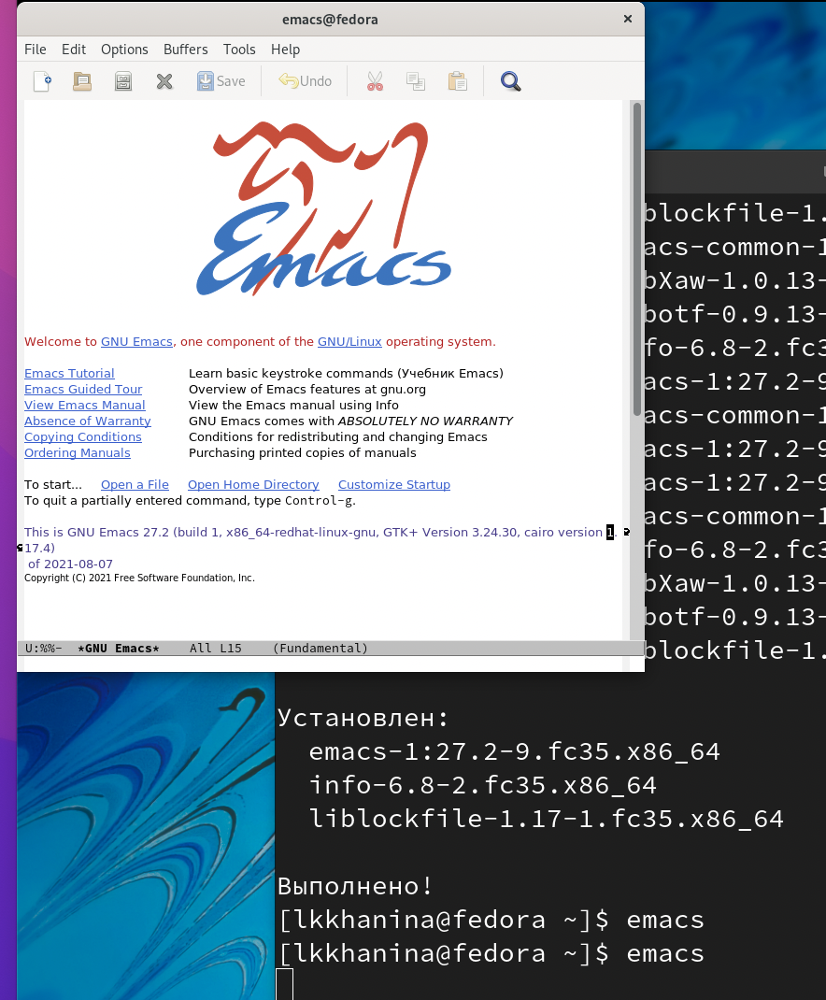{ #fig:001 width=70% }

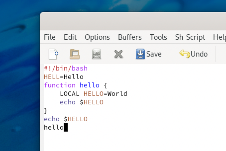{ #fig:001 width=70% }

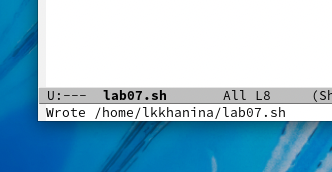{ #fig:001 width=70% }

## Вырезаем командой C-k целую строку. Вставляем строку в конец файла комбинацией C-y

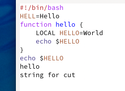{ #fig:001 width=70% }

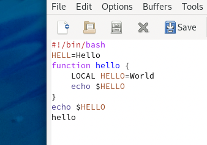{ #fig:001 width=70% }

## Выделяем область текста с помощью C-space, копируем ее в буфер обмена с помощью Alt-w и вставляем в конец файла с помощью C-y

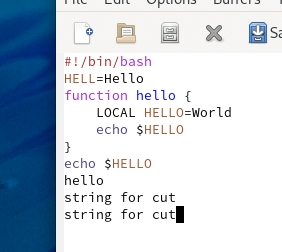{ #fig:001 width=70% }

## Вновь выделяем эту область и уже удаляем с помощью C-w

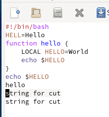{ #fig:001 width=70% }

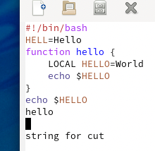{ #fig:001 width=70% }

## Отменим последние действия с помощью сочетания C-/

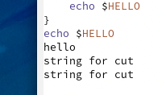{ #fig:001 width=70% }

## С помощью команды C-a перемещаем курсор в начало строки, а с помощью команды C-e — в конец

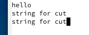{ #fig:001 width=70% }

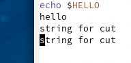{ #fig:001 width=70% }

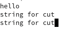{ #fig:001 width=70% }

## С помощью команды M-< перемещаем курсор в начало буфера, а с помощью команды M-> — в конец

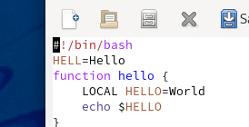{ #fig:001 width=70% }

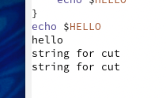{ #fig:001 width=70% }

## С помощью C-x C-b выводим список активных буферов на экран. Перемещаемся во вновь открытое окно с помощью C-x и закрываем его с помощью C-x 0

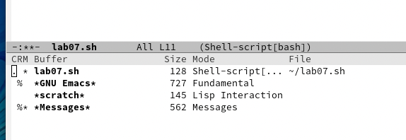{ #fig:001 width=70% }

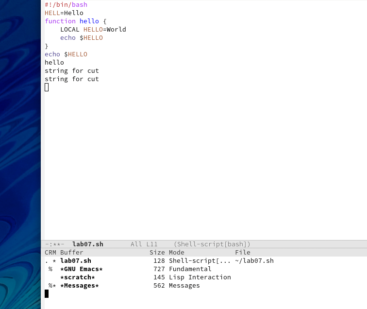{ #fig:001 width=70% }

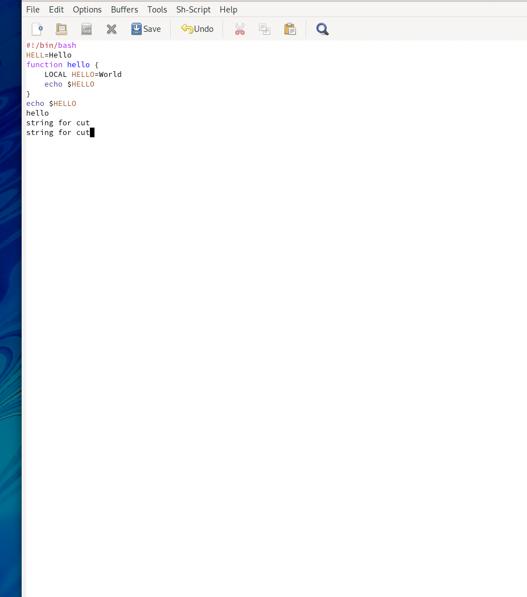{ #fig:001 width=70% }

## Затем переключаемся между буферами, но уже с помощью C-x b

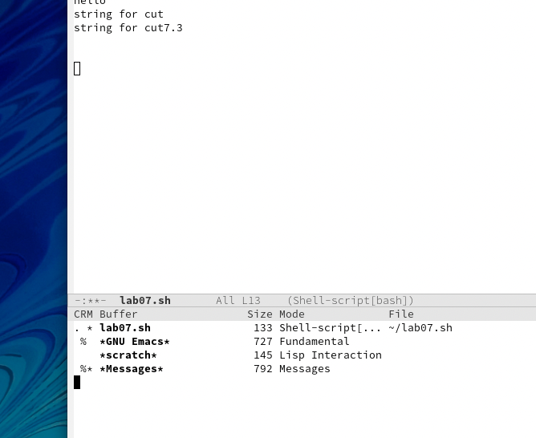{ #fig:001 width=70% }

## Поделите фрейм на 4 части: разделите фрейм на два окна по вертикали (C-x 3), а затем каждое из этих окон на две части по горизонтали(C-x 2)

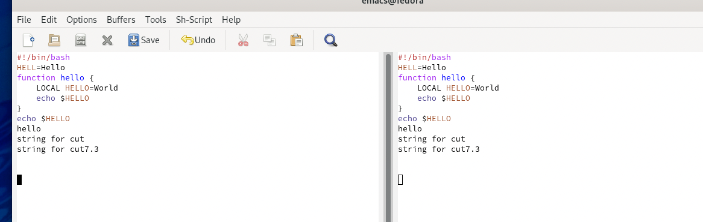{ #fig:001 width=70% }

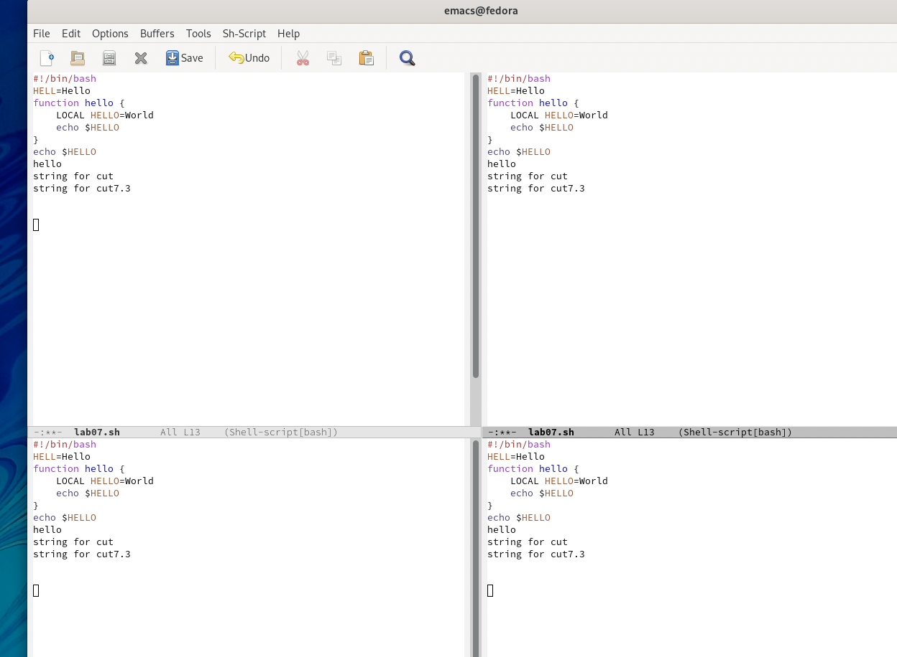{ #fig:001 width=70% }

## В каждой части откроем файл с помощью С-x C-f

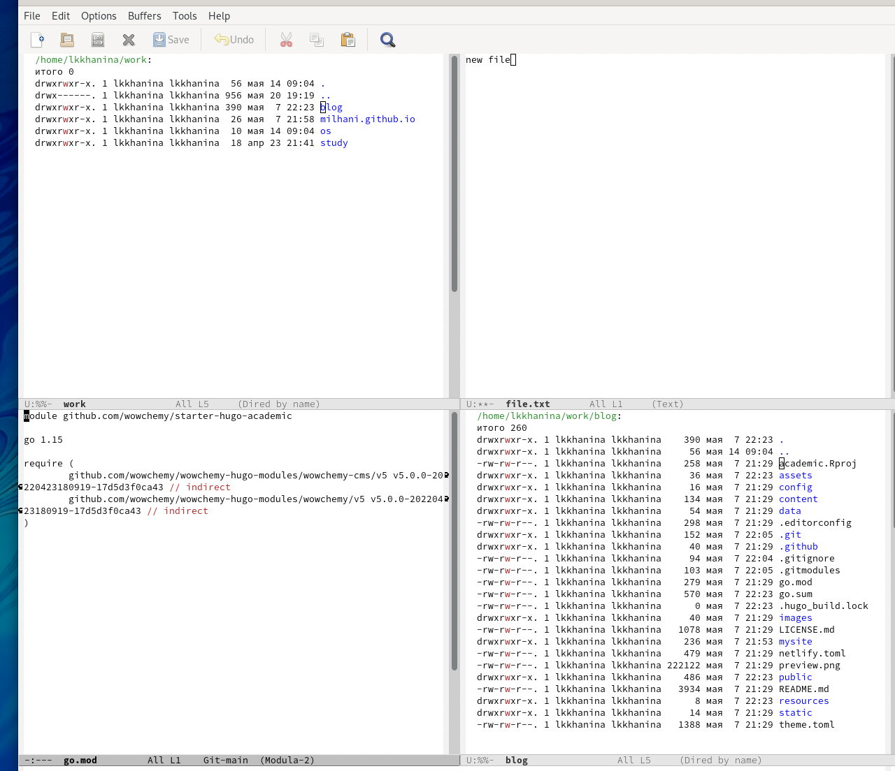{ #fig:001 width=70% }

## В режиме поиска найдем несколько слов с помощью C-s. Переключимся между результатами поиска с помощью C-s и выйдем из режима с помощью C-g      

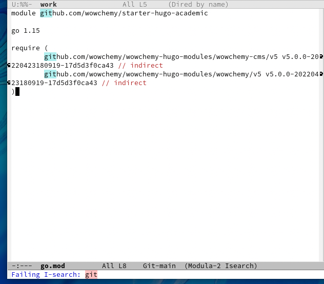{ #fig:001 width=70% }

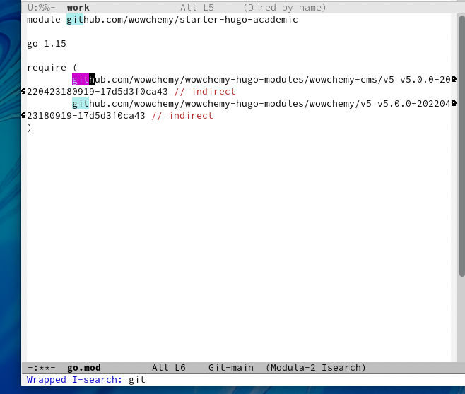{ #fig:001 width=70% }

## В режиме поиска и замены (Alt-%) введем текст, который нужно найти и заменить, введем текст-замену и подтвердим ее

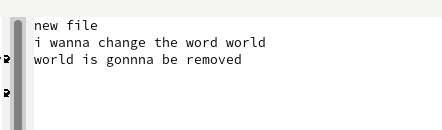{ #fig:001 width=70% }

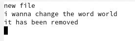{ #fig:001 width=70% }

## Попробуем режим поиска Alt-s o

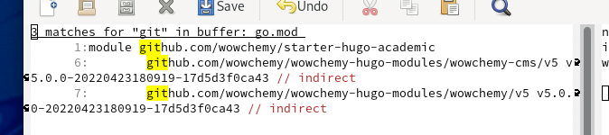{ #fig:001 width=70% }

# Выводы

Я научилась работать в emacs. Познакомилась с режимами работы над буферами и с режимами работы над текстом
