---
## Front matter
title: "Лабораторная работа №9"
author: "Ханина Людмила Константиновна"

## Generic otions
lang: ru-RU
toc-title: "Содержание"

## Bibliography
bibliography: bib/cite.bib
csl: pandoc/csl/gost-r-7-0-5-2008-numeric.csl

## Pdf output format
toc: true # Table of contents
toc-depth: 2
lof: true # List of figures
lot: true # List of tables
fontsize: 12pt
linestretch: 1.5
papersize: a4
documentclass: scrreprt
## I18n polyglossia
polyglossia-lang:
  name: russian
  options:
	- spelling=modern
	- babelshorthands=true
polyglossia-otherlangs:
  name: english
## I18n babel
babel-lang: russian
## Fonts
mainfont: PT Serif
romanfont: PT Serif
sansfont: PT Sans
monofont: PT Mono
mainfontoptions: Ligatures=TeX
romanfontoptions: Ligatures=TeX
sansfontoptions: Ligatures=TeX,Scale=MatchLowercase
monofontoptions: Scale=MatchLowercase,Scale=0.9
## Biblatex
biblatex: true
biblio-style: "gost-numeric"
biblatexoptions:
  - parentracker=true
  - backend=biber
  - hyperref=auto
  - language=auto
  - autolang=other*
  - citestyle=gost-numeric
## Pandoc-crossref LaTeX customization
figureTitle: "Рис."
tableTitle: "Таблица"
listingTitle: "Листинг"
lofTitle: "Список иллюстраций"
lotTitle: "Список таблиц"
lolTitle: "Листинги"
## Misc options
indent: true
header-includes:
  - \usepackage{indentfirst}
  - \usepackage{float} # keep figures where there are in the text
  - \floatplacement{figure}{H} # keep figures where there are in the text
---

# Цель работы

Познакомиться с операционной системой Linux. Получить практические навыки работы с редактором Emacs.

# Задание

*  Открытьemacs.
* Создать файл lab07.sh с помощью комбинации Ctrl-x Ctrl-f. Наберить текст. 
* Сохранить файл с помощью комбинации Ctrl-x Ctrl-s (C-x C-s).
* Вырезать одной командой целую строку (С-k).
* Вставить эту строку в конец файла (C-y).
* Выделить область текста (C-space).
* Скопировать область в буфер обмена(M-w).
* Вставить область в конец файла.
* Вновь выделить эту область и на этот раз вырезать её (C-w).
* Отмените последнее действие (C-/).
* Переместите курсор в начало строки (C-a).
* Переместите курсор в конец строки (C-e).
* Переместите курсор в начало буфера (M-<).
* Переместите курсор в конец буфера (M->).
* Вывести список активных буферов на экран (C-x C-b).
* Переместитесь во вновь открытое окно (C-x) o со списком открытых буферов и переключитесь на другой буфер.
* Закройте это окно (C-x 0).
* Теперь вновь переключайтесь между буферами, но уже без вывода их списка на
экран(C-x b).
* Поделите фрейм на 4 части: разделите фрейм на два окна по вертикали (C-x 3), а затем каждое из этих окон на две части по горизонтали(C-x 2). 
* В каждом из четырёх созданных окон откройте новый буфер (файл) и введите несколько строк текста.
* Переключитесь в режим поиска (C-s) и найдите несколько слов, присутствующих
в тексте.
* Переключайтесь между результатами поиска, нажимая C-s.
* Выйдите из режима поиска, нажав C-g.
* Перейдите в режим поиска и замены (M-%), введите текст, который следует найти
и заменить, нажмите Enter  затем введите текст для замены. После того как будут
подсвечены результаты поиска, нажмите ! для подтверждения замены.
* Испробуйте другой режим поиска, нажав M-s o. Объясните, чем он отличается от
обычного режима?

# Теоретическое введение

| Команда | Значение команды                                                                                                        |
|--------------|----------------------------------------------------------------------------------------------------------------------------|
| `C-x C-f`          | Открыть файл     |
| `C-x C-s`       | Сохранить текст в буфер     |
| `C-x C-b`          | Отобразить список открытых буферов в новом окне     |
| `C-x 0`       | Закрыть текущее окно (при этом буфер не удаляется)    |
| `C-w`          | Удалить выделенную область текста в список удалений    |
| `C-y`       | Вставить текст из списка удалений в текущую позицию курсора     |

# Выполнение лабораторной работы

1. Открываем emacs. 

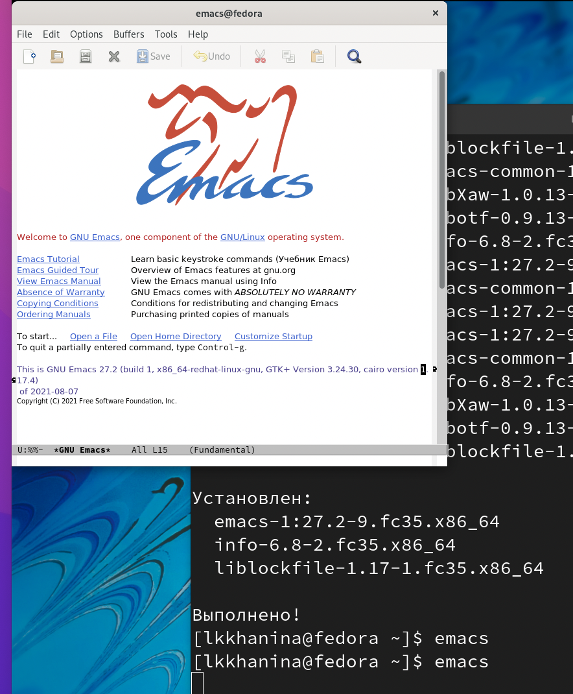{ #fig:001 width=70% }

2. Создаем файл lab07.sh c помощью комбинации C-x C-f, записываем туда текст и сохраняем файл с помощью C-x C-s.  

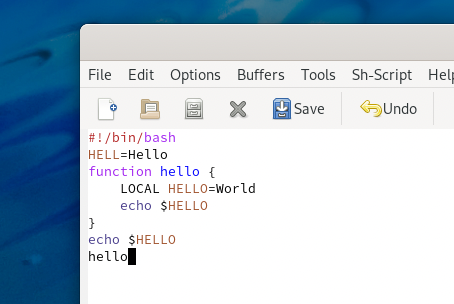{ #fig:001 width=70% }

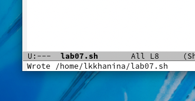{ #fig:001 width=70% }

3. Вырезаем командой C-k целую строку. Вставляем строку в конец файла комбинацией C-y.

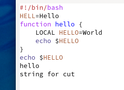{ #fig:001 width=70% }

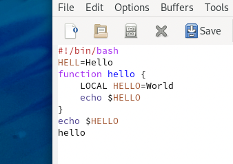{ #fig:001 width=70% }

4. Выделяем область текста с помощью C-space, копируем ее в буфер обмена с помощью Alt-w и вставляем в конец файла с помощью C-y. 

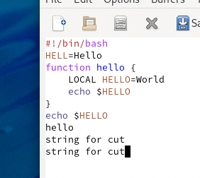{ #fig:001 width=70% }

5. Вновь выделяем эту область и уже удаляем с помощью C-w. 

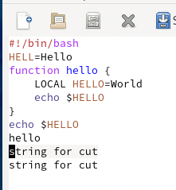{ #fig:001 width=70% }

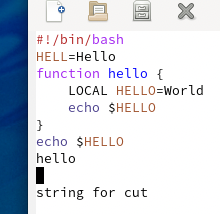{ #fig:001 width=70% }

6. Отменим последние действия с помощью сочетания C-/. 

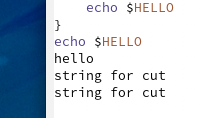{ #fig:001 width=70% }

7. С помощью команды C-a перемещаем курсор в начало строки, а с помощью команды C-e — в конец. 

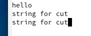{ #fig:001 width=70% }

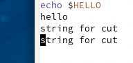{ #fig:001 width=70% }

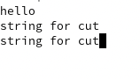{ #fig:001 width=70% }

8. С помощью команды M-< перемещаем курсор в начало буфера, а с помощью команды M-> — в конец. 

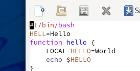{ #fig:001 width=70% }

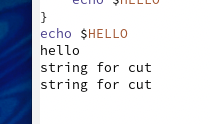{ #fig:001 width=70% }

9. С помощью C-x C-b выводим список активных буферов на экран. 

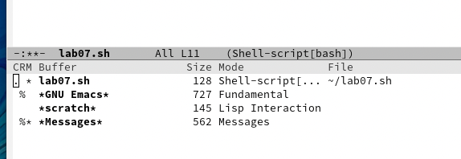{ #fig:001 width=70% }

10. Перемещаемся во вновь открытое окно с помощью C-x и закрываем его с помощью C-x 0. 

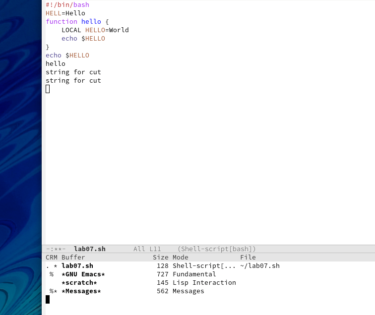{ #fig:001 width=70% }

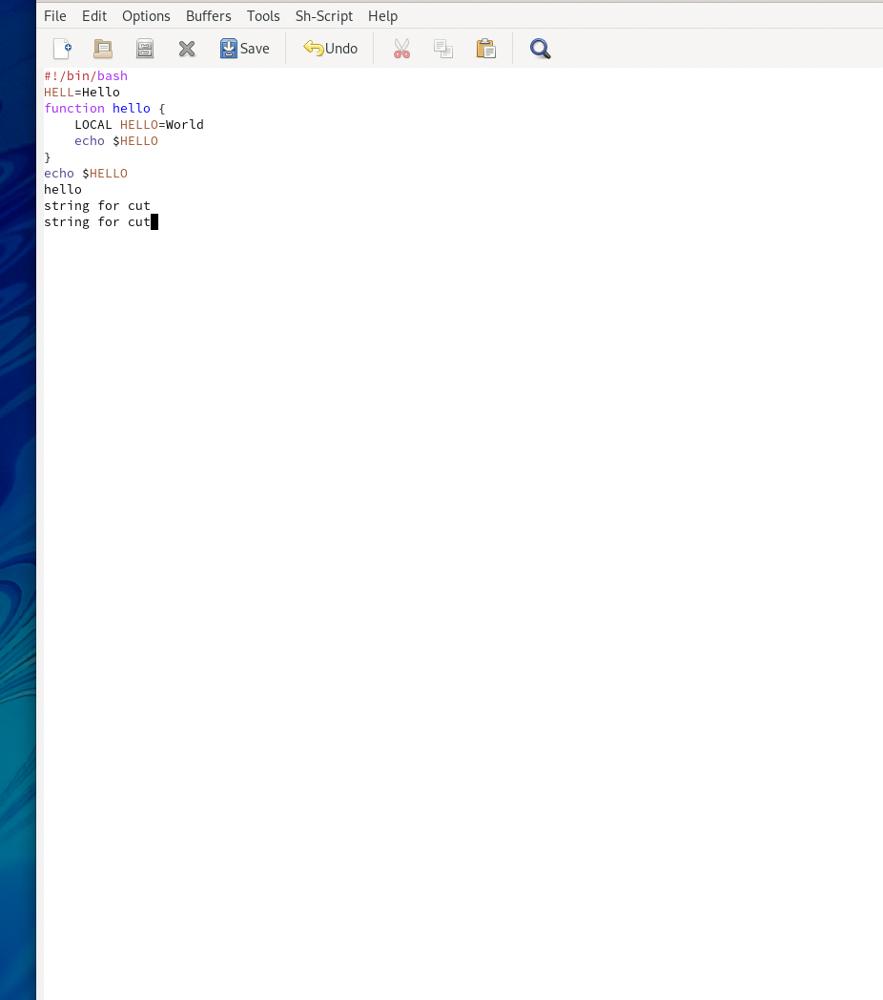{ #fig:001 width=70% }

11. Затем переключаемся между буферами, но уже с помощью C-x b. 

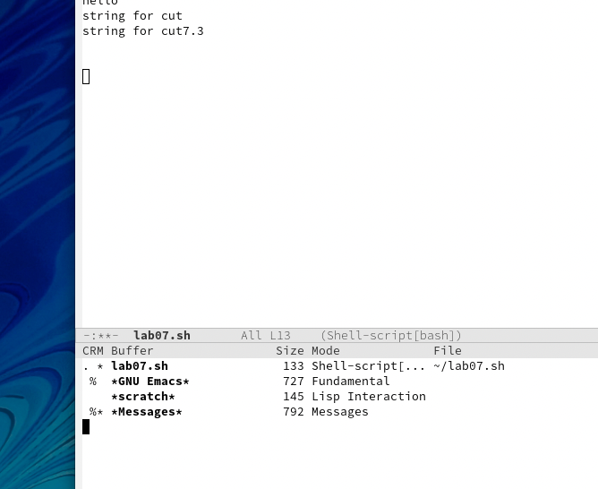{ #fig:001 width=70% }

12. Поделите фрейм на 4 части: разделите фрейм на два окна по вертикали (C-x 3), а затем каждое из этих окон на две части по горизонтали(C-x 2).   

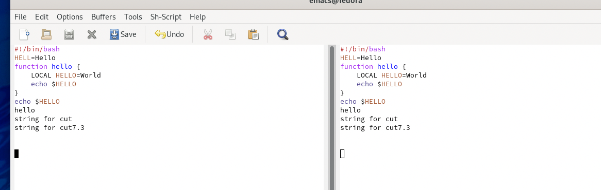{ #fig:001 width=70% }

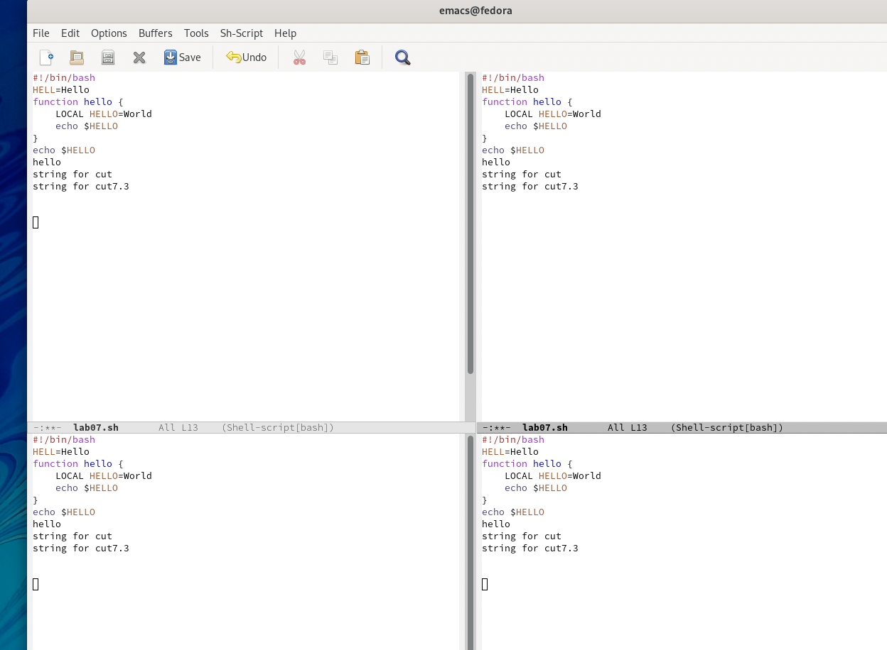{ #fig:001 width=70% }

13. В каждой части откроем файл с помощью С-x C-f.    

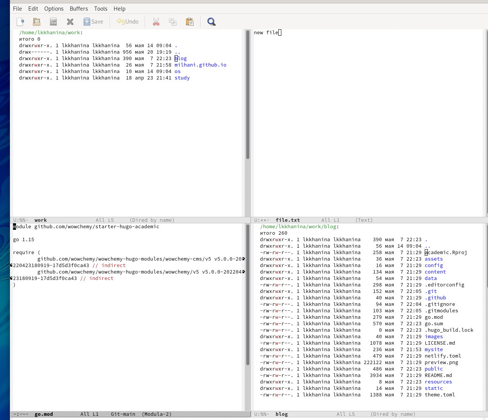{ #fig:001 width=70% }

14. В режиме поиска найдем несколько слов с помощью C-s.    

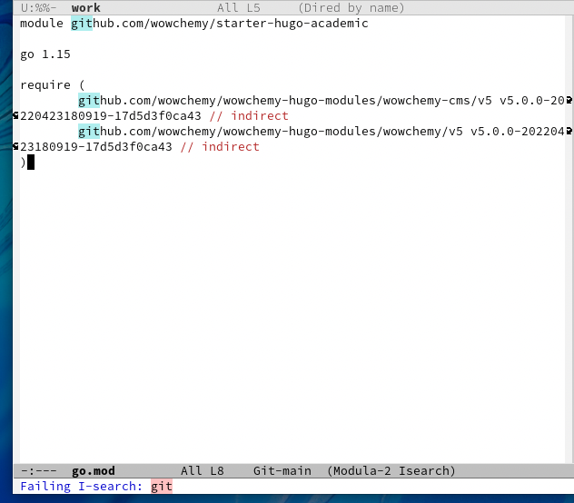{ #fig:001 width=70% }

15. Переключимся между результатами поиска с помощью C-s и выйдем из режима с помощью C-g.     

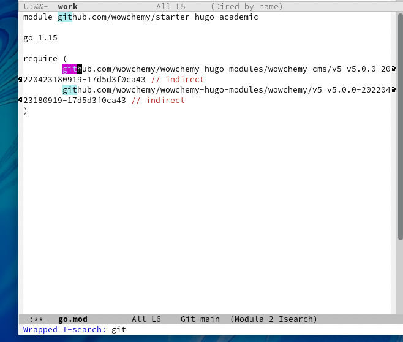{ #fig:001 width=70% }

16. В режиме поиска и замены (Alt-%) введем текст, который нужно найти и заменить, введем текст-замену и подтвердим ее.    

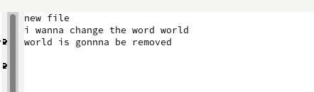{ #fig:001 width=70% }

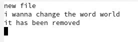{ #fig:001 width=70% }

17. Попробуем режим поиска Alt-s o.     

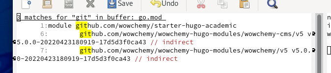{ #fig:001 width=70% }

# Контрольные вопросы

1. Режимы работы в mc:
 • Информация: на панель выводятся сведения о файле и текущей файловой системе,
расположенных на активной панели;
 • Дерево: на одной из панелей выводится структура дерева каталогов.   

2. С помощью комбинаций клавиш в mc можно просмотреть содержимое файла (F3), изменить содержимое файла (F4), скопировать файлы (F5), перенести файлы (F6), создать подкаталог (F7), удалить файл/каталог (F8). 

3. Струтура левой (и правой) панели:
 • Формат списка позволяет управлять отображением файлов и каталогов. 
 • Порядок сортировки позволяет задать критерий сортировки при выводе списка файлов. 

4. Структура Файл:
 • Просмотр (F3) позволяет просматривать файл. 
 • Правка (F4) позволяет изменять файл. 
 • Копирование (F5) позволяет копировать указанный файл/каталог в определенное место
 • Права доступа позволяют указать или изменить права доступа к файлам/каталогам. 
 • Создание каталога (F7) позволяет создать каталог. 
 • Удалить (F8) позволяет удалить файл/каталог. 

5. Структура Команда:
 • Дерево каталогов — отображает структуру каталогов. 
 • Поиск файлов — выполняет поиск файлов по заданным параметрам. 
 • Сравнить каталоги — сравнивает содержимое каталогов. 
 • История командной строки – выводит историю использованных команд. 

6. Структура Настройки:
 • Конфигурация — позволяет скорректировать настройки работы с панеляи. 
 • Внешний вид и Настройки панелей — изменяет расположение панелей и их цветовыделение. 

7. Встроенные команды mс:
 • F1 — Помощь
 • F2 — Сохранить изменения в файл при редактировании
 • F3 — Просмотр файла
 • F3 — (Во время редактирования) Начать выделение текста. Повторное нажатие F3 закончит выделение
 • F4 — Редактирование файла
 • F5 — Скопировать выделенное
 • F6 — Переместить выделенное
 • F8 — Удалить выделенное  

8. Команды встроенного редактора mc:
 • F4 — поиск с заменой
 • F6 — поиск с помощью регулярного выражения
 • Shift+F3 — Начать выделение блока текста. Повторное нажатие F3 закончит выделение
 • Shift+F5 — Вставка текста из внутреннего буфера обмена mc (прочитать внешний файл)
 • Ctrl+f — Занести выделенный фрагмент во внутренний буфер обмена mc (записать во внешний файл)
 • Ctrl+k — Удалить часть строки до конца строки
 • Ctrl+s — Включить или выключить подсветку синтаксиса
 • Ctrl+u — Отменить действия
 • Ctrl+y — Удалить строку

9. Файлы меню содержат списки команд для выполнения часто повторяемых пользователем операций. Эти меню создаются и поддерживаются самими пользователями. Могут быть созданы три файла меню: в текущем каталоге, в домашнем каталоге пользователя и общесистемный.

10. Операции над файлами:
 • Shift+F4 — Создает новый файл
 • shift-f6 — переименовать файл
 • alt-. — показать скрытые файлы
 • ctrl-x, c — права на файл
 • ctrl-x, o — владелец файла
 • Shift-F3 — просмотр файла
 • Ctrl-X+L — создать ссылку на файл
 • Ctrl-X+S — создать символическую ссылку на файл
 • F12 — Save as
 • ctrl-x, ctrl-d — сравнить файлы

# Выводы

Я научилась работать в emacs. Познакомилась с режимами работы над буферами и с режимами работы над текстом. 
