---
## Front matter
title: "Лабораторная работа №10"
author: "Ханина Людмила Константиновна"

## Generic otions
lang: ru-RU

## Bibliography
bibliography: bib/cite.bib
csl: pandoc/csl/gost-r-7-0-5-2008-numeric.csl

## Pdf output format
toc: true # Table of contents
toc-depth: 2
lof: true # List of figures
lot: true # List of tables
fontsize: 12pt
linestretch: 1.5
papersize: a4
documentclass: scrreprt
## I18n polyglossia
polyglossia-lang:
  name: russian
  options:
	- spelling=modern
	- babelshorthands=true
polyglossia-otherlangs:
  name: english
## I18n babel
babel-lang: russian
## Fonts
mainfont: PT Serif
romanfont: PT Serif
sansfont: PT Sans
monofont: PT Mono
mainfontoptions: Ligatures=TeX
romanfontoptions: Ligatures=TeX
sansfontoptions: Ligatures=TeX,Scale=MatchLowercase
monofontoptions: Scale=MatchLowercase,Scale=0.9
## Biblatex
biblatex: true
biblio-style: "gost-numeric"
biblatexoptions:
  - parentracker=true
  - backend=biber
  - hyperref=auto
  - language=auto
  - autolang=other*
  - citestyle=gost-numeric
## Pandoc-crossref LaTeX customization
figureTitle: "Рис."
tableTitle: "Таблица"
listingTitle: "Листинг"
lofTitle: "Список иллюстраций"
lotTitle: "Список таблиц"
lolTitle: "Листинги"
## Misc options
indent: true
header-includes:
  - \usepackage{indentfirst}
  - \usepackage{float} # keep figures where there are in the text
  - \floatplacement{figure}{H} # keep figures where there are in the text
---

# Цель работы

Изучить основы программирования в оболочке ОС UNIX/Linux. Научиться писать небольшие командные файлы.

# Задание

* Написатьскрипт,которыйпризапускебудетделатьрезервнуюкопиюсамогосебя(то есть файла, в котором содержится его исходный код) в другую директорию backup в вашем домашнем каталоге. При этом файл должен архивироваться одним из ар- хиваторов на выбор zip, bzip2 или tar. Способ использования команд архивации необходимо узнать, изучив справку.
* Написать пример командного файла, обрабатывающего любое произвольное число аргументов командной строки, в том числе превышающее десять. Например, скрипт может последовательно распечатывать значения всех переданных аргументов.
* Написать командный файл — аналог команды ls (без использования самой этой команды и команды dir). Требуется, чтобы он выдавал информацию о нужном каталоге и выводил информацию о возможностях доступа к файлам этого каталога.
* Написать командный файл, который получает в качестве аргумента командно йстроки формат файла (.txt, .doc, .jpg, .pdf и т.д.) и вычисляет количество таких файлов в указанной директории. Путь к директории также передаётся в виде аргумента командной строки.

# Теоретическое введение

| Команда | Значение команды                                                                                                        |
|--------------|----------------------------------------------------------------------------------------------------------------------------|
| `for имя [in список-значений] do список-команд
done`          | Оператор цикла for   |
| ` getopts option-string  variable  [arg ... ]`       | Использование команды getopts    |

# Выполнение лабораторной работы

1. C помощью команды man узнаем информацию про zip, bzip2, tar. 

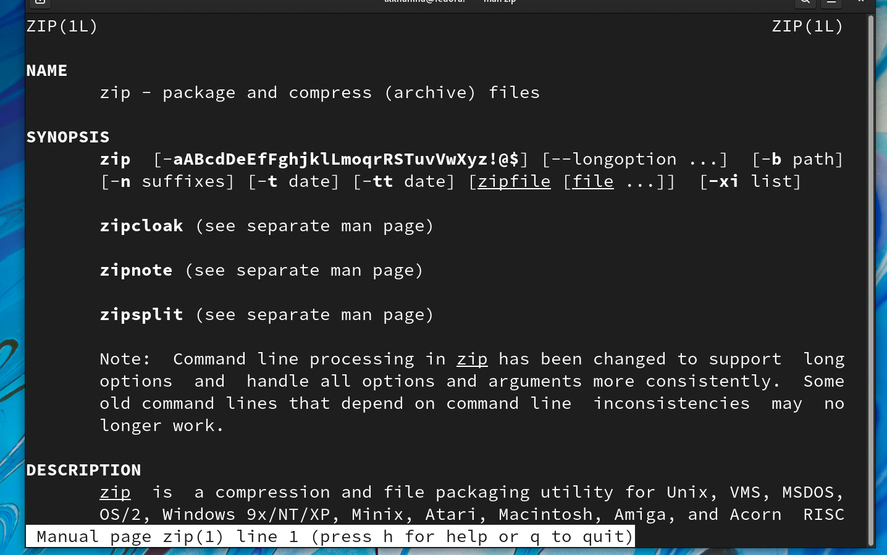{ #fig:001 width=70% }

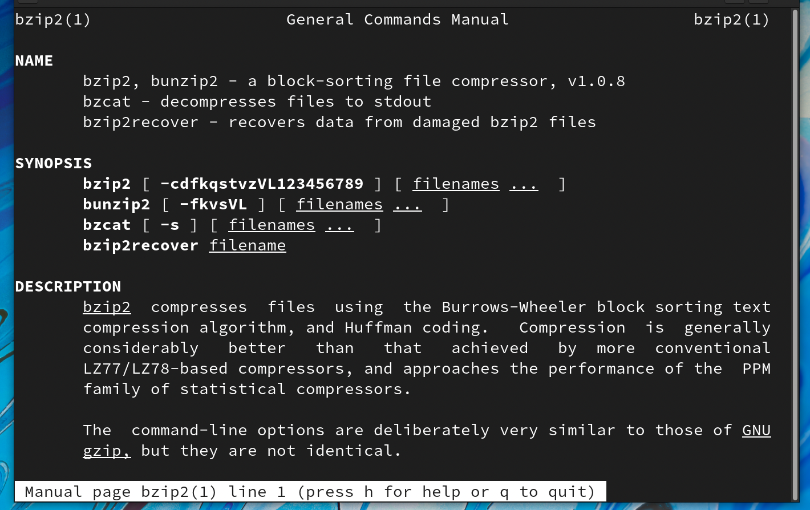{ #fig:001 width=70% }

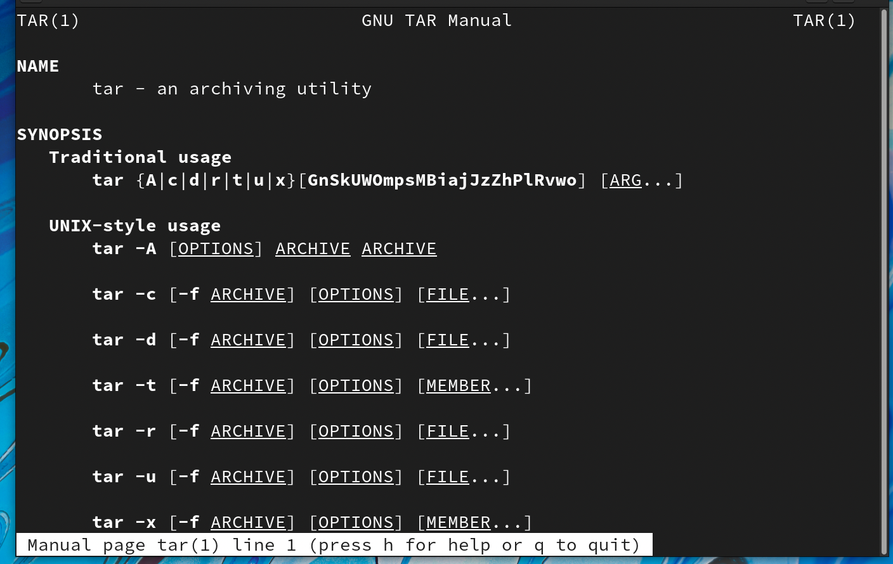{ #fig:001 width=70% }

2. Создаем файл lab01first.sh, в котором будем писать скрипт, который при запуске будет делать резервную копию самого себя в другую директорию backup в нашем домашнем каталоге. Файл будет архивироваться с помощью архиватора bzip2. Перед запуском изменим права доступа, чтобы иметь возможность запускать скрипт. 

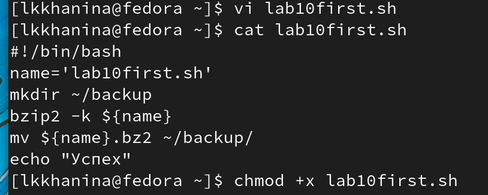{ #fig:001 width=70% }

3. Посмотрим корректность исполнения скрипта. Для этого зайдем в появившийся каталог backup и посмотрим текст архивированног файла. Все хорошо. 

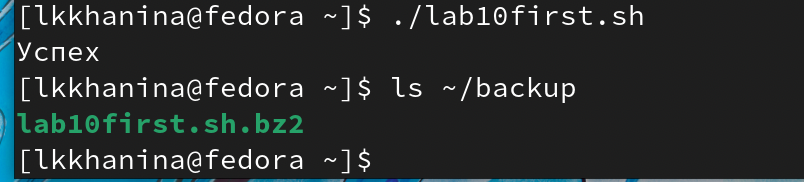{ #fig:001 width=70% }

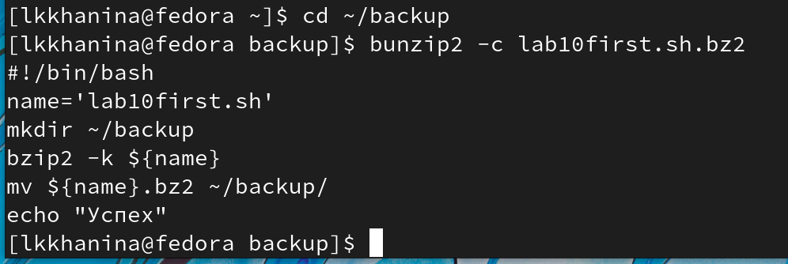{ #fig:001 width=70% }

4. Далее создаем файл lab10second, в котором будет второй скрипт, обрабатывающий любое произвольное число аргументов командной строки, в том числе превышающее десять. Например, скрипт может последовательно распечатывать значения всех переданных аргументов. Сразу изменим права доступа. 

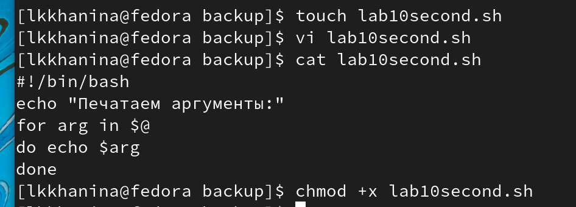{ #fig:001 width=70% }

5. Запустим скрипт и убедимся, что он исправно работает. 

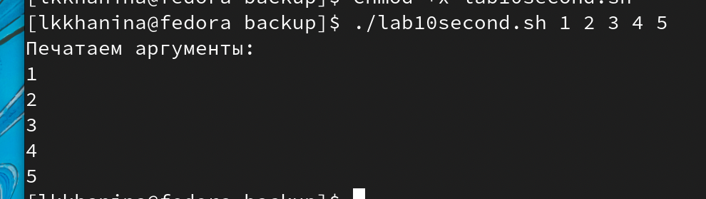{ #fig:001 width=70% }

6. Далее создаем файл lab10third, в котором будет третий скрипт, аналог команды ls (без использования самой этой команды и команды dir). Требуется, чтобы он выдавал информацию о нужном каталоге и выводил информацию о возможностях доступа к файлам этого каталога. Также изменим права доступа, чтобы суметь запустить скрипт. 

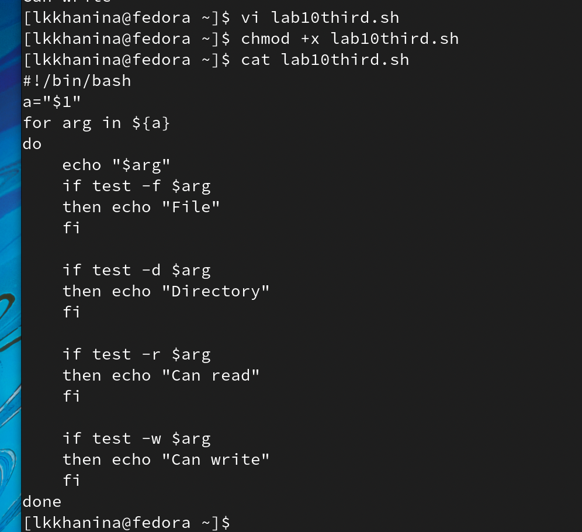{ #fig:001 width=70% }

7. Запустим скрипт и убедимся, что он исправно работает. 

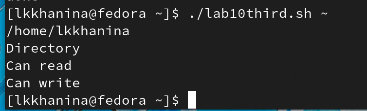{ #fig:001 width=70% }

8. Далее создаем файл lab10fourth, в котором будет четвертый скрипт, который получает в качестве аргумента командной строки формат файла (.txt, .doc, .jpg, .pdf и т.д.) и вычисляет количество таких файлов в указанной директории. Путь к директории также передаётся в виде аргумента командной строки. Также изменим права доступа, чтобы суметь запустить скрипт. 

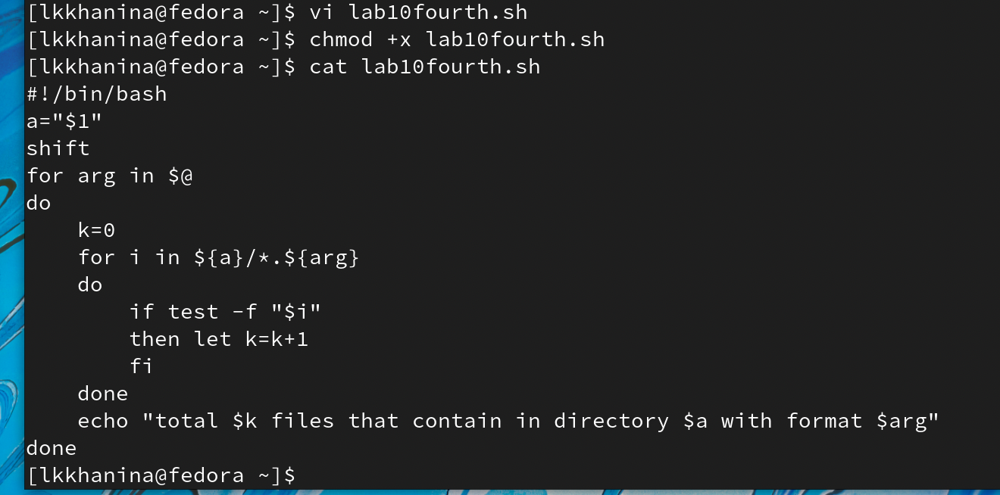{ #fig:001 width=70% }

9. Запустим скрипт и убедимся, что он исправно работает. 

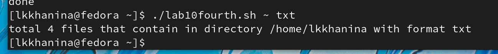{ #fig:001 width=70% }

# Контрольные вопросы

1. Режимы работы редактора vi:
* командный режим — предназначен для ввода команд редактирования инавигации по
редактируемому файлу;
* режим вставки — предназначен для ввода содержания редактируемого файла;
* режим последней (или командной) строки — используется для записи изменений в файл
и выхода из редактора.  

2. Чтобы выйти из редактора, не сохраняя изменения, достаточно выйти в командный режим (Esc) и написать :q или :q!.

3. Команды позиционирования:
* 0 - переход в начало строки;
* $ — переход в конец строки;
* G — переход в конец файла;
* nG — переход на строку с номером n.

4. Словом для vi является набор букв, который отделяется от других слов пробелом, табуляцией, возвратом каретки и/или любые знаки пунктуации. 

5. Чтобы перейти в начало/конец файла, необходимо использовать командe 1G и G соответственно.  

6. Группы команд редактирования.

Вставка текста:
* а – вставить текст после курсора;
* A - вставить текст в конец строки;
* ni - вставить текст n раз. 

Удаление текста:
* x - удалить один символ в буфер;
* dw - удалить одно слово в буфер;
* dd - удалить в буфер одну строку;
* ndd - удалитьвбуфер n строк.

Копирование текста в буфер:
* Y -  скопировать строку в буфер;
* yw - ускопировать слово в буфер;
* nY - скопировать 𝑛 строк в буфер.

Замена текста:
* cx - заменить слово;
* ncw - заменить𝑛слов;
* r - заменить слово;
* R - заменить текст.

7. Чтобы заполнить строку символами $, необходимо использовать / или одинарные кавычки. 

8. Чтобы отменить действия во время редактирования, нужно нажать на горячую клавишу u. 

9. Группы команд редактирования в режиме командной строки.

Копирование и перемещение текста:
* :n,md – удалить строки с n по m;
* :i,jmk - переместить строки с i по j, начиная со строки k;
* :i,jtk - копировать строки с i по j в строку k. 

Запись в файл и выход из редактора:
* :w — записать изменённый текст в файл, не выходя из vi;
* :w filename - записать измененный текст в новый файл filename;
* :w! filename - записать измененный текст в новый файл filename;
* :wq - записать изменения в файл и выйти из vi.
* :q -  выйти из редактора vi;
* :q! - выйти из редактора без записи.

10. Чтобы определить позицию, в которой заканчивается строка, достаточно использовать символ $. 

11. Опции vi:
* h	Влево
* j	Вниз
* k	Вверх
* l	Вправо
* «стрелки»	Перемещение по тексту (в больших файлах работает медленно, в некоторых конфигурациях может работать некорректно).
* w	К следующему слову
* W	К следующему слову (по пробелам)
* b	К началу слова
* B	К началу слова (по пробелам)
* ^	К первому непробельному символу строки

12. Определить режим работы vi можно по доступным инструментам. Если вдруг вы запутались, можно с помощью Esc вернуться в обычный режим. 

13. Командный режим -> режим вставки -> режим командной строки.

# Выводы

Я научилась писать небольшие командный файлы для решения различных вопрсов. 
