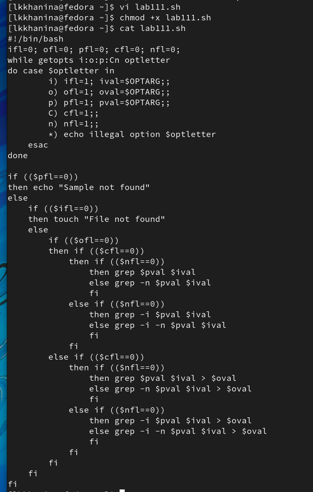
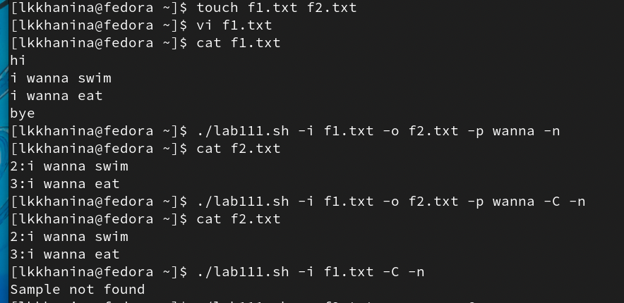
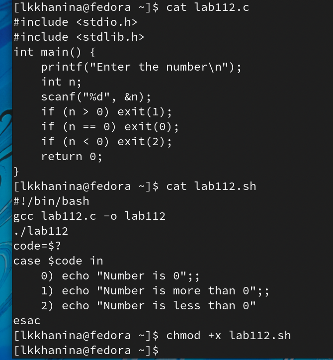
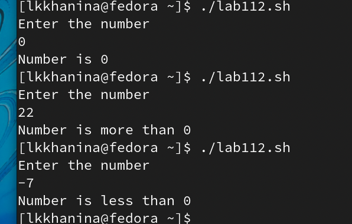
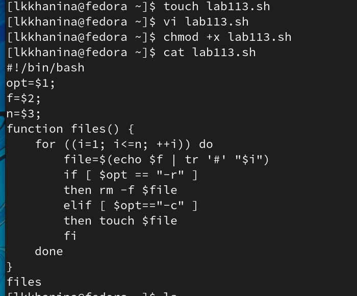
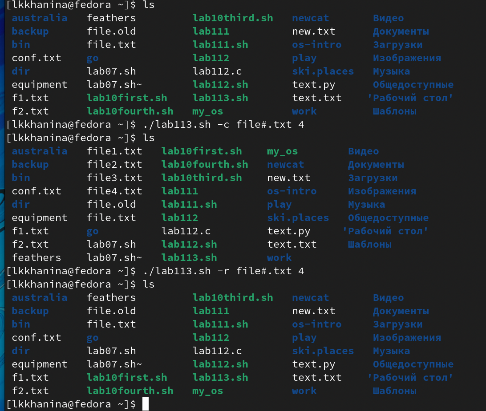
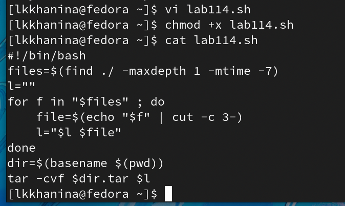
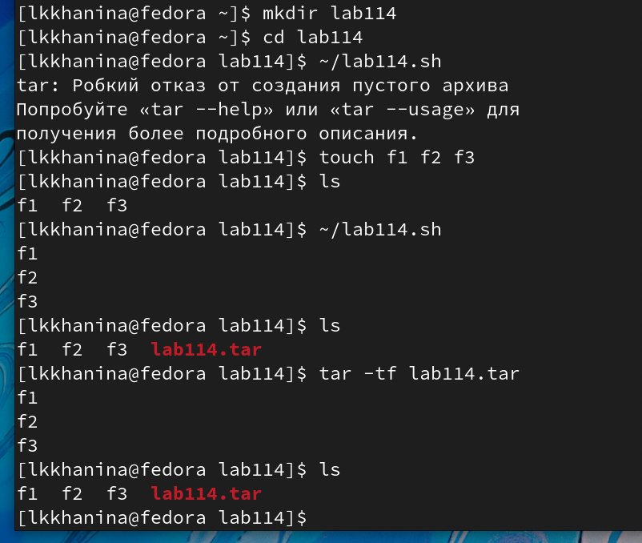

---
## Front matter
lang: ru-RU
title: Презентация лабораторной работы №11
author: |
	Ханина Людмила. Sevastianov\inst{1}
institute: |
	\inst{1}RUDN University, Moscow, Russian Federation

## Formatting
toc: false
slide_level: 2
theme: metropolis
header-includes: 
 - \metroset{progressbar=frametitle,sectionpage=progressbar,numbering=fraction}
 - '\makeatletter'
 - '\beamer@ignorenonframefalse'
 - '\makeatother'
aspectratio: 43
section-titles: true
---

# Презентация лабораторной работы №11

## Цель

Изучить основы программирования в оболочке ОС UNIX. Научится писать более сложные командные файлы с использованием логических управляющих конструкций и циклов

## Задание

* Используя команды getoptsgrep, написать командный файл, который анализирует командную строку с ключами:
– -iinputfile — прочитать данные из указанного файла; 
– -ooutputfile — вывести данные в указанный файл;
– -pшаблон — указать шаблон для поиска;
– -C — различать большие и малые буквы;
– -n — выдавать номера строк.
а затем ищет в указанном файле нужные строки, определяемые ключом -p.
* Написать на языке Си программу, которая вводит число и определяет,является ли оно больше нуля, меньше нуля или равно нулю. Затем программа завершается с помощью функции exit(n), передавая информацию в о коде завершения в оболочку. Команд- ный файл должен вызывать эту программу и, проанализировав с помощью команды $?, выдать сообщение о том, какое число было введено.
* Написать командный файл, создающий указанное число файлов, пронумерованных последовательно от 1 до 𝑁 (например 1.tmp, 2.tmp, 3.tmp,4.tmp и т.д.). Число файлов, которые необходимо создать, передаётся в аргументы командной строки. Этот же ко- мандный файл должен уметь удалять все созданные им файлы (если они существуют).
* Написать командный файл, который с помощью команды tar запаковывает в архив все файлы в указанной директории. Модифицировать его так, чтобы запаковывались только те файлы, которые были изменены менее недели тому назад (использовать команду find).

# Выполнение лабораторной работы

## Cоздадим файл lab111.sh и запишем в него скрипт, который будет анализировать командную строку с ключами. Далее изменим доступ к файлу, чтобы можно было его запускать

{ #fig:001 width=70% }

## Проверим, что он работает. Для этого создадим файлы f1.txt и f2.txt. В первый напишем текст. Теперь запустим файл и увидим, что программа отработола корректно

{ #fig:001 width=70% }

## Далее создадим файлы lab112.c и lab112.sh. В первый запишем скрипт, который бдут определять, какое число ввел пользователь. Во второй скрипт, который будет анализировать исполнение первого. Изменим доступ к файлу lab112.sh, чтобы можно было его запускать

{ #fig:001 width=70% }

{ #fig:001 width=70% }

## Теперь запустим файл и увидим, что программа отработола корректно

{ #fig:001 width=70% }

## Cоздадим файл lab113.sh и запишем в него скрипт, который будет с опцией -c создавать заданное количество файлов, а с опцией -r — их удалять. Далее изменим доступ к файлу, чтобы можно было его запускать

{ #fig:001 width=70% }

## Теперь запустим файл и увидим, что программа отработола корректно

{ #fig:001 width=70% }

## Cоздадим файл lab114.sh и запишем в него скрипт, который будет с помощью команды tar запаковывает в архив все файлы, которые были изменены менее недели тому назад, в указанной директории. Далее изменим доступ к файлу, чтобы можно было его запускать

{ #fig:001 width=70% }

## Чтобы проверить корректность скрипта, создаем директорию и добавляем в нее файлы. Теперь запускаем файл и видим, что программа отработола корректно

{ #fig:001 width=70% }

# Выводы

Я научилась писать более сложные командный файлы с использованием логических управляющих конструкций и циклов
