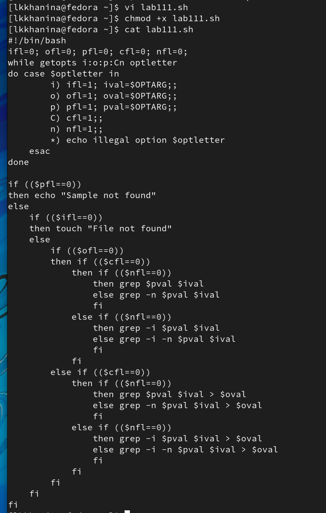
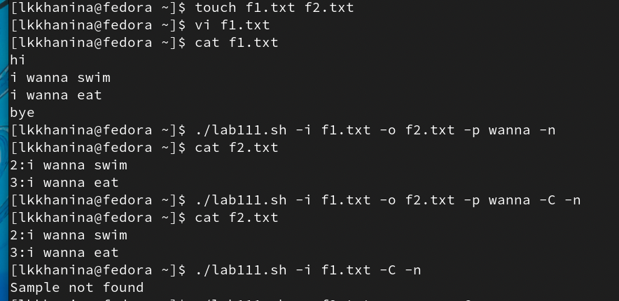
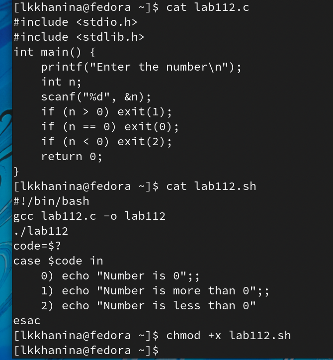
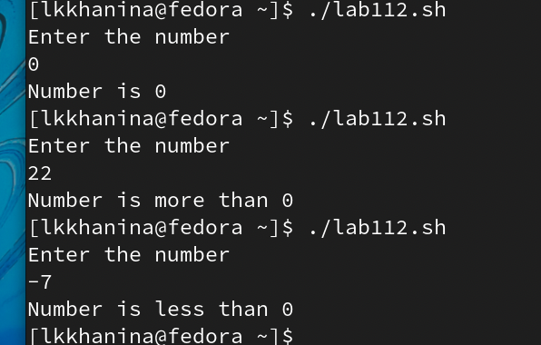
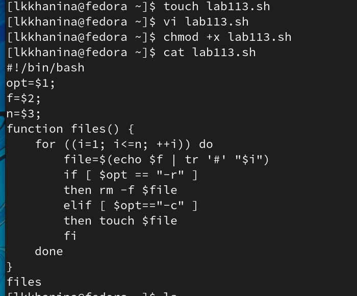
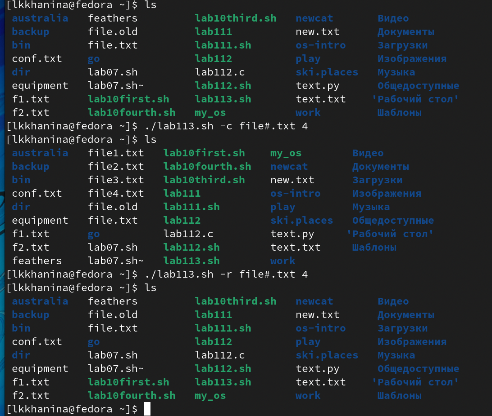
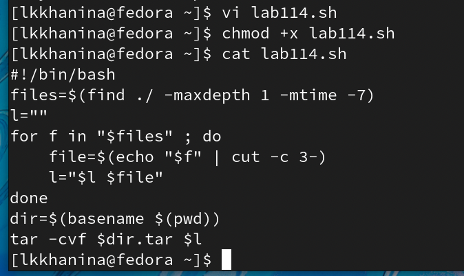
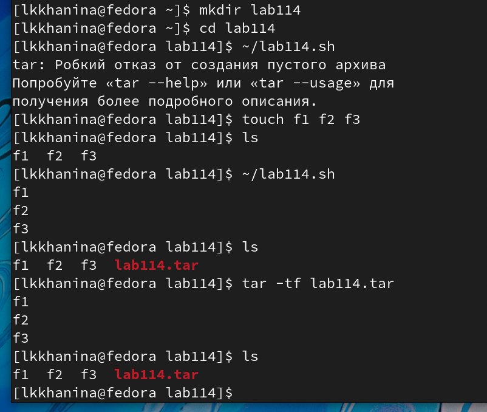

---
## Front matter
title: "Лабораторная работа №11"
author: "Ханина Людмила Константиновна"

## Generic otions
lang: ru-RU

## Bibliography
bibliography: bib/cite.bib
csl: pandoc/csl/gost-r-7-0-5-2008-numeric.csl

## Pdf output format
toc: true # Table of contents
toc-depth: 2
lof: true # List of figures
lot: true # List of tables
fontsize: 12pt
linestretch: 1.5
papersize: a4
documentclass: scrreprt
## I18n polyglossia
polyglossia-lang:
  name: russian
  options:
	- spelling=modern
	- babelshorthands=true
polyglossia-otherlangs:
  name: english
## I18n babel
babel-lang: russian
## Fonts
mainfont: PT Serif
romanfont: PT Serif
sansfont: PT Sans
monofont: PT Mono
mainfontoptions: Ligatures=TeX
romanfontoptions: Ligatures=TeX
sansfontoptions: Ligatures=TeX,Scale=MatchLowercase
monofontoptions: Scale=MatchLowercase,Scale=0.9
## Biblatex
biblatex: true
biblio-style: "gost-numeric"
biblatexoptions:
  - parentracker=true
  - backend=biber
  - hyperref=auto
  - language=auto
  - autolang=other*
  - citestyle=gost-numeric
## Pandoc-crossref LaTeX customization
figureTitle: "Рис."
tableTitle: "Таблица"
listingTitle: "Листинг"
lofTitle: "Список иллюстраций"
lotTitle: "Список таблиц"
lolTitle: "Листинги"
## Misc options
indent: true
header-includes:
  - \usepackage{indentfirst}
  - \usepackage{float} # keep figures where there are in the text
  - \floatplacement{figure}{H} # keep figures where there are in the text
---

# Цель работы

Изучить основы программирования в оболочке ОС UNIX. Научится писать более сложные командные файлы с использованием логических управляющих конструкций и циклов.

# Задание

* Используя команды getoptsgrep, написать командный файл, который анализирует командную строку с ключами:
– -iinputfile — прочитать данные из указанного файла; 
– -ooutputfile — вывести данные в указанный файл;
– -pшаблон — указать шаблон для поиска;
– -C — различать большие и малые буквы;
– -n — выдавать номера строк.
а затем ищет в указанном файле нужные строки, определяемые ключом -p.
* Написать на языке Си программу, которая вводит число и определяет,является ли оно больше нуля, меньше нуля или равно нулю. Затем программа завершается с помощью функции exit(n), передавая информацию в о коде завершения в оболочку. Команд- ный файл должен вызывать эту программу и, проанализировав с помощью команды $?, выдать сообщение о том, какое число было введено.
* Написать командный файл, создающий указанное число файлов, пронумерованных последовательно от 1 до 𝑁 (например 1.tmp, 2.tmp, 3.tmp,4.tmp и т.д.). Число файлов, которые необходимо создать, передаётся в аргументы командной строки. Этот же ко- мандный файл должен уметь удалять все созданные им файлы (если они существуют).
* Написать командный файл, который с помощью команды tar запаковывает в архив все файлы в указанной директории. Модифицировать его так, чтобы запаковывались только те файлы, которые были изменены менее недели тому назад (использовать команду find).

# Выполнение лабораторной работы

1. Cоздадим файл lab111.sh и запишем в него скрипт, который будет анализировать командную строку с ключами. Далее изменим доступ к файлу, чтобы можно было его запускать. 

{ #fig:001 width=70% }

2. Проверим, что он работает. Для этого создадим файлы f1.txt и f2.txt. В первый напишем текст. Теперь запустим файл и увидим, что программа отработола корректно. 

{ #fig:001 width=70% }

3. Далее создадим файлы lab112.c и lab112.sh. В первый запишем скрипт, который бдут определять, какое число ввел пользователь. Во второй скрипт, который будет анализировать исполнение первого. Изменим доступ к файлу lab112.sh, чтобы можно было его запускать.

{ #fig:001 width=70% }

{ #fig:001 width=70% }

4. Теперь запустим файл и увидим, что программа отработола корректно.

{ #fig:001 width=70% }

5. Cоздадим файл lab113.sh и запишем в него скрипт, который будет с опцией -c создавать заданное количество файлов, а с опцией -r — их удалять. Далее изменим доступ к файлу, чтобы можно было его запускать. 

{ #fig:001 width=70% }

6. Теперь запустим файл и увидим, что программа отработола корректно.

{ #fig:001 width=70% }

7. Cоздадим файл lab114.sh и запишем в него скрипт, который будет с помощью команды tar запаковывает в архив все файлы, которые были изменены менее недели тому назад, в указанной директории. Далее изменим доступ к файлу, чтобы можно было его запускать. 

{ #fig:001 width=70% }

8. Чтобы проверить корректность скрипта, создаем директорию и добавляем в нее файлы. Теперь запускаем файл и видим, что программа отработола корректно.

{ #fig:001 width=70% }

# Контрольные вопросы

1. Команда getopts является встроенной командой командной оболочки bash, предназначенной для разбора параметров сценариев. Она обрабатывает исключительно однобуквенные параметры как с аргументами, так и без них и этого вполне достаточно для передачи сценариям любых входных данных.

2. При генерации имен используют метасимволы:
* '*' —	произвольная (возможно пустая) последовательность символов;
* ? — один произвольный символ;
* [...]	— любой из символов, указанных в скобках перечислением и/или с указанием диапазона;
* cat f* — выдаст все файлы каталога, начинающиеся с "f";
* cat *f* — выдаст все файлы, содержащие "f";
* cat program.?	– выдаст файлы данного каталога с однобуквенными расширениями, скажем * "program.c" и "program.o", но не выдаст "program.com";
* cat [a-d]* – выдаст файлы, которые начинаются с "a", "b", "c", "d". 

3. Операторы управления действиями: if, for, while, case. 

4. Чтобы прервать цикл, можно использовать оператор break. 

5. Операция сравнения возвращает: значение true («истина»), если высказывание с оператором правдивое (условие выполняется), и false («ложь») — если высказывание с оператором ложное (условие не выполняется).

6. Строка if test -f man$s/$i.$s проверяет, существует ли файл man$s/$i.$s и является ли этот файл обычным файлом. Если данный файл является каталогом, то команда вернет false.

7. Цикл while выполняет тело цикла пока условие истинно. Цикл until выполняет тело цикла пока условие ложно.

# Выводы

Я научилась писать более сложные командный файлы с использованием логических управляющих конструкций и циклов. 
