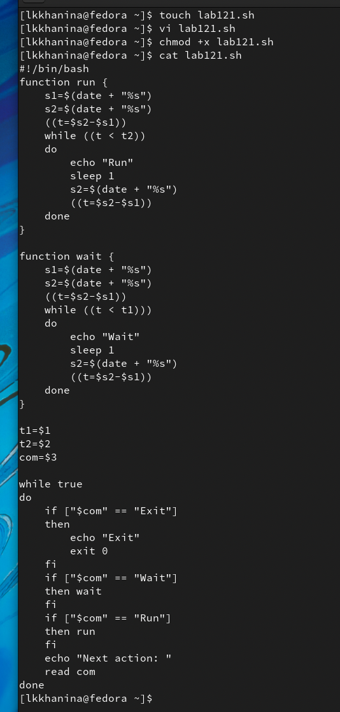
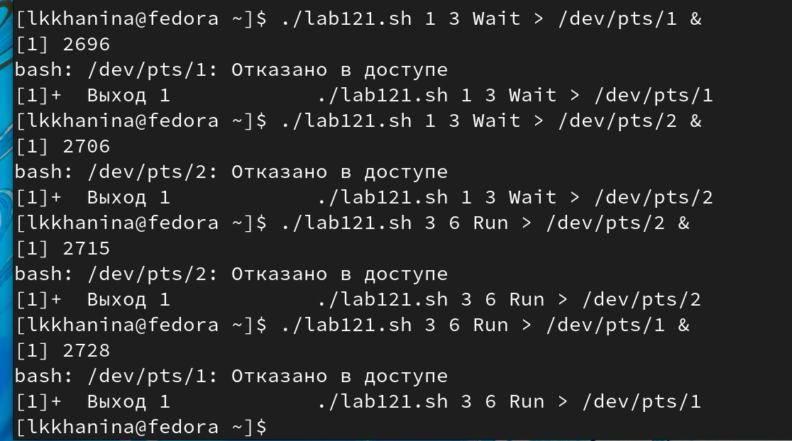
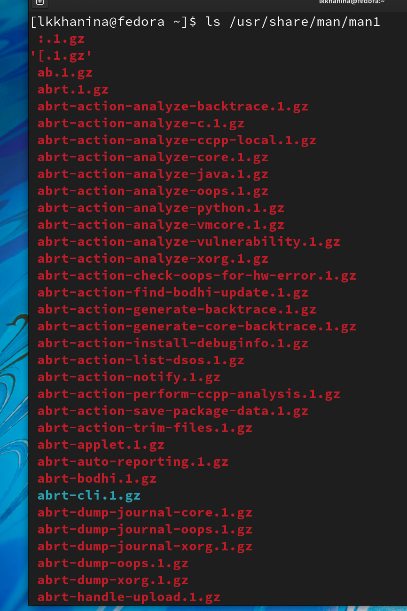
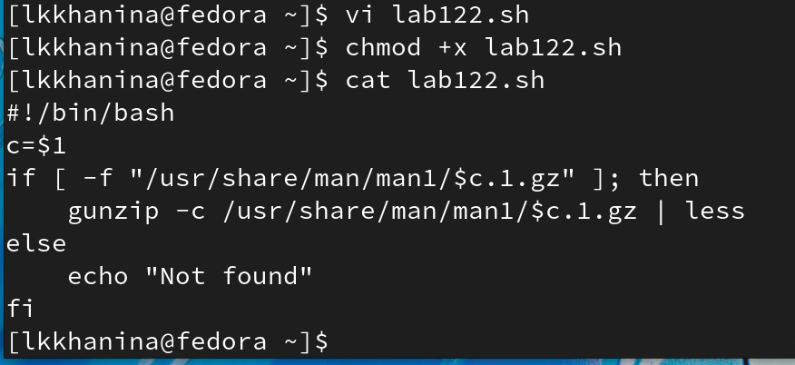
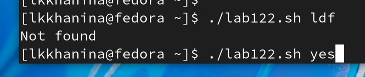
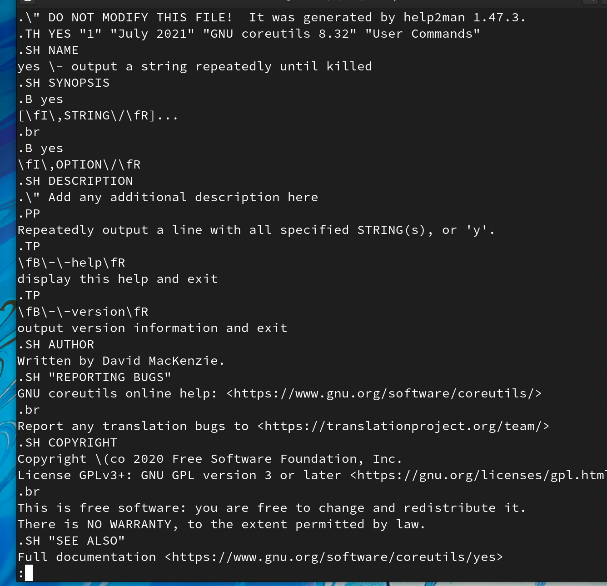
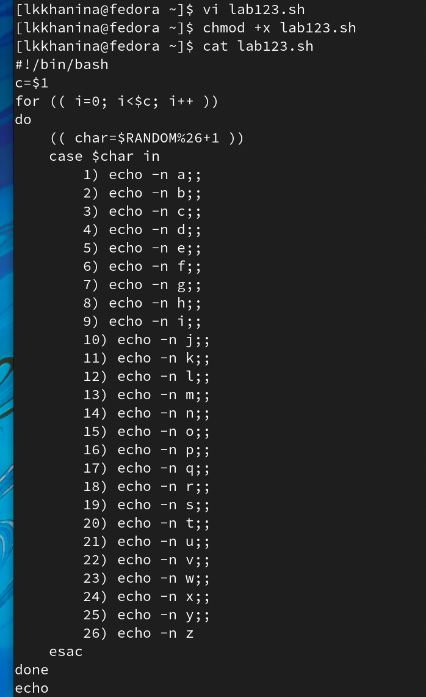
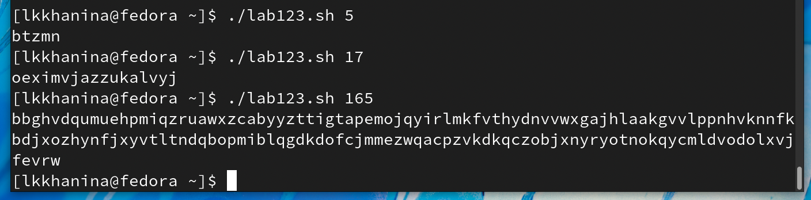

---
## Front matter
lang: ru-RU
title: Презентация лабораторной работы №12
author: |
	Ханина Людмила. Sevastianov\inst{1}
institute: |
	\inst{1}RUDN University, Moscow, Russian Federation

## Formatting
toc: false
slide_level: 2
theme: metropolis
header-includes: 
 - \metroset{progressbar=frametitle,sectionpage=progressbar,numbering=fraction}
 - '\makeatletter'
 - '\beamer@ignorenonframefalse'
 - '\makeatother'
aspectratio: 43
section-titles: true
---

# Презентация лабораторной работы №12

## Цель

Изучить основы программирования в оболочке ОС UNIX. Научиться писать более сложные командные файлы с использованием логических управляющих конструкций и циклов

## Задание

* Написать командный файл, реализующий упрощённый механизм семафоров. Командный файл должен в течение некоторого времени t1 дожидаться освобождения ресурса, выдавая об этом сообщение, а дождавшись его освобождения, использовать его в течение некоторого времени t2<>t1, также выдавая информацию о том, что ресурс используется соответствующим командным файлом (процессом). Запустить командный файл в одном виртуальном терминале в фоновом режиме, перенаправив его вывод в другой (> /dev/tty#, где # — номер терминала куда перенаправляется вывод), в котором также запущен этот файл, но не фоновом, а в привилегированном режиме. Доработать программу так, чтобы имелась возможность взаимодействия трёх и более процессов.
* Реализовать команду man с помощью командного файла. Изучите содержимое каталога /usr/share/man/man1. В нем находятся архивы текстовых файлов, содержащих справку по большинству установленных в системе программ и команд. Каждый архив можно открыть командой less сразу же просмотрев содержимое справки. Командный файл должен получать в виде аргумента командной строки название команды и в виде результата выдавать справку об этой команде или сообщение об отсутствии справки, если соответствующего файла нет в каталоге man1.
* Используя встроенную переменную $RANDOM, напишите командный файл, генерирующий случайную последовательность букв латинского алфавита. Учтите, что $RANDOM выдаёт псевдослучайные числа в диапазоне от 0 до 32767.

# Выполнение лабораторной работы

## Cоздадим файл lab121.sh и запишем в него скрипт, реализующий упрощённый механизм семафоров. Изменим доступ к файлу, чтобы можно было его запускать

{ #fig:001 width=70% }

##  Проверим, что он работает. Запустим

{ #fig:001 width=70% }

##  Далее посмотрим на содержимое файла /usr/share/man/man1

{ #fig:001 width=70% }

## Далее создадим файл lab122.sh. Запишем скрипт, который будет искать введенное слово в каталоге /usr/share/man/man1 и выводить содержимое, то есть справку о команде. Изменим доступ к файлу lab122.sh, чтобы можно было его запускать

{ #fig:001 width=70% }

## Теперь запустим файл и увидим, что программа отработала корректно

{ #fig:001 width=70% }

{ #fig:001 width=70% }

## Cоздадим файл lab123.sh и запишем в него скрипт, генерирующий случайную последовательность букв латинского алфавита

{ #fig:001 width=70% }

## Теперь запустим файл и увидим, что программа отработала корректно

{ #fig:001 width=70% }

# Выводы

Я научилась писать более сложные командный файлы с использованием логических управляющих конструкций и циклов
