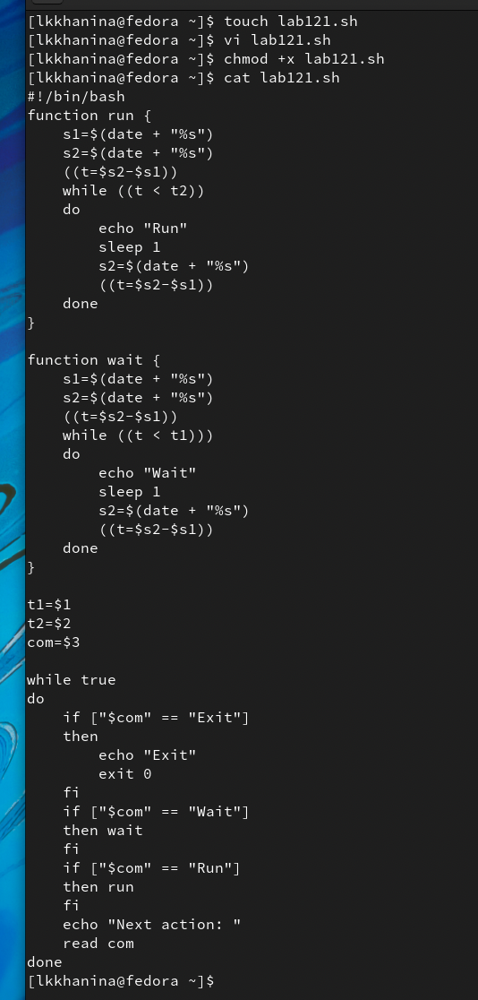
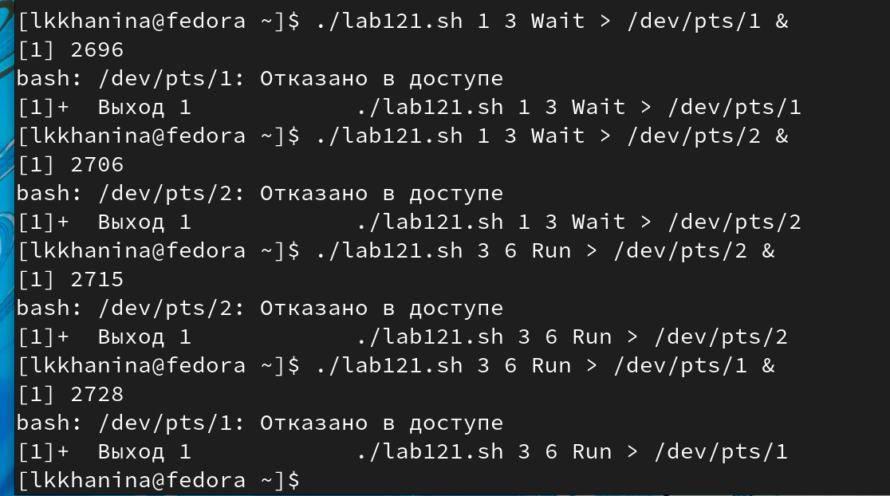
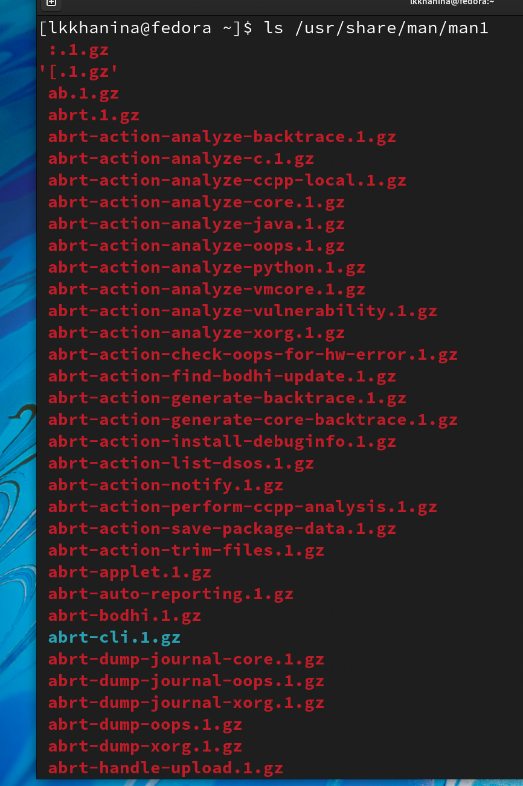
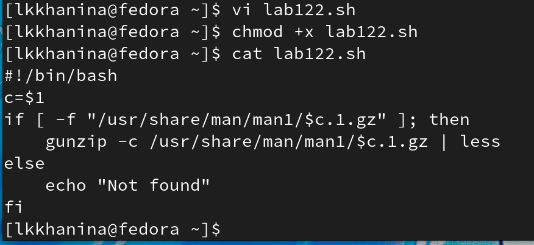
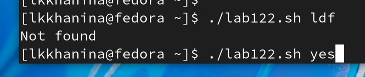
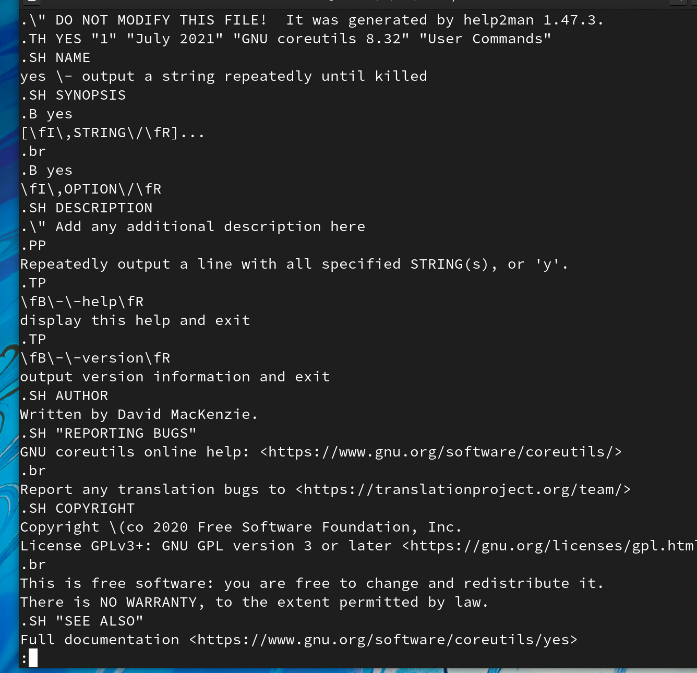
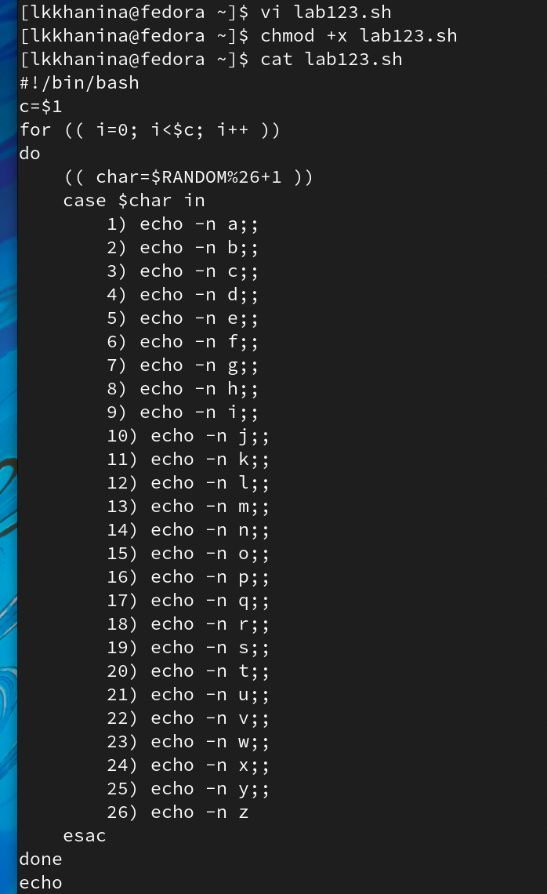
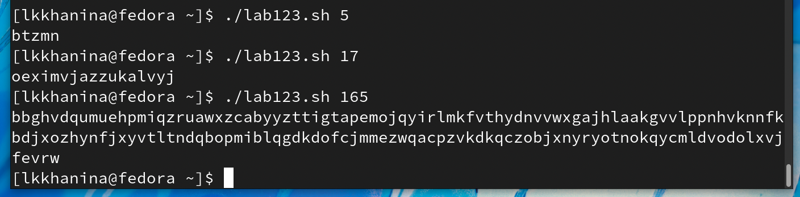

---
## Front matter
title: "Лабораторная работа №12"
author: "Ханина Людмила Константиновна"

## Generic otions
lang: ru-RU

## Bibliography
bibliography: bib/cite.bib
csl: pandoc/csl/gost-r-7-0-5-2008-numeric.csl

## Pdf output format
toc: true # Table of contents
toc-depth: 2
lof: true # List of figures
lot: true # List of tables
fontsize: 12pt
linestretch: 1.5
papersize: a4
documentclass: scrreprt
## I18n polyglossia
polyglossia-lang:
  name: russian
  options:
	- spelling=modern
	- babelshorthands=true
polyglossia-otherlangs:
  name: english
## I18n babel
babel-lang: russian
## Fonts
mainfont: PT Serif
romanfont: PT Serif
sansfont: PT Sans
monofont: PT Mono
mainfontoptions: Ligatures=TeX
romanfontoptions: Ligatures=TeX
sansfontoptions: Ligatures=TeX,Scale=MatchLowercase
monofontoptions: Scale=MatchLowercase,Scale=0.9
## Biblatex
biblatex: true
biblio-style: "gost-numeric"
biblatexoptions:
  - parentracker=true
  - backend=biber
  - hyperref=auto
  - language=auto
  - autolang=other*
  - citestyle=gost-numeric
## Pandoc-crossref LaTeX customization
figureTitle: "Рис."
tableTitle: "Таблица"
listingTitle: "Листинг"
lofTitle: "Список иллюстраций"
lotTitle: "Список таблиц"
lolTitle: "Листинги"
## Misc options
indent: true
header-includes:
  - \usepackage{indentfirst}
  - \usepackage{float} # keep figures where there are in the text
  - \floatplacement{figure}{H} # keep figures where there are in the text
---

# Цель работы

Изучить основы программирования в оболочке ОС UNIX. Научиться писать более сложные командные файлы с использованием логических управляющих конструкций и циклов.

# Задание

* Написать командный файл, реализующий упрощённый механизм семафоров. Командный файл должен в течение некоторого времени t1 дожидаться освобождения ресурса, выдавая об этом сообщение, а дождавшись его освобождения, использовать его в течение некоторого времени t2<>t1, также выдавая информацию о том, что ресурс используется соответствующим командным файлом (процессом). Запустить командный файл в одном виртуальном терминале в фоновом режиме, перенаправив его вывод в другой (> /dev/tty#, где # — номер терминала куда перенаправляется вывод), в котором также запущен этот файл, но не фоновом, а в привилегированном режиме. Доработать программу так, чтобы имелась возможность взаимодействия трёх и более процессов.
* Реализовать команду man с помощью командного файла. Изучите содержимое каталога /usr/share/man/man1. В нем находятся архивы текстовых файлов, содержащих справку по большинству установленных в системе программ и команд. Каждый архив можно открыть командой less сразу же просмотрев содержимое справки. Командный файл должен получать в виде аргумента командной строки название команды и в виде результата выдавать справку об этой команде или сообщение об отсутствии справки, если соответствующего файла нет в каталоге man1.
* Используя встроенную переменную $RANDOM, напишите командный файл, генерирующий случайную последовательность букв латинского алфавита. Учтите, что $RANDOM выдаёт псевдослучайные числа в диапазоне от 0 до 32767.

# Выполнение лабораторной работы

1. Cоздадим файл lab121.sh и запишем в него скрипт, реализующий упрощённый механизм семафоров. Изменим доступ к файлу, чтобы можно было его запускать.

{ #fig:001 width=70% }

2. Проверим, что он работает. Запустим.  

{ #fig:001 width=70% }

3. Далее посмотрим на содержимое файла /usr/share/man/man1. 

{ #fig:001 width=70% }

4. Далее создадим файл lab122.sh. Запишем скрипт, который будет искать введенное слово в каталоге /usr/share/man/man1 и выводить содержимое, то есть справку о команде. Изменим доступ к файлу lab122.sh, чтобы можно было его запускать.

{ #fig:001 width=70% }

5. Теперь запустим файл и увидим, что программа отработала корректно.

{ #fig:001 width=70% }

{ #fig:001 width=70% }

6. Cоздадим файл lab123.sh и запишем в него скрипт, генерирующий случайную последовательность букв латинского алфавита. 

{ #fig:001 width=70% }

7. Теперь запустим файл и увидим, что программа отработала корректно.

{ #fig:001 width=70% }

# Контрольные вопросы

1. while [$1 != "exit"]

В данной строчке допущены следующие ошибки:

* не хватает пробелов после первой скобки и перед второй скобкой;
* выражение $1 необходимо взять в "".

Таким образом, правильный вариант должен выглядеть так: while [ "$1" != "exit" ]

2. Для объединения строк в одну можно воспользоваться следующими способами:
* newstring="$s1$s2"
* string += "text"

3. Утилита seq выводит последовательность целых чисел с шагом, заданным пользователем.
*  Чтобы просто напечатать последовательность чисел, начиная с 1 и заканчивая n, используйте следующую команду: seq n;
*  Можно указать верхний и нижний пределы: seq begin end (seq 1 3 -> 1 2 3);
*  Также можно указать шаг: seq begin step end (seq 1 3 10 -> 1 4 7 10). 

4. Ответом будет 3, так как было использовано целочисленное деление. 

5. Основные ключевые различия между Zsh и Bash:
* Zsh более интерактивный и настраиваемый, чем Bash.
* У Zsh есть поддержка с плавающей точкой, которой нет у Bash.
* В Zsh поддерживаются структуры хеш-данных, которых нет в Bash.
* Функции вызова в Bash лучше по сравнению с Zsh.
* Внешний вид подсказки можно контролировать в Bash, тогда как Zsh настраивается.
* Конфигурационными файлами являются .bashrc в интерактивных оболочках без регистрации и .profile или .bash_profile в оболочках входа в Bash. В Zsh оболочками, не входящими в систему, являются .zshrc, а оболочками для входа - .zprofile.
* Массивы Zsh индексируются от 1 до длины, тогда как Bash индексируется от -1 до длины.
* В Zsh, если шаблоны не совпадают ни с одним файлом, выдается ошибка. Находясь в Баше, он остается без изменений.

6. Синтаксис верен. 

7. Преимущества sh:
* стандартизировано;
* это намного проще и легче узнать;
* он переносится через системы POSIX - даже если они не имеют bash, они должны иметь sh.

Есть и преимущества использования bash. Его функции делают программирование более удобным и похожим на программирование на других современных языках программирования. К ним относятся такие области, как локальные переменные и массивы. Обычный sh - очень минималистический язык программирования.

# Выводы

Я научилась писать более сложные командный файлы с использованием логических управляющих конструкций и циклов. 
