---
## Front matter
lang: ru-RU
title: Презентация лабораторной работы №13
author: |
	Ханина Людмила. Sevastianov\inst{1}
institute: |
	\inst{1}RUDN University, Moscow, Russian Federation

## Formatting
toc: false
slide_level: 2
theme: metropolis
header-includes: 
 - \metroset{progressbar=frametitle,sectionpage=progressbar,numbering=fraction}
 - '\makeatletter'
 - '\beamer@ignorenonframefalse'
 - '\makeatother'
aspectratio: 43
section-titles: true
---

# Презентация лабораторной работы №13

## Цель

Приобрести простейшие навыки разработки, анализа, тестирования и отладки приложений в ОС типа UNIX/Linux на примере создания на языке программирования С калькулятора с простейшими функциями

## Задание

* В домашнем каталоге создайте подкаталог ~/work/os/lab_prog.
* Создайте в нём файлы:calculate.h, calculate.c, main.c.
* С помощью gdb выполните отладку программы calcul. 
* С помощью утилиты splint попробуйте проанализировать коды файлов calculate.c и main.c.

# Выполнение лабораторной работы

## В домашнем каталоге создаем подкаталог ~/work/os/lab_prog

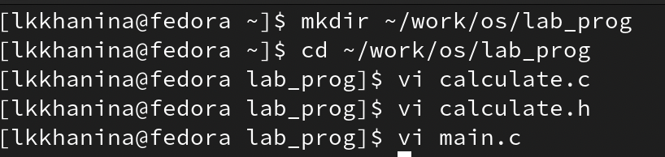{ #fig:001 width=70% }

##  Создаем в нём файлы: calculate.h, calculate.c, main.c

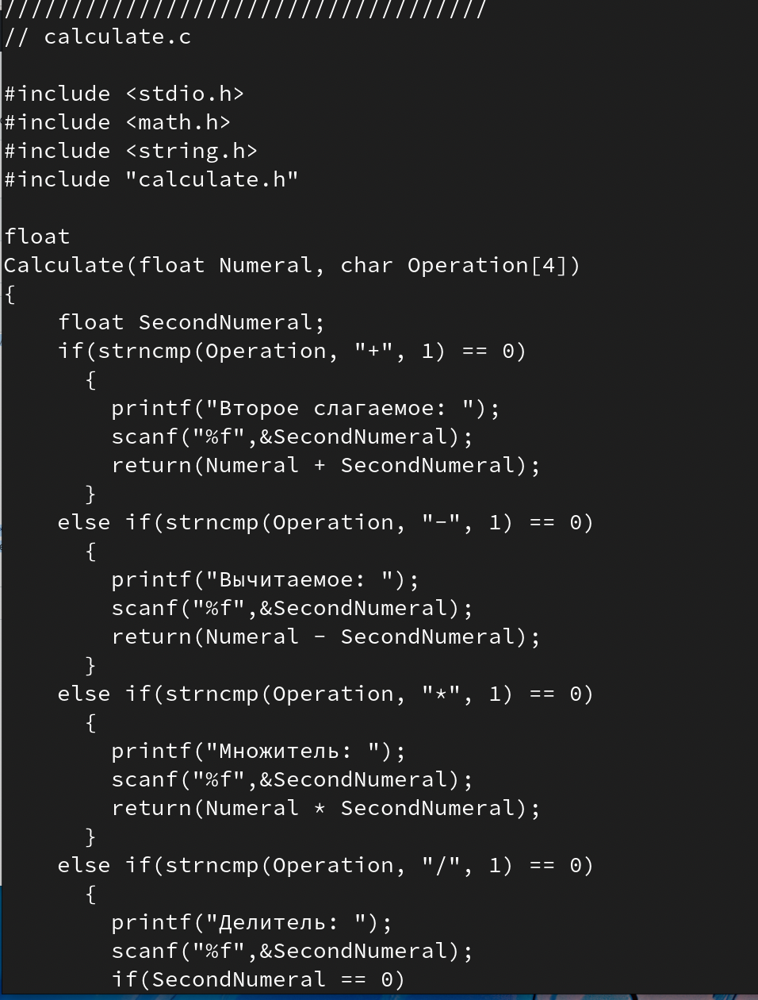{ #fig:001 width=70% }

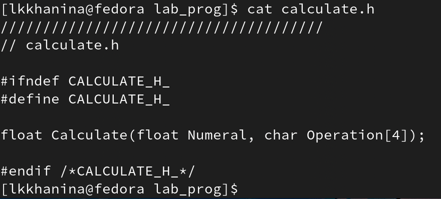{ #fig:001 width=70% }

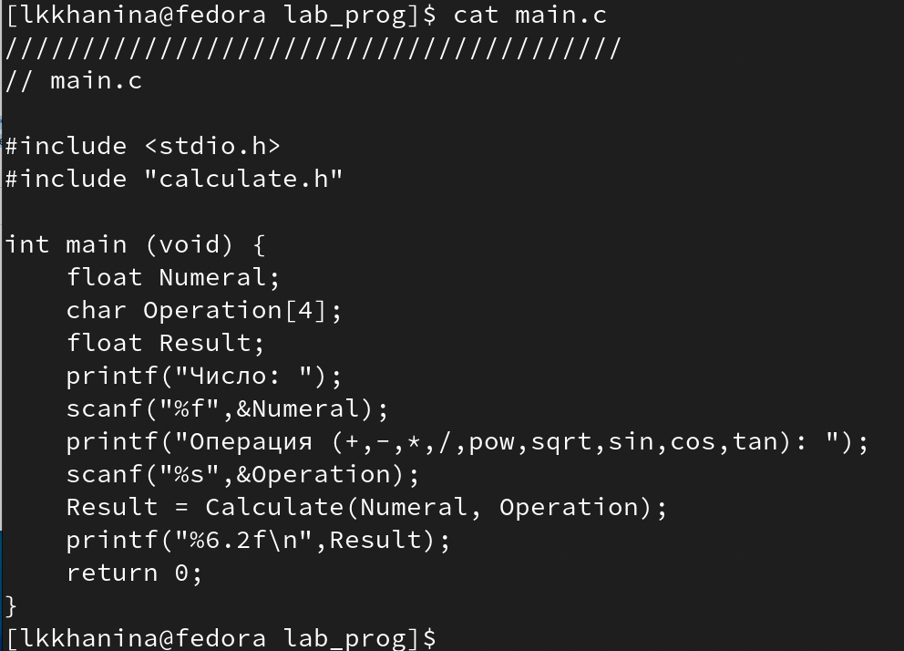{ #fig:001 width=70% }

##  Выполняем компиляцию программы посредством gcc. Синтаксических ошибок нет.

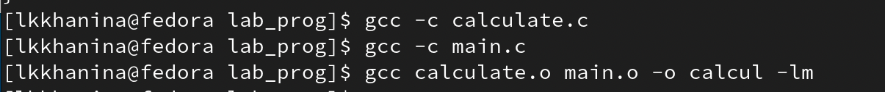{ #fig:001 width=70% }

## Создаем Makefile. Этот файл нужен для автоматической компиляции файлов и объединения их в один исполняемый файд calcul. clean удаляет все файлы. Переменная CC отвечает за утилиту компиляции; CFLAFS — опции данной утилиты; LIBS — опции для объединения объектных файлов в один исполняемый файл 

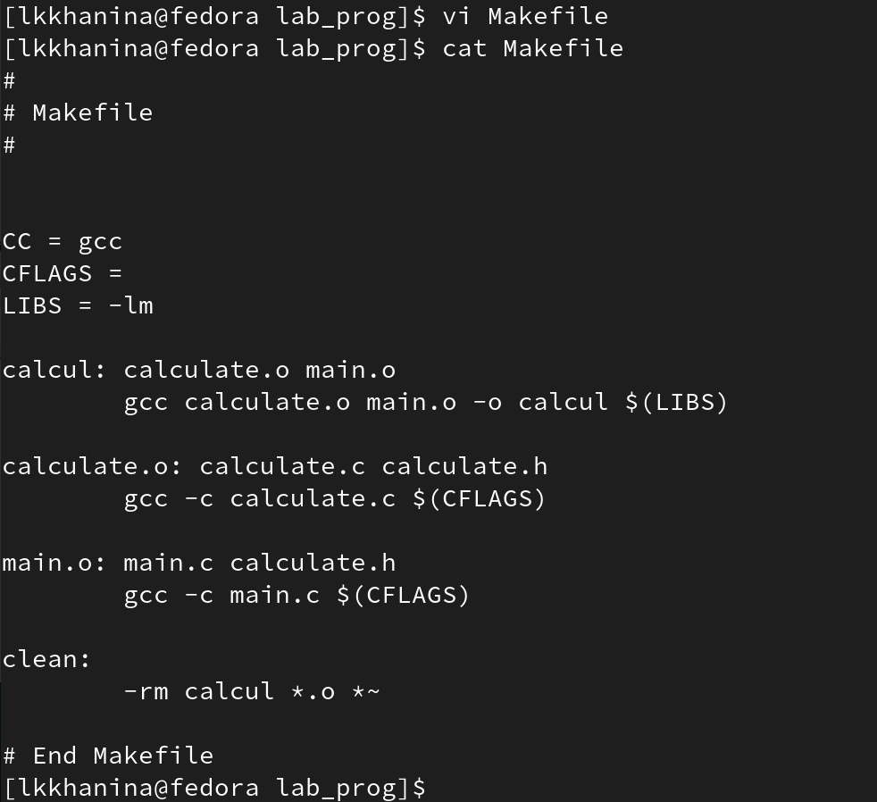{ #fig:001 width=70% }

## Исправляем Makefile и выполняем компиляцию файлов

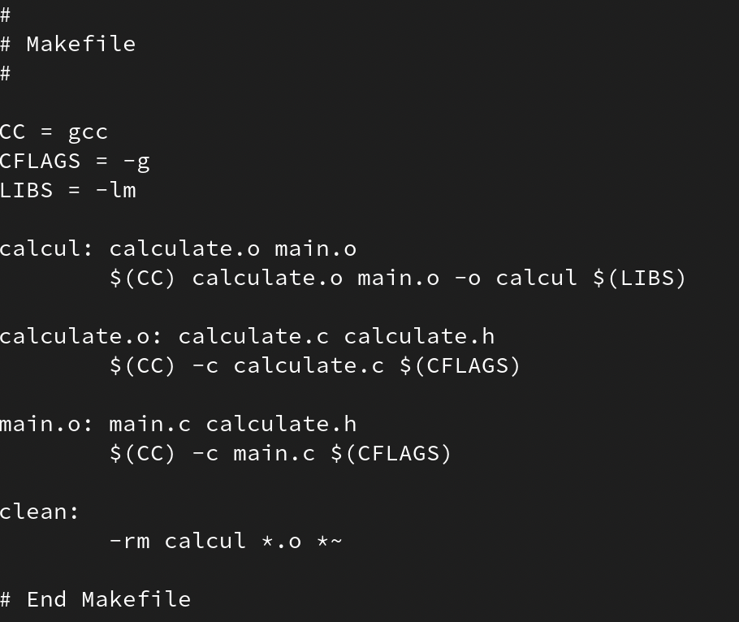{ #fig:001 width=70% }

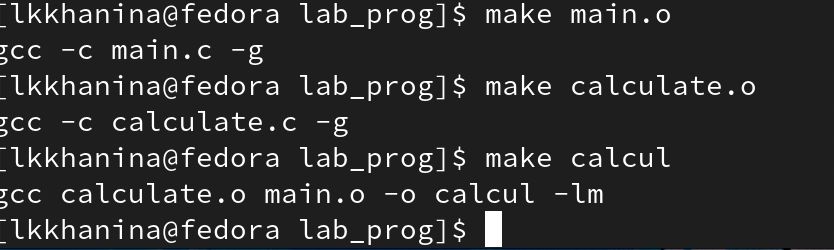{ #fig:001 width=70% }

## Запускаем отладчик GDB

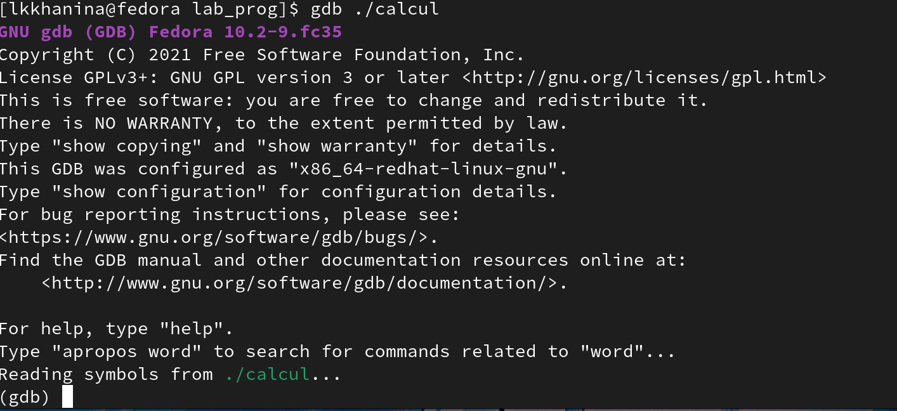{ #fig:001 width=70% }

## Запускаем программу с помощью команды run

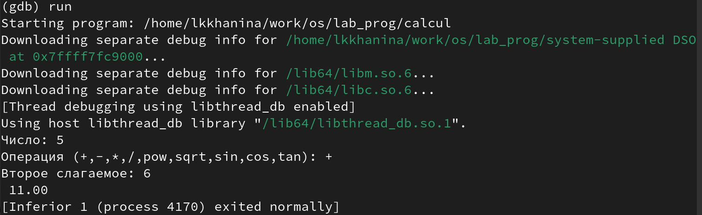{ #fig:001 width=70% }

## Для постраничного просмотра исходного кода используем команду list. Для просмотра строк с 12 по 15 используем команды list 12,15. А чтобы посмотреть определенные строки неосновного файла, то нужно использовать list с параметрами. Например, list calculate.c:20,29

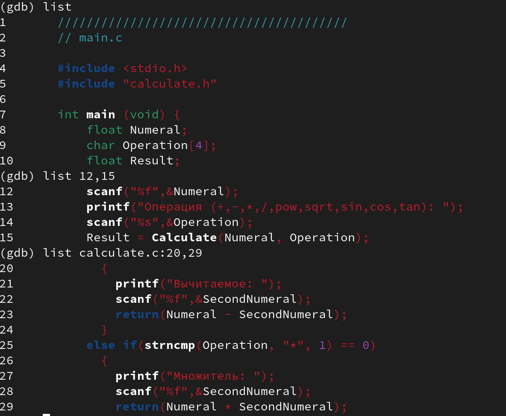{ #fig:001 width=70% }

## Устанавливаем точку останова в файле calculate.c на строке номер 21 и выводим информацию обо всех имеющихся точках останова. Запускаем программу и убеждаемся, что она остановится в момент прохождения breakpoint'a

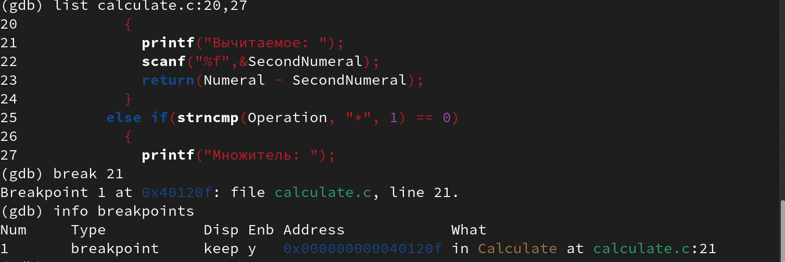{ #fig:001 width=70% }

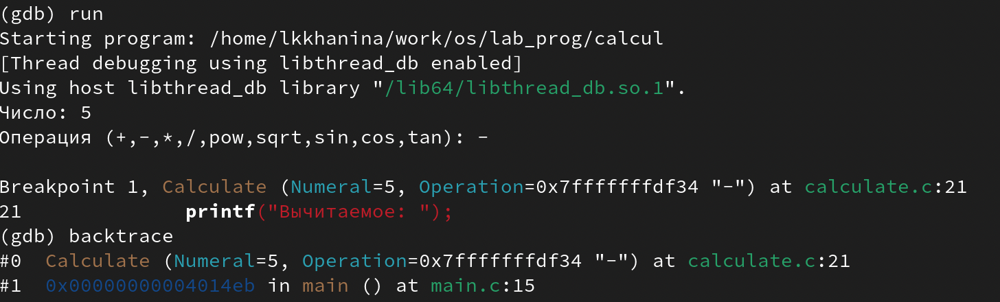{ #fig:001 width=70% }

## Посмотрим значение переменной Numeral и сравним его с результатом вывода команды display Numeral

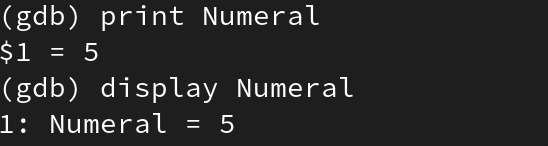{ #fig:001 width=70% }

## Уберем точки останова

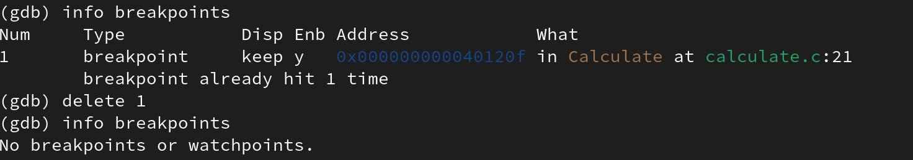{ #fig:001 width=70% }

## С помощью утилиты splint узнаем, что в файле calculate.c просходит сравнение вещесвтенного числа с нулем, а в main.c есть функция scanf, которая возращает целое число, которое нигде не используется  

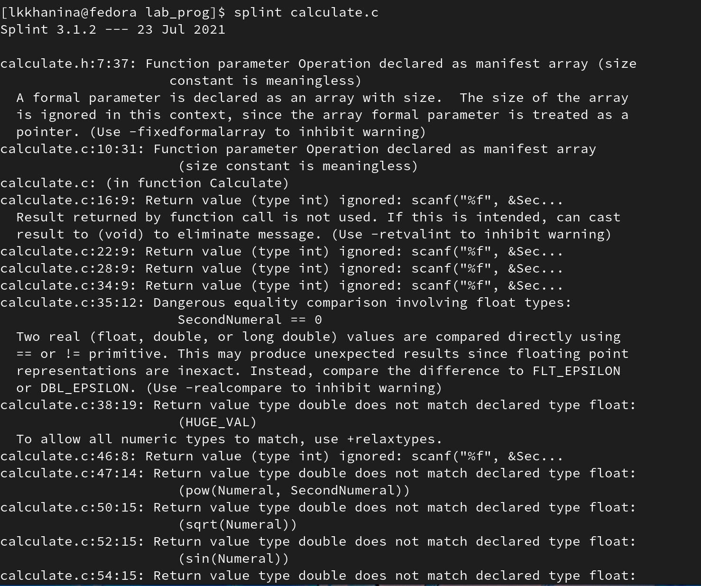{ #fig:001 width=70% }

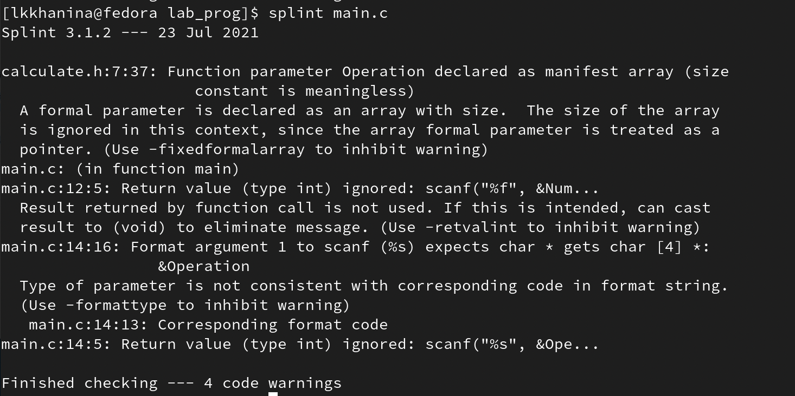{ #fig:001 width=70% }

# Выводы

Я научилась запускать откладчик GDB, работать с ним и тестировать программы
