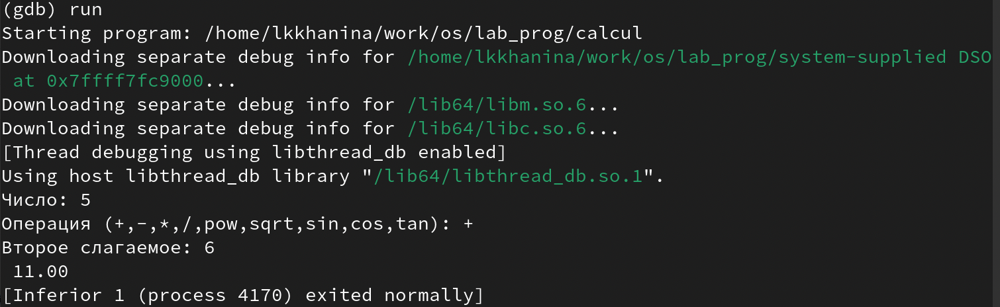

---
## Front matter
title: "Лабораторная работа №13"
author: "Ханина Людмила Константиновна"

## Generic otions
lang: ru-RU

## Bibliography
bibliography: bib/cite.bib
csl: pandoc/csl/gost-r-7-0-5-2008-numeric.csl

## Pdf output format
toc: true # Table of contents
toc-depth: 2
lof: true # List of figures
lot: true # List of tables
fontsize: 12pt
linestretch: 1.5
papersize: a4
documentclass: scrreprt
## I18n polyglossia
polyglossia-lang:
  name: russian
  options:
	- spelling=modern
	- babelshorthands=true
polyglossia-otherlangs:
  name: english
## I18n babel
babel-lang: russian
## Fonts
mainfont: PT Serif
romanfont: PT Serif
sansfont: PT Sans
monofont: PT Mono
mainfontoptions: Ligatures=TeX
romanfontoptions: Ligatures=TeX
sansfontoptions: Ligatures=TeX,Scale=MatchLowercase
monofontoptions: Scale=MatchLowercase,Scale=0.9
## Biblatex
biblatex: true
biblio-style: "gost-numeric"
biblatexoptions:
  - parentracker=true
  - backend=biber
  - hyperref=auto
  - language=auto
  - autolang=other*
  - citestyle=gost-numeric
## Pandoc-crossref LaTeX customization
figureTitle: "Рис."
tableTitle: "Таблица"
listingTitle: "Листинг"
lofTitle: "Список иллюстраций"
lotTitle: "Список таблиц"
lolTitle: "Листинги"
## Misc options
indent: true
header-includes:
  - \usepackage{indentfirst}
  - \usepackage{float} # keep figures where there are in the text
  - \floatplacement{figure}{H} # keep figures where there are in the text
---

# Цель работы

Приобрести простейшие навыки разработки, анализа, тестирования и отладки приложений в ОС типа UNIX/Linux на примере создания на языке программирования С калькулятора с простейшими функциями.
# Задание

* В домашнем каталоге создайте подкаталог ~/work/os/lab_prog.
* Создайте в нём файлы:calculate.h, calculate.c, main.c.
* С помощью gdb выполните отладку программы calcul. 
* С помощью утилиты splint попробуйте проанализировать коды файлов calculate.c и main.c.

# Выполнение лабораторной работы

1. В домашнем каталоге создаем подкаталог ~/work/os/lab_prog.

{ #fig:001 width=70% }

2. Создаем в нём файлы: calculate.h, calculate.c, main.c.
Это будет примитивнейший калькулятор, способный складывать, вычитать, умножать и делить, возводить число в степень, брать квадратный корень, вычислять sin, cos, tan. При запуске он будет запрашивать первое число, операцию, второе число. После этого программа выведет результат и остановится. 

{ #fig:001 width=70% }

{ #fig:001 width=70% }

{ #fig:001 width=70% }

3. Выполняем компиляцию программы посредством gcc. Синтаксических ошибок нет.

{ #fig:001 width=70% }

4. Создаем Makefile. Этот файл нужен для автоматической компиляции файлов и объединения их в один исполняемый файд calcul. clean удаляет все файлы. Переменная CC отвечает за утилиту компиляции; CFLAFS — опции данной утилиты; LIBS — опции для объединения объектных файлов в один исполняемый файл. 

{ #fig:001 width=70% }

5. Исправляем Makefile и выполняем компиляцию файлов. 

{ #fig:001 width=70% }

{ #fig:001 width=70% }

6. Запускаем отладчик GDB. 

{ #fig:001 width=70% }

7. Запускаем программу с помощью команды run.

{ #fig:001 width=70% }

8. Для постраничного просмотра исходного кода используем команду list. Для просмотра строк с 12 по 15 используем команды list 12,15. А чтобы посмотреть определенные строки неосновного файла, то нужно использовать list с параметрами. Например, list calculate.c:20,29. 

{ #fig:001 width=70% }

9. Устанавливаем точку останова в файле calculate.c на строке номер 21 и выводим информацию обо всех имеющихся точках останова. 

{ #fig:001 width=70% }

10. Запускаем программу и убеждаемся, что она остановится в момент прохождения breakpoint'a. 

{ #fig:001 width=70% }

11. Посмотрим значение переменной Numeral и сравним его с результатом вывода команды display Numeral. 

{ #fig:001 width=70% }

12. Уберем точки останова. 

{ #fig:001 width=70% }

13. С помощью утилиты splint узнаем, что в файле calculate.c просходит сравнение вещесвтенного числа с нулем, а в main.c есть функция scanf, которая возращает целое число, которое нигде не используется.  

{ #fig:001 width=70% }

{ #fig:001 width=70% }

# Контрольные вопросы

1. Воспользоваться man. 

2. Создание любой программы обычно начинается с базовой идеи (но не всегда), разработки ее блок-схемы (современные программисты часто пропускают этот этап), интерфейса пользователя (весьма ответственный процесс) и написания исходного текста. Далее следуют этапы компиляции и отладки.

3. Суффикс это составная часть имени файла. Система сборки каких-либо программ (например язык java) требует, чтобы имена файлов исходного кода заканчивались на .java.

4. Основное назначение компилятора языка Си в UNIX заключается в компиляции всей программы и получении исполняемого файла/модуля.

5. Утилита make создана для сборки разрабатываемого приложения и компиляции. 

6. # Цель по умолчанию  - исполняемый edit
```
edit : main.o kbd.o command.o display.o
    cc -o edit main.o kbd.o command.o display.o

main.o : main.c defs.h
    cc -c main.c
kbd.o : kbd.c defs.h command.h
    cc -c kbd.c
command.o : command.c defs.h command.h
    cc -c command.c
display.o : display.c defs.h buffer.h
     cc -c display.c
clean :
    rm edit main.o kbd.o command.o display.o
```
По умолчанию, make начинает с первой цели (не считая целей начинающихся с точки). Это цель по умолчанию. В нашем случае это цель edit. Если файл edit новее чем файлы, от которых он зависит, то ничего не произойдет. Зависимости вычисляются рекурсивно для всех файлов, от которых зависит edit. Перекомпиляция и сборка должна быть проведена, если исходный файл или любой из заголовочных файлов, упомянутых среди зависимостей, обновлен позднее, чем объектный файл, или если объектный файл не существует.

Правилу clean не соответствует никакого создаваемого файла и, соответственно, clean ни от чего не зависит и само не входит в список зависимостей. При запуске по умолчанию clean вызываться не будет. Для его выполнения необходимо явно указать цель при запуске make: make clean

7. Отладка — этап разработки компьютерной программы, на котором обнаруживают, локализуют и устраняют ошибки. Чтобы понять, где возникла ошибка, приходится:

узнавать текущие значения переменных;
выяснять, по какому пути выполнялась программа.

8. Основные команды отладчика gdb:

* backtrace − вывод на экран пути к текущей точке останова (по сутивывод − названий всех функций);
* break − установить точку останова (в качестве параметра можетбыть указан номер строки или название функции);
* clear − удалить все точки останова в функции;
* delete − удалить точку останова;
* display − добавить выражение в список выражений, значения которых отображаются при достижении точки останова программы;
* finish − выполнить программу до момента выхода из функции;
* info breakpoints − вывести на экран список используемых точек останова;
* list − вывести на экран исходный код (вВ ходе выполнения данной лабораторной работы я приобрелапростейшие навыки разработки, анализа, тестирования и отладки приложений в ОС типа UNIX/Linuxна примере создания на языке программирования С калькулятора с простейшими функциями. качестве параметра может быть указано название файла и через двоеточие номера начальнойи конечной строк);
next − выполнить программу пошагово, но без выполнения вызываемых в программе функций;
* print − вывести значение указываемого в качестве параметра выражения;
* run − запуск программы на выполнение. 

9. Схему отладки смотреть в пунктах 6-12. 

10. В строке scanf(“%s”, &Operation); нужно убрать знак &, потому что имя массива символов уже является указателем на первый элемент этого массива.

11. Например, точки останова позволяют посмотреть, как работает код. 

12. Splint, сокращение от Secure Programming Lint, является инструмент программирования для статической проверки программ на языке C на предмет безопасности уязвимостей и ошибок кодирования.

# Выводы

Я научилась запускать откладчик GDB, работать с ним и тестировать программы. 
