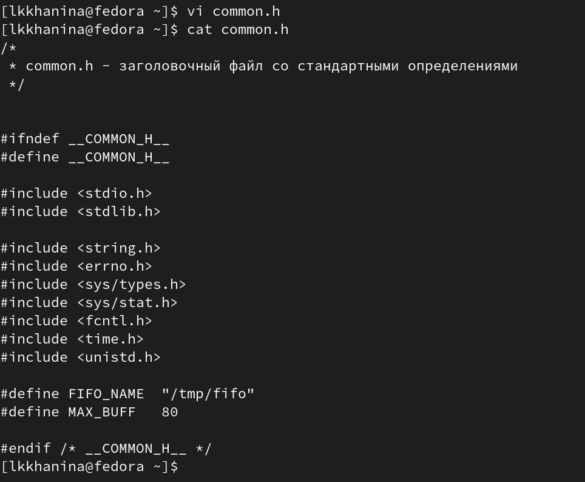
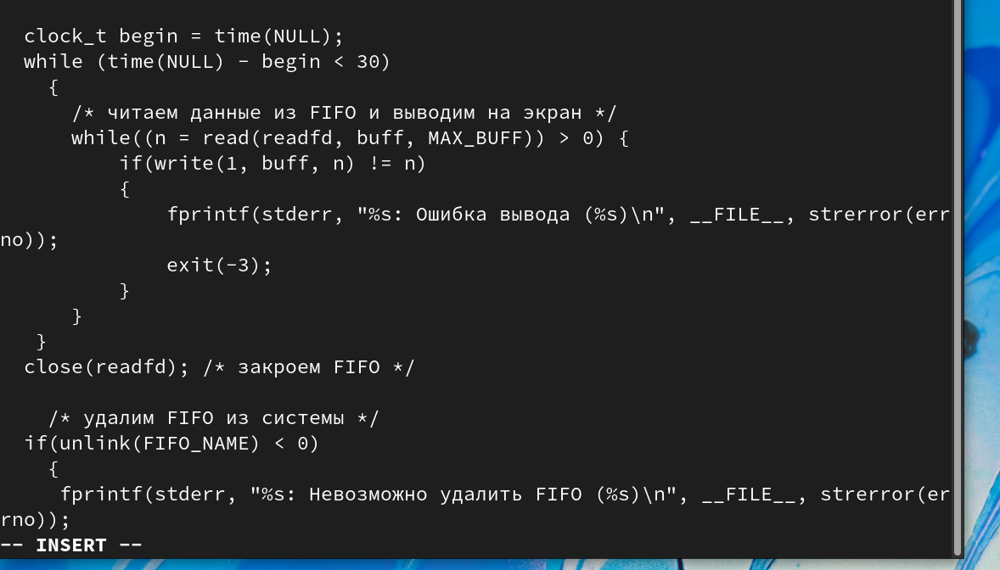
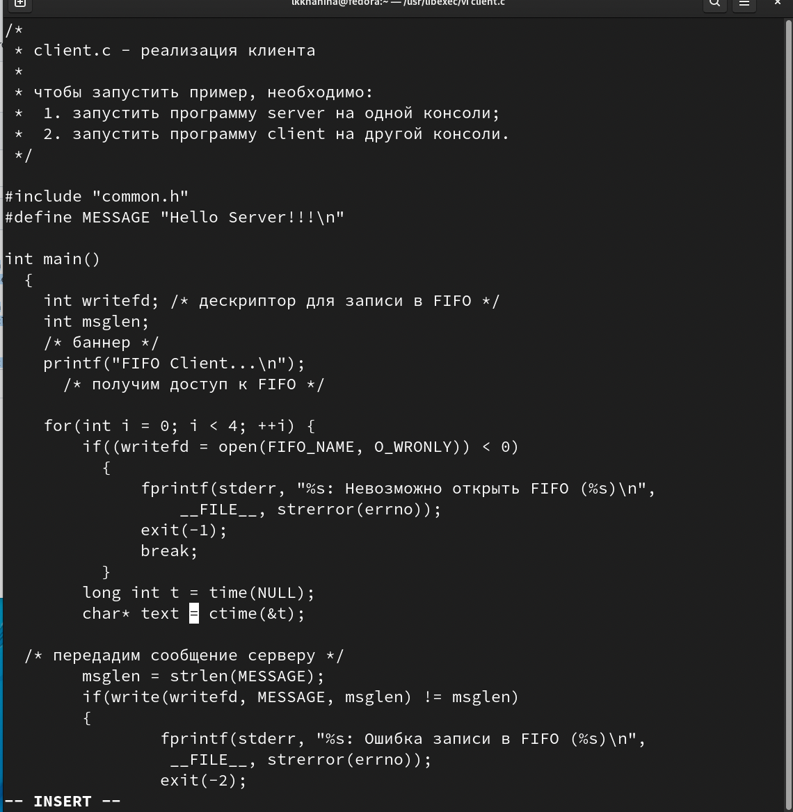
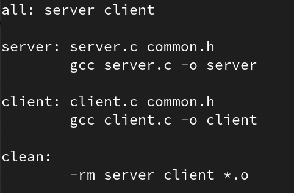
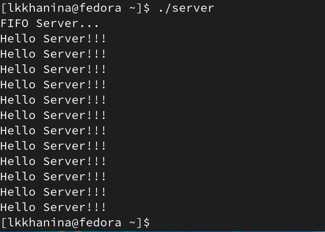
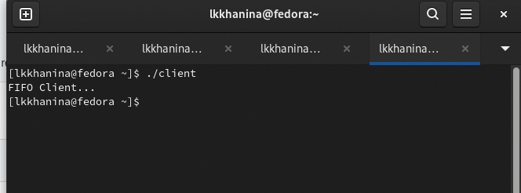
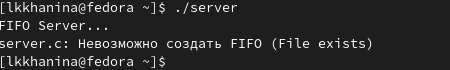

---
## Front matter
lang: ru-RU
title: Презентация лабораторной работы №14
author: |
	Ханина Людмила. Sevastianov\inst{1}
institute: |
	\inst{1}RUDN University, Moscow, Russian Federation

## Formatting
toc: false
slide_level: 2
theme: metropolis
header-includes: 
 - \metroset{progressbar=frametitle,sectionpage=progressbar,numbering=fraction}
 - '\makeatletter'
 - '\beamer@ignorenonframefalse'
 - '\makeatother'
aspectratio: 43
section-titles: true
---

# Презентация лабораторной работы №14

## Цель

Приобретение практических навыков работы с именованными каналами

## Задание

Изучите приведённые в тексте программы server.c и client.c. Взяв данные примеры за образец, напишите аналогичные программы, внеся следующие изменения:
* Работает не 1 клиент, а несколько (например, два).
* Клиенты передают текущее время с некоторой периодичностью (например, раз в пять
секунд). Используйте функцию sleep() для приостановки работы клиента.
* Сервер работает не бесконечно, а прекращает работу через некоторое время (например, 30 сек). Используйте функцию clock() для определения времени работы сервера.
Что будет в случае, если сервер завершит работу, не закрыв канал?

# Выполнение лабораторной работы

## Создадим файлы с помощью команды
```
touch common.h server.c client.c Makefile
```

## Вставим в них предложенные коды, но добавим некоторые вещи. Например, в файл common.h добавим заголовочные файлы unistd.h и time.h, которые пригодятся для других скриптов

{ #fig:001 width=70% }

## В server.c добавим цикл while, чтобы отслеживать время работы сервера. Разница между текущим временем time(NULL) и началом (begin) должна быть не больше 30 секунд 

{ #fig:001 width=70% }

## В client.c добавим цикл, отвечающий за сообщения о текущем времени, и команду sleep(5), которая будет приостанавлиать работу клиента на 5 секунд

{ #fig:001 width=70% }

## Makefile менять не будем

{ #fig:001 width=70% }

## Компилируем коды с помощью команды make all

{ #fig:001 width=70% }

## Проверим работу скриптов. Запустим в одном терминале ./server, а в нескольких других ./client. Спустя 30 секунд сервер прекратить работу. Скрипт работает корректно

{ #fig:001 width=70% }

{ #fig:001 width=70% }

## Если сервер завершит работу, не закрыв канал, то при повторном запуске сервера появится ошибка: 

{ #fig:001 width=70% }

# Выводы

Я научилась работать с именованными каналами и изменять скрипты так, чтобы они выполняли определенные вещи
