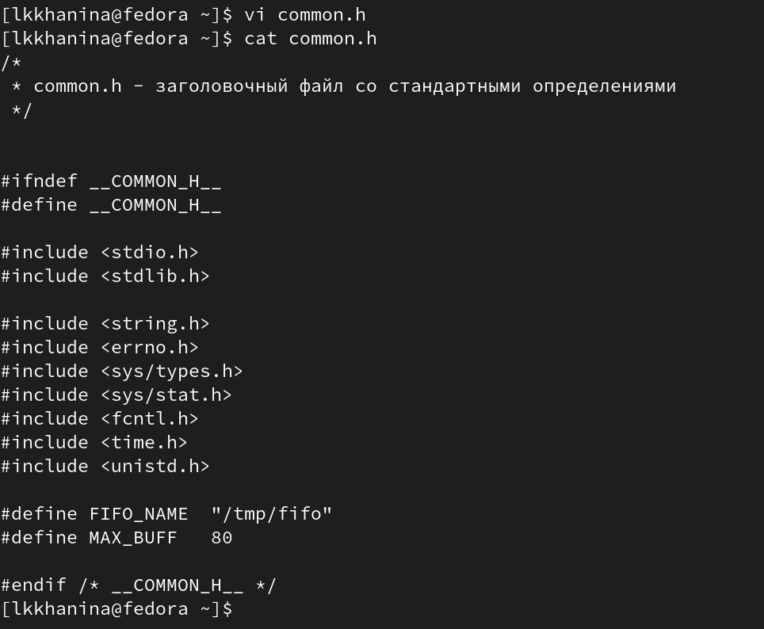
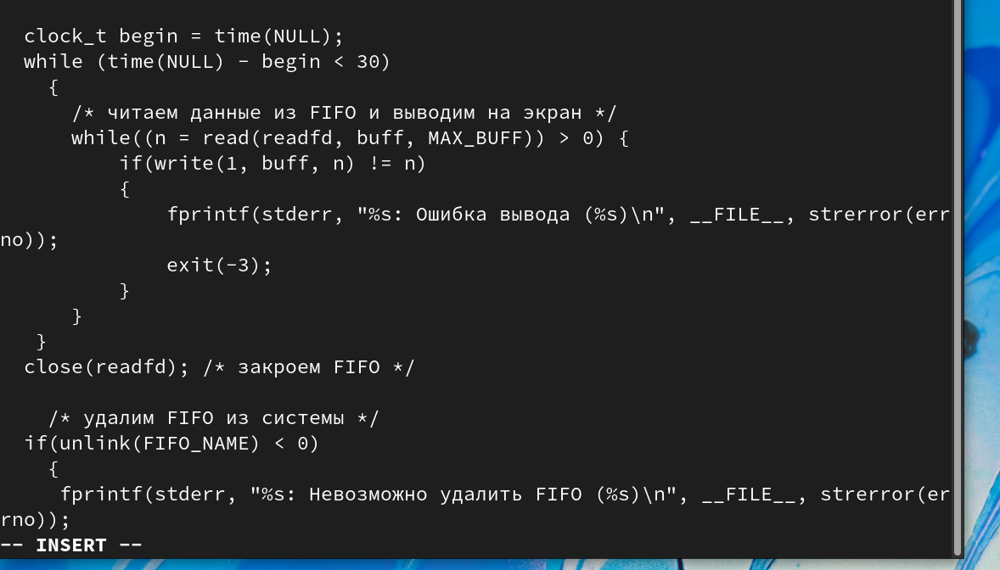
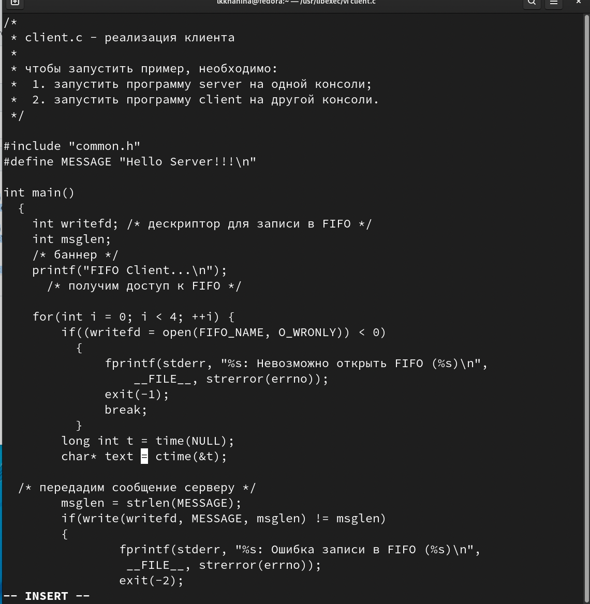
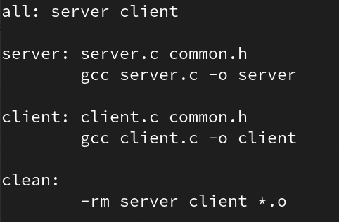
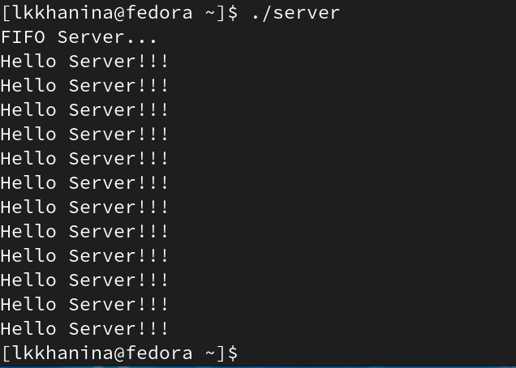
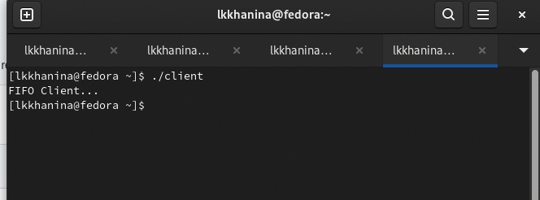
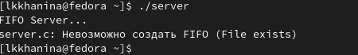

---
## Front matter
title: "Лабораторная работа №14"
author: "Ханина Людмила Константиновна"

## Generic otions
lang: ru-RU

## Bibliography
bibliography: bib/cite.bib
csl: pandoc/csl/gost-r-7-0-5-2008-numeric.csl

## Pdf output format
toc: true # Table of contents
toc-depth: 2
lof: true # List of figures
lot: true # List of tables
fontsize: 12pt
linestretch: 1.5
papersize: a4
documentclass: scrreprt
## I18n polyglossia
polyglossia-lang:
  name: russian
  options:
	- spelling=modern
	- babelshorthands=true
polyglossia-otherlangs:
  name: english
## I18n babel
babel-lang: russian
## Fonts
mainfont: PT Serif
romanfont: PT Serif
sansfont: PT Sans
monofont: PT Mono
mainfontoptions: Ligatures=TeX
romanfontoptions: Ligatures=TeX
sansfontoptions: Ligatures=TeX,Scale=MatchLowercase
monofontoptions: Scale=MatchLowercase,Scale=0.9
## Biblatex
biblatex: true
biblio-style: "gost-numeric"
biblatexoptions:
  - parentracker=true
  - backend=biber
  - hyperref=auto
  - language=auto
  - autolang=other*
  - citestyle=gost-numeric
## Pandoc-crossref LaTeX customization
figureTitle: "Рис."
tableTitle: "Таблица"
listingTitle: "Листинг"
lofTitle: "Список иллюстраций"
lotTitle: "Список таблиц"
lolTitle: "Листинги"
## Misc options
indent: true
header-includes:
  - \usepackage{indentfirst}
  - \usepackage{float} # keep figures where there are in the text
  - \floatplacement{figure}{H} # keep figures where there are in the text
---

# Цель работы

Приобретение практических навыков работы с именованными каналами.

# Задание

Изучите приведённые в тексте программы server.c и client.c. Взяв данные примеры за образец, напишите аналогичные программы, внеся следующие изменения:
* Работает не 1 клиент, а несколько (например, два).
* Клиенты передают текущее время с некоторой периодичностью (например, раз в пять
секунд). Используйте функцию sleep() для приостановки работы клиента.
* Сервер работает не бесконечно, а прекращает работу через некоторое время (например, 30 сек). Используйте функцию clock() для определения времени работы сервера.
Что будет в случае, если сервер завершит работу, не закрыв канал?

# Выполнение лабораторной работы

1. Создадим файлы с помощью команды
```
touch common.h server.c client.c Makefile
```

2. Вставим в них предложенные коды, но добавим некоторые вещи. Например, в файл common.h добавим заголовочные файлы unistd.h и time.h, которые пригодятся для других скриптов.

{ #fig:001 width=70% }

3. В server.c добавим цикл while, чтобы отслеживать время работы сервера. Разница между текущим временем time(NULL) и началом (begin) должна быть не больше 30 секунд. 

{ #fig:001 width=70% }

4. В client.c добавим цикл, отвечающий за сообщения о текущем времени, и команду sleep(5), которая будет приостанавлиать работу клиента на 5 секунд.  

{ #fig:001 width=70% }

5. Makefile менять не будем. 

{ #fig:001 width=70% }

6. Компилируем коды с помощью команды make all. 

{ #fig:001 width=70% }

7. Проверим работу скриптов. Запустим в одном терминале ./server, а в нескольких других ./client. Спустя 30 секунд сервер прекратить работу. Скрипт работает корректно. 

{ #fig:001 width=70% }

{ #fig:001 width=70% }

8. Если сервер завершит работу, не закрыв канал, то при повторном запуске сервера появится ошибка: 

{ #fig:001 width=70% }

# Контрольные вопросы

1. Воспользоваться man. 

2. Создание любой программы обычно начинается с базовой идеи (но не всегда), разработки ее блок-схемы (современные программисты часто пропускают этот этап), интерфейса пользователя (весьма ответственный процесс) и написания исходного текста. Далее следуют этапы компиляции и отладки.

3. Суффикс - это составная часть имени файла. Система сборки каких-либо программ (например язык java) требует, чтобы имена файлов исходного кода заканчивались на .java.

4. Основное назначение компилятора языка Си в UNIX заключается в компиляции всей программы и получении исполняемого файла/модуля.

5. Утилита make создана для сборки разрабатываемого приложения и компиляции. 

6. Цель по умолчанию — исполняемый edit. 
```
edit : main.o kbd.o command.o display.o
    cc -o edit main.o kbd.o command.o display.o

main.o : main.c defs.h
    cc -c main.c
kbd.o : kbd.c defs.h command.h
    cc -c kbd.c
command.o : command.c defs.h command.h
    cc -c command.c
display.o : display.c defs.h buffer.h
     cc -c display.c
clean :
    rm edit main.o kbd.o command.o display.o
```
По умолчанию, make начинает с первой цели (не считая целей начинающихся с точки). Это цель по умолчанию. В нашем случае это цель edit. Если файл edit новее чем файлы, от которых он зависит, то ничего не произойдет. Зависимости вычисляются рекурсивно для всех файлов, от которых зависит edit. Перекомпиляция и сборка должна быть проведена, если исходный файл или любой из заголовочных файлов, упомянутых среди зависимостей, обновлен позднее, чем объектный файл, или если объектный файл не существует.

Правилу clean не соответствует никакого создаваемого файла и, соответственно, clean ни от чего не зависит и само не входит в список зависимостей. При запуске по умолчанию clean вызываться не будет. Для его выполнения необходимо явно указать цель при запуске make: make clean

7. Отладка — этап разработки компьютерной программы, на котором обнаруживают, локализуют и устраняют ошибки. Чтобы понять, где возникла ошибка, приходится:
* узнавать текущие значения переменных;
* выяснять, по какому пути выполнялась программа.

8. Основные команды отладчика gdb:
* backtrace − вывод на экран пути к текущей точке останова (по сути вывод названий всех функций);
* break − установить точку останова (в качестве параметра может быть указан номер строки или название функции);
* clear − удалить все точки останова в функции;
* delete − удалить точку останова;
* display − добавить выражение в список выражений, значения которых отображаются при достижении точки останова программы;
* finish − выполнить программу до момента выхода из функции;
* info breakpoints − вывести на экран список используемых точек останова;
* list − вывести на экран исходный код;
next − выполнить программу пошагово, но без выполнения вызываемых в программе функций;
* print − вывести значение указываемого в качестве параметра выражения;
* run − запуск программы на выполнение. 

9. Схему отладки смотреть в пунктах 6-12. 

10. В строке scanf(“%s”, &Operation); нужно убрать знак &, потому что имя массива символов уже является указателем на первый элемент этого массива.

11. Например, точки останова позволяют посмотреть, как работает код. 

12. Splint, сокращение от Secure Programming Lint, является инструмент программирования для статической проверки программ на языке C на предмет безопасности уязвимостей и ошибок кодирования.

# Выводы

Я научилась работать с именованными каналами и изменять скрипты так, чтобы они выполняли определенные вещи. 
