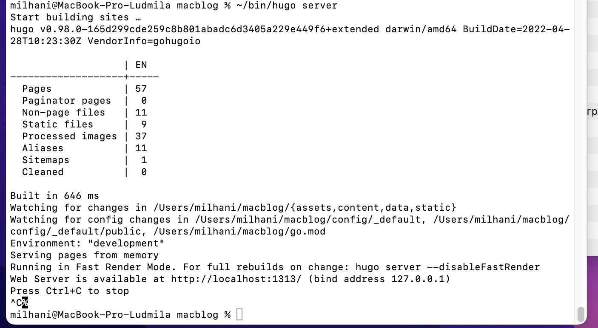
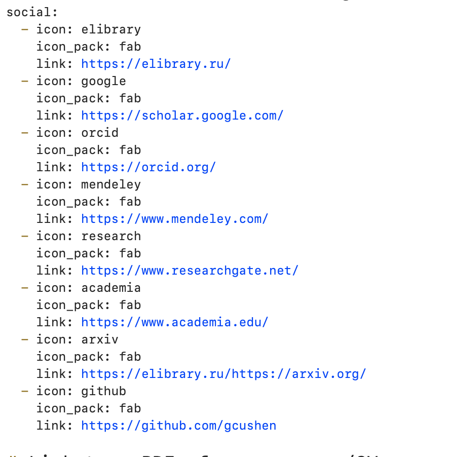
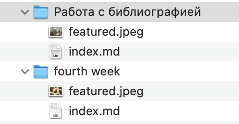
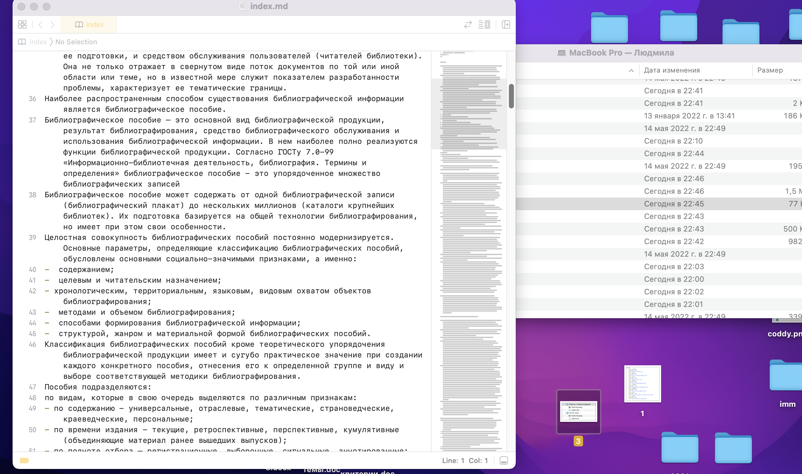

---
## Front matter
lang: ru-RU
title: Презентация ИП этап 4
author: |
	Ханина Людмила. Sevastianov\inst{1}
institute: |
	\inst{1}RUDN University, Moscow, Russian Federation

## Formatting
toc: false
slide_level: 2
theme: metropolis
header-includes: 
 - \metroset{progressbar=frametitle,sectionpage=progressbar,numbering=fraction}
 - '\makeatletter'
 - '\beamer@ignorenonframefalse'
 - '\makeatother'
aspectratio: 43
section-titles: true
---

# Презентация ИП этап 4

## Задание

* Зарегистрироваться на соответствующих ресурсах и разместить на них ссылки на сайте:
1. eLibrary : https://elibrary.ru/;
2. Google Scholar : https://scholar.google.com/;
3. ORCID : https://orcid.org/;
4. Mendeley : https://www.mendeley.com/;
5. ResearchGate : https://www.researchgate.net/;
6. Academia.edu : https://www.academia.edu/;
7. arXiv : https://arxiv.org/;
8. github : https://github.com/.
* Сделать пост по прошедшей неделе.
* Добавить пост на тему по выбору. 

# Выполнение лабораторной работы

## Запускаю ~/bin/hugo server и начинаю работать с сайтом

{ #fig:001 width=70% }

## Захожу в файл macblog/content/authors/admin/_index.md. В нем изменяю иконки и ссылки на необходимые

{ #fig:001 width=70% }

## Далее создаю пост про прошедшую неделю на основе других постов. Аналогично создаю пост на тему «Работа с библиографией»

{ #fig:001 width=70% }

{ #fig:001 width=70% }

## Последний шаг для изменения репозитория

```
git add .
git commit -am "fourth stage"
git push
```

# Выводы

Сделала два новых поста и добавила ссылки с иконками
