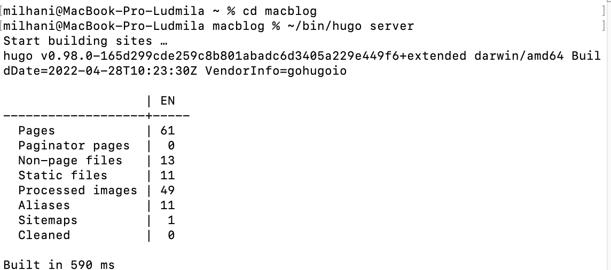
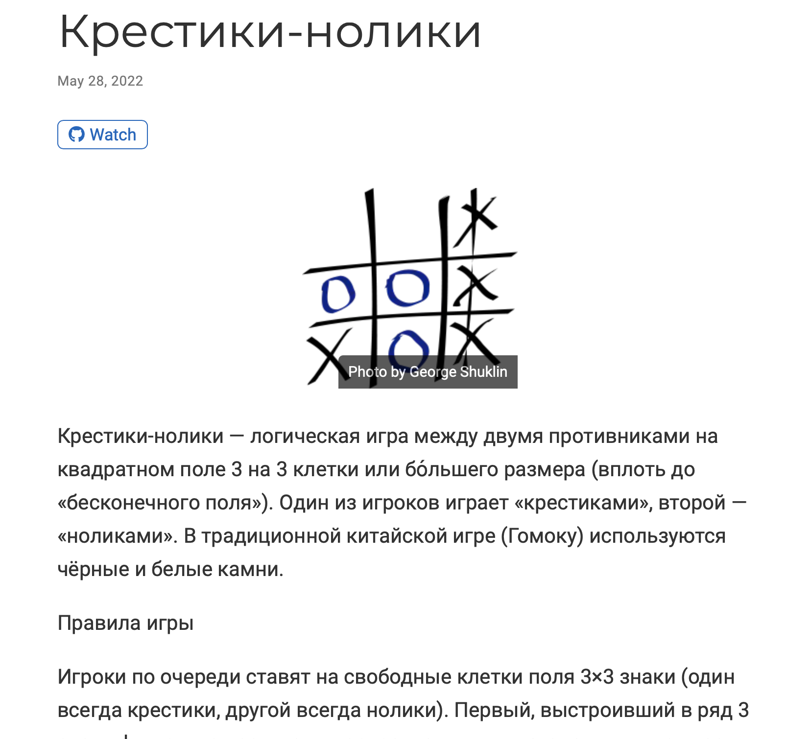
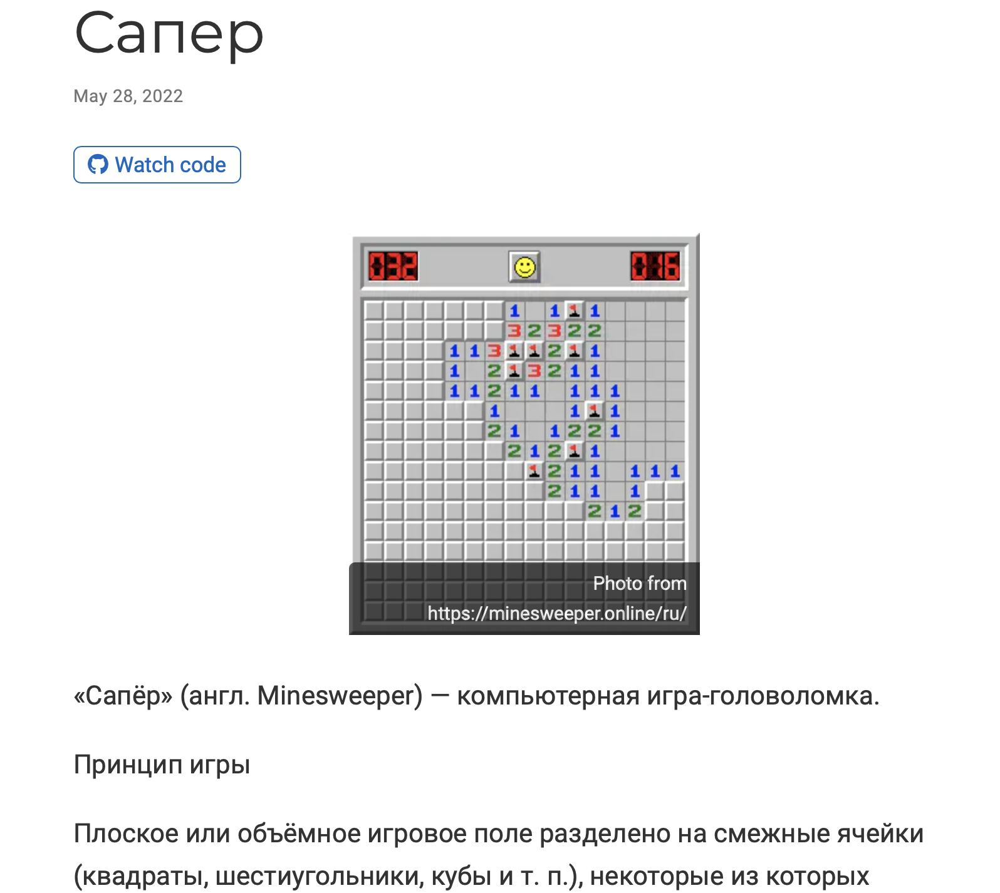
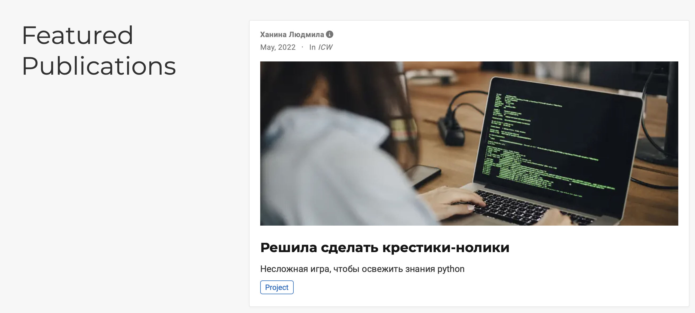
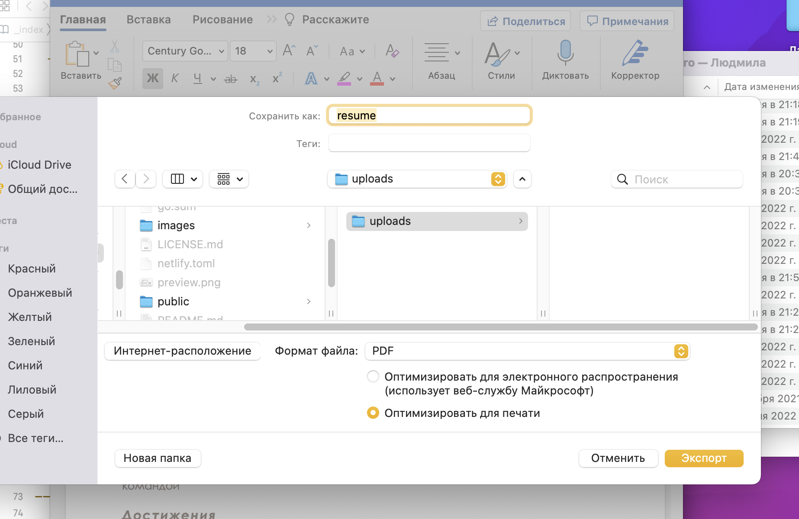
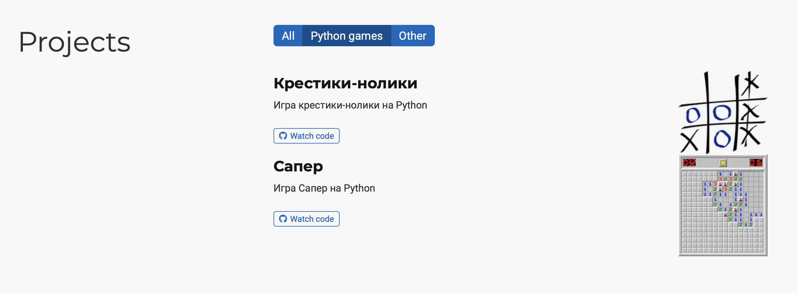
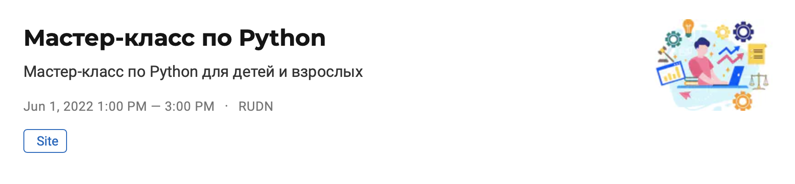
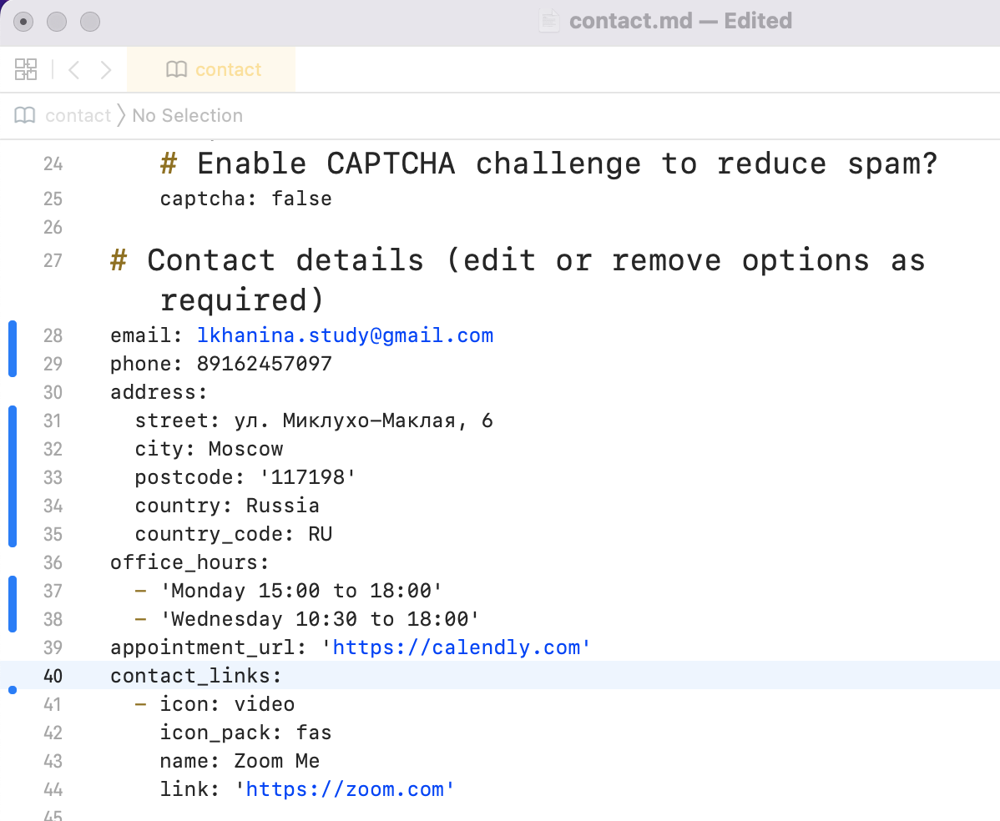
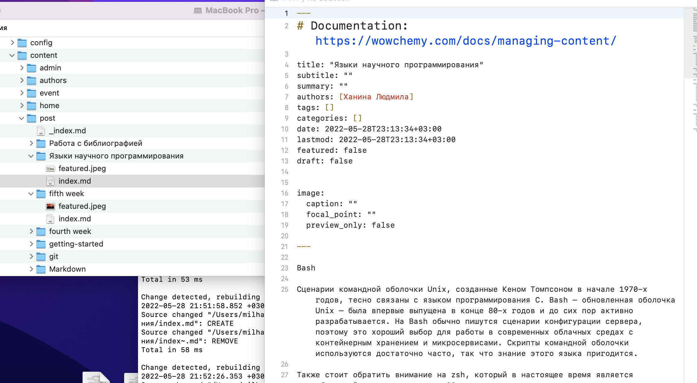

---
## Front matter
lang: ru-RU
title: Презентация ИП этап 5
author: |
	Ханина Людмила. Sevastianov\inst{1}
institute: |
	\inst{1}RUDN University, Moscow, Russian Federation

## Formatting
toc: false
slide_level: 2
theme: metropolis
header-includes: 
 - \metroset{progressbar=frametitle,sectionpage=progressbar,numbering=fraction}
 - '\makeatletter'
 - '\beamer@ignorenonframefalse'
 - '\makeatother'
aspectratio: 43
section-titles: true
---

# Презентация ИП этап 5

## Задание

* Сделать записи для персональных проектов.
* Сделать пост по прошедшей неделе.
* Добавить пост на тему по выбору. 

# Выполнение лабораторной работы

## Запускаю ~/bin/hugo server и начинаю работать с сайтом

{ #fig:001 width=70% }

## Захожу в файл macblog/content/project. Добавляю туда два проекта

{ #fig:001 width=70% }

{ #fig:001 width=70% }

## Захожу в файл macblog/content/publications. Добавляю туда публикацию 

{ #fig:001 width=70% }

## Добавляю резюмю в папку static/uploads

{ #fig:001 width=70% }

## Меняю теги на те, что использовала в проектах

{ #fig:001 width=70% }

## Cоздаю событие в папке content/event

{ #fig:001 width=70% }

## Меняю контакты: почту, телефон, адрес 

{ #fig:001 width=70% }

## Далее создаю пост про прошедшую неделю на основе других постов. Аналогично создаю пост на тему «Языки научного программирования»

{ #fig:001 width=70% }

## Последний шаг для изменения репозитория

```
git add .
git commit -am "fourth stage"
git push
```

# Выводы

Сделала два новых поста и добавила всю оставшуюся информацию о себе
