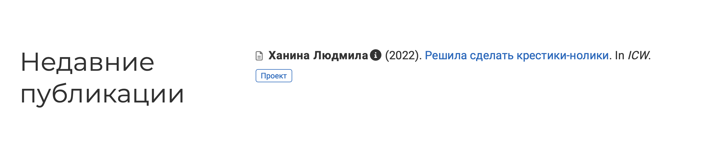
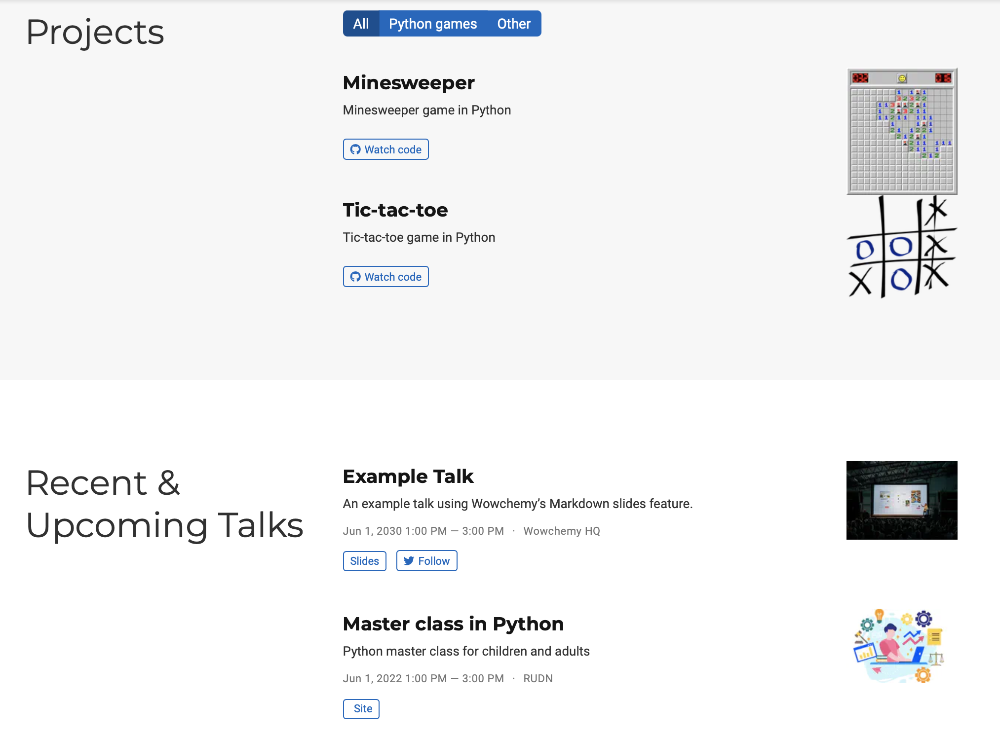

---
## Front matter
lang: ru-RU
title: Презентация ИП этап 6
author: |
	Ханина Людмила. Sevastianov\inst{1}
institute: |
	\inst{1}RUDN University, Moscow, Russian Federation

## Formatting
toc: false
slide_level: 2
theme: metropolis
header-includes: 
 - \metroset{progressbar=frametitle,sectionpage=progressbar,numbering=fraction}
 - '\makeatletter'
 - '\beamer@ignorenonframefalse'
 - '\makeatother'
aspectratio: 43
section-titles: true
---

# Презентация ИП этап 6

## Задание

* Сделать поддержку английского и русского языков.
* Разместить элементы сайта на обоих языках.
* Разместить контент на обоих языках.
* Сделать пост по прошедшей неделе.
* Добавить пост на тему по выбору (на двух языках). 

# Выполнение лабораторной работы

## Запускаю ~/bin/hugo server и начинаю работать с сайтом 

##  Захожу в файл macblog/config/_default/languages.yaml. Добавляю туда русский язык

{ #fig:001 width=70% }

## Меняю файл menus.yaml на файлы menus.ru.yaml и menus.en.yaml

{ #fig:001 width=70% }

{ #fig:001 width=70% }

## Далее идем в папку content и создаем там две папки ru и en

{ #fig:001 width=70% }

## Начинаем переводить данные на русский. Достижения:

{ #fig:001 width=70% }

{ #fig:001 width=70% }

## Контакты:

{ #fig:001 width=70% }

{ #fig:001 width=70% }

## События:

{ #fig:001 width=70% }

{ #fig:001 width=70% }

## Опыт:

{ #fig:001 width=70% }

{ #fig:001 width=70% }

## Избранные публикации:

{ #fig:001 width=70% }

{ #fig:001 width=70% }

## Посты:

{ #fig:001 width=70% }

{ #fig:001 width=70% }

## Проекты:

{ #fig:001 width=70% }

{ #fig:001 width=70% }

## Публикации:

{ #fig:001 width=70% }

{ #fig:001 width=70% }

## Навыки:

{ #fig:001 width=70% }

{ #fig:001 width=70% }

## Теперь переведем некоторые разделы на английский. Биография:

{ #fig:001 width=70% }

## Контакты:

{ #fig:001 width=70% }

## Публикации:

{ #fig:001 width=70% }

## Достижения и посты:

{ #fig:001 width=70% }

## Проекты и события:

{ #fig:001 width=70% }

## Навыки и опыт: 

{ #fig:001 width=70% }

## Далее создадим пост про прошедшую неделю на двух языках. Аналогично создадим пост на тему «Депривация сна». 

{ #fig:001 width=70% }

{ #fig:001 width=70% }

## Последний шаг для изменения репозитория:
```
git add .
git commit -am "sixth week"
git push
```

# Выводы

Сделала сайт двуязычным, перевела материалы на английский и русский и создала посты на двух языках
