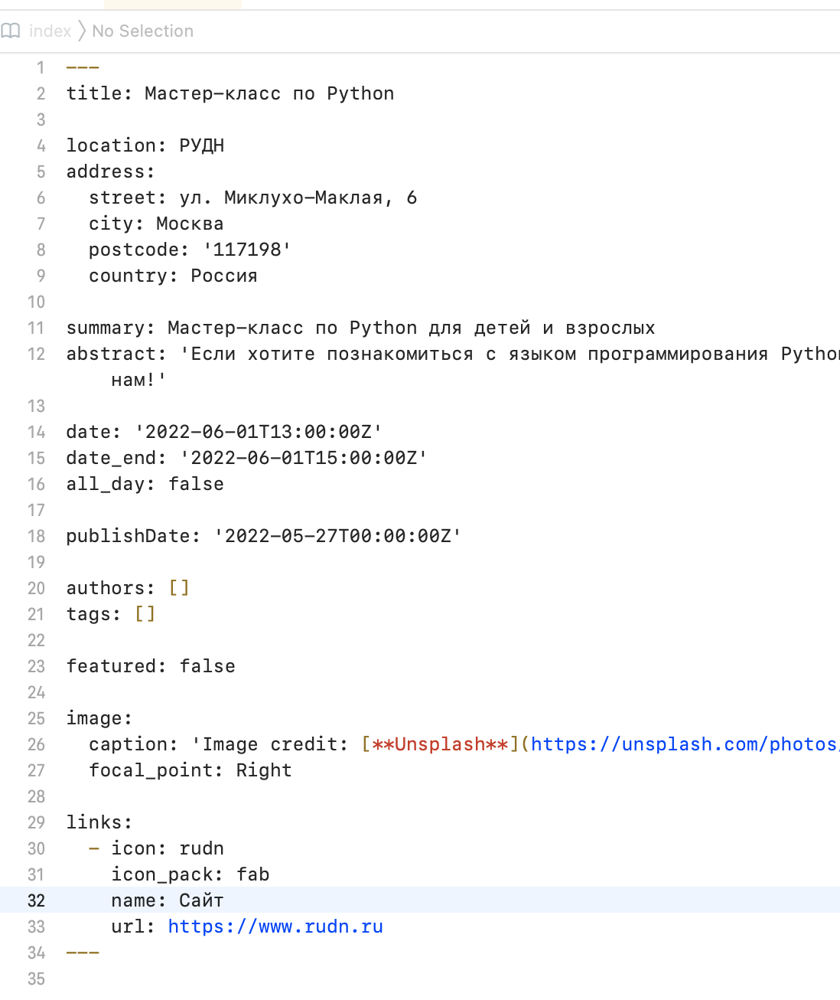
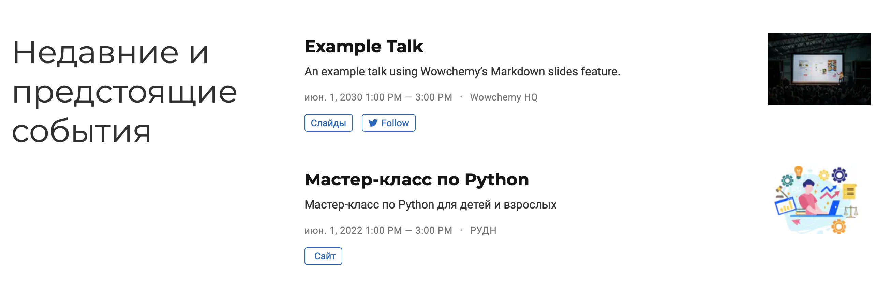
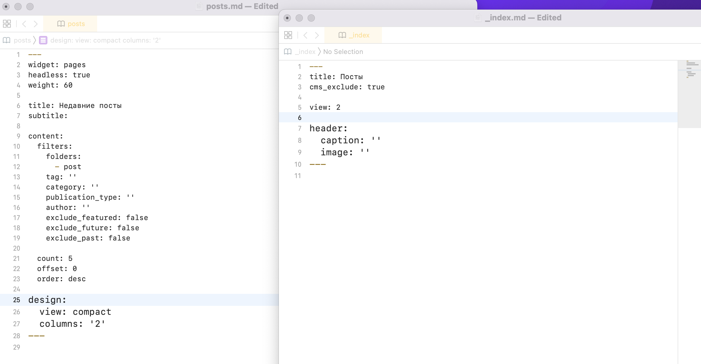

---
## Front matter
title: "Отчёт по ИП этап 5"
author: "Ханина Людмила Константиновна"

## Bibliography
bibliography: bib/cite.bib
csl: pandoc/csl/gost-r-7-0-5-2008-numeric.csl

## Pdf output format
toc: true # Table of contents
toc-depth: 2
lof: true # List of figures
lot: true # List of tables
fontsize: 12pt
linestretch: 1.5
papersize: a4
documentclass: scrreprt
## I18n polyglossia
polyglossia-lang:
  name: russian
  options:
	- spelling=modern
	- babelshorthands=true
polyglossia-otherlangs:
  name: english
## I18n babel
babel-lang: russian
babel-otherlangs: english
## Fonts
mainfont: PT Serif
romanfont: PT Serif
sansfont: PT Sans
monofont: PT Mono
mainfontoptions: Ligatures=TeX
romanfontoptions: Ligatures=TeX
sansfontoptions: Ligatures=TeX,Scale=MatchLowercase
monofontoptions: Scale=MatchLowercase,Scale=0.9
## Biblatex
biblatex: true
biblio-style: "gost-numeric"
biblatexoptions:
  - parentracker=true
  - backend=biber
  - hyperref=auto
  - language=auto
  - autolang=other*
  - citestyle=gost-numeric
## Pandoc-crossref LaTeX customization
figureTitle: "Рис."
tableTitle: "Таблица"
listingTitle: "Листинг"
lofTitle: "Список иллюстраций"
lotTitle: "Список таблиц"
lolTitle: "Листинги"
## Misc options
indent: true
header-includes:
  - \usepackage{indentfirst}
  - \usepackage{float} # keep figures where there are in the text
  - \floatplacement{figure}{H} # keep figures where there are in the text
---

# Задание

* Сделать записи для персональных проектов.
* Сделать пост по прошедшей неделе.
* Добавить пост на тему по выбору. 

# Выполнение лабораторной работы

1. Запускаю ~/bin/hugo server и начинаю работать с сайтом. 

{ #fig:001 width=70% }

2.  Захожу в файл macblog/content/project. Добавляю туда два проекта. 

{ #fig:001 width=70% }

{ #fig:001 width=70% }

{ #fig:001 width=70% }

{ #fig:001 width=70% }

3. Захожу в файл macblog/content/publications. Добавляю туда публикацию.  

{ #fig:001 width=70% }

{ #fig:001 width=70% }

4. Добавляю резюмю в папку static/uploads. 

{ #fig:001 width=70% }

5. Меняю теги на те, что использовала в проектах. 

{ #fig:001 width=70% }

{ #fig:001 width=70% }

6. Cоздаю событие в папке content/event. 

{ #fig:001 width=70% }

{ #fig:001 width=70% }

7. Меняю контакты: почту, телефон, адрес. 

{ #fig:001 width=70% }

8. Далее создаю пост про прошедшую неделю на основе других постов. Аналогично создаю пост на тему «Языки научного программирования». 

{ #fig:001 width=70% }

9. Последний шаг для изменения репозитория:
```
git add .
git commit -am "fifth week"
git push
```

# Выводы

Сделала два новых поста и добавила всю оставшуюся информацию о себе. 
